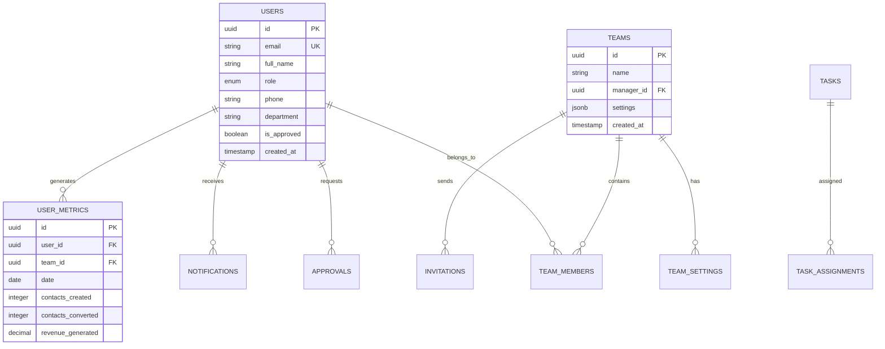
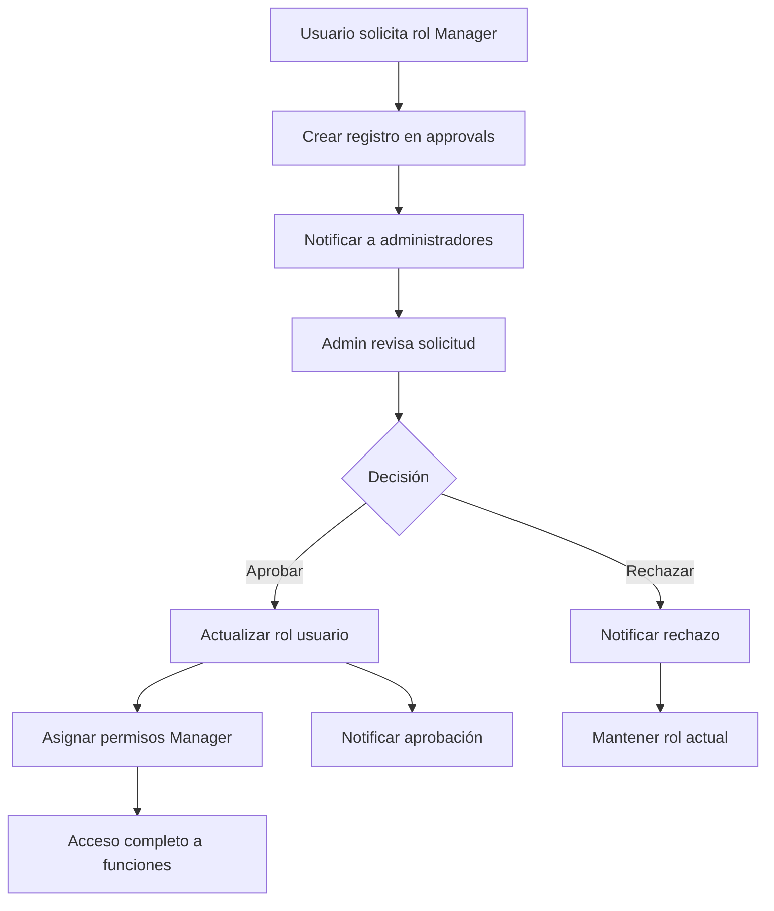

# Análisis y Plan de Implementación: Sistema de Roles Robusto - CRM Cactus

## 1. ANÁLISIS DEL ESTADO ACTUAL

### 1.1 Estructura Actual del Sistema de Roles

**Roles Definidos:**
- `advisor`: Asesor comercial con permisos limitados
- `manager`: Manager de equipo con permisos intermedios
- `admin`: Administrador con permisos completos

**Implementación Actual:**
```typescript
// authStore.ts - Interface User
export interface User {
  id: string;
  name: string;
  username: string;
  email?: string;
  role: 'advisor' | 'manager' | 'admin';
  company: string;
  avatar?: string;
  phone?: string;
  department?: string;
  isApproved: boolean;
  createdAt: string;
  team_id?: string;
}
```

**Sistema de Permisos:**
- Implementado en `utils/permissions.ts`
- Mapeo de roles a permisos específicos
- Verificación granular de acceso

### 1.2 Funcionalidades Existentes

**CRM y Gestión de Contactos:**
- Store: `crmStore.ts` - Gestión completa de contactos
- Métricas: `metricsStore.ts` - Análisis de rendimiento
- Notas: `notesStore.ts` - Sistema de anotaciones

**Gestión de Equipos:**
- Store: `teamStore.ts` - Administración de equipos
- Migraciones: Tablas `teams`, `team_members`, `approvals`
- Panel Admin: `AdminPanel.tsx` - Gestión de usuarios

**Dashboard y Métricas:**
- `dashboardStore.ts` - Métricas en tiempo real
- `LiveMetricsPanel.tsx` - Visualización de datos
- `HistoricalDataModal.tsx` - Datos históricos

### 1.3 Problemas Identificados

**1. Sistema de Aprobación Incompleto:**
- Falta notificación automática a administradores
- No hay flujo claro para aprobación de managers
- Proceso de registro inconsistente entre roles

**2. Gestión de Equipos Limitada:**
- Managers no pueden ver métricas consolidadas de su equipo
- Falta acceso individual a datos de asesores
- No hay herramientas de exportación específicas

**3. Base de Datos Desorganizada:**
- Datos mock mezclados con datos reales
- Falta sincronización entre stores
- Estructura de permisos no optimizada

**4. Experiencia de Usuario Fragmentada:**
- Componentes no están bien divididos por funcionalidad
- Falta consistencia en la navegación por roles
- Mensajes de error y estados de carga inconsistentes

## 2. PLAN DETALLADO PARA SISTEMA DE ROLES ROBUSTO

### 2.1 Gestión de Roles Durante el Registro

**Flujo Mejorado de Registro:**

1. **Registro de Advisor:**
   - Aprobación automática
   - Asignación a equipo por defecto
   - Acceso inmediato a funcionalidades básicas

2. **Registro de Manager:**
   - Estado inicial: `pending_approval`
   - Notificación automática a administradores
   - Acceso limitado hasta aprobación

3. **Creación de Admin:**
   - Solo por administradores existentes
   - Proceso de verificación adicional
   - Log de auditoría completo

**Componentes a Modificar:**
```typescript
// pages/Register.tsx - Mejorar flujo de registro
// store/authStore.ts - Añadir lógica de notificaciones
// components/NotificationToast.tsx - Sistema de alertas
```

### 2.2 Sistema de Aprobación para Managers

**Flujo de Aprobación:**

1. **Solicitud de Manager:**
   ```sql
   INSERT INTO approvals (user_id, requested_role, status, created_at)
   VALUES (user_id, 'manager', 'pending', NOW());
   ```

2. **Notificación a Administradores:**
   - Email automático
   - Notificación en dashboard
   - Badge de pendientes en sidebar

3. **Proceso de Aprobación:**
   - Panel dedicado en AdminPanel
   - Comentarios y justificación
   - Historial de decisiones

**Nuevos Componentes:**
```typescript
// components/ApprovalPanel.tsx - Panel de aprobaciones
// components/NotificationCenter.tsx - Centro de notificaciones
// services/notificationService.ts - Servicio de notificaciones
```

### 2.3 Estructura Optimizada de Base de Datos

**Nuevas Tablas Requeridas:**

```sql
-- Tabla de notificaciones
CREATE TABLE notifications (
    id UUID PRIMARY KEY DEFAULT gen_random_uuid(),
    user_id UUID REFERENCES users(id) ON DELETE CASCADE,
    type VARCHAR(50) NOT NULL,
    title VARCHAR(255) NOT NULL,
    message TEXT,
    data JSONB DEFAULT '{}',
    read_at TIMESTAMP WITH TIME ZONE,
    created_at TIMESTAMP WITH TIME ZONE DEFAULT NOW()
);

-- Tabla de métricas por usuario
CREATE TABLE user_metrics (
    id UUID PRIMARY KEY DEFAULT gen_random_uuid(),
    user_id UUID REFERENCES users(id) ON DELETE CASCADE,
    team_id UUID REFERENCES teams(id) ON DELETE CASCADE,
    date DATE NOT NULL,
    contacts_created INTEGER DEFAULT 0,
    contacts_converted INTEGER DEFAULT 0,
    calls_made INTEGER DEFAULT 0,
    meetings_scheduled INTEGER DEFAULT 0,
    revenue_generated DECIMAL(10,2) DEFAULT 0,
    created_at TIMESTAMP WITH TIME ZONE DEFAULT NOW(),
    UNIQUE(user_id, date)
);

-- Tabla de configuración de equipos
CREATE TABLE team_settings (
    id UUID PRIMARY KEY DEFAULT gen_random_uuid(),
    team_id UUID REFERENCES teams(id) ON DELETE CASCADE,
    setting_key VARCHAR(100) NOT NULL,
    setting_value JSONB,
    updated_by UUID REFERENCES users(id),
    updated_at TIMESTAMP WITH TIME ZONE DEFAULT NOW(),
    UNIQUE(team_id, setting_key)
);
```

### 2.4 Funcionalidades Específicas para Managers

**Dashboard de Manager:**

1. **Vista Consolidada del Equipo:**
   - Métricas agregadas del equipo
   - Comparación de rendimiento entre asesores
   - Tendencias y proyecciones

2. **Gestión Individual de Asesores:**
   - Acceso a contactos de cada asesor
   - Métricas individuales detalladas
   - Herramientas de coaching y feedback

3. **Herramientas de Exportación:**
   - Reportes personalizables
   - Exportación a Excel/CSV
   - Programación de reportes automáticos

**Nuevos Componentes para Managers:**
```typescript
// pages/ManagerDashboard.tsx - Dashboard específico
// components/TeamMetricsPanel.tsx - Métricas del equipo
// components/AdvisorDetailView.tsx - Vista individual de asesor
// components/ReportGenerator.tsx - Generador de reportes
// components/TeamPerformanceChart.tsx - Gráficos de rendimiento
```

### 2.5 Componentes Bien Estructurados

**Reorganización de Componentes:**

```
src/
├── components/
│   ├── auth/
│   │   ├── LoginForm.tsx
│   │   ├── RegisterForm.tsx
│   │   └── ApprovalStatus.tsx
│   ├── dashboard/
│   │   ├── AdminDashboard.tsx
│   │   ├── ManagerDashboard.tsx
│   │   └── AdvisorDashboard.tsx
│   ├── team/
│   │   ├── TeamOverview.tsx
│   │   ├── TeamMemberCard.tsx
│   │   └── TeamMetrics.tsx
│   ├── crm/
│   │   ├── ContactList.tsx
│   │   ├── ContactDetail.tsx
│   │   └── ContactForm.tsx
│   ├── notifications/
│   │   ├── NotificationCenter.tsx
│   │   ├── NotificationItem.tsx
│   │   └── NotificationBadge.tsx
│   └── shared/
│       ├── Layout.tsx
│       ├── Sidebar.tsx
│       └── Header.tsx
```

## 3. ARQUITECTURA TÉCNICA

### 3.1 Diseño de Base de Datos Mejorado

**Diagrama de Entidades:**



### 3.2 Flujos de Trabajo para Aprobaciones

**Flujo de Aprobación de Manager:**



### 3.3 Sistema de Permisos Granular

**Matriz de Permisos Actualizada:**

| Funcionalidad | Advisor | Manager | Admin |
|---------------|---------|---------|-------|
| Ver propios contactos | ✅ | ✅ | ✅ |
| Ver contactos del equipo | ❌ | ✅ | ✅ |
| Ver todos los contactos | ❌ | ❌ | ✅ |
| Crear/editar contactos | ✅ | ✅ | ✅ |
| Eliminar contactos | ❌ | ✅ | ✅ |
| Ver métricas propias | ✅ | ✅ | ✅ |
| Ver métricas del equipo | ❌ | ✅ | ✅ |
| Ver métricas globales | ❌ | ❌ | ✅ |
| Gestionar equipo | ❌ | ✅ | ✅ |
| Aprobar usuarios | ❌ | ❌ | ✅ |
| Configurar sistema | ❌ | ❌ | ✅ |
| Exportar reportes | ❌ | ✅ | ✅ |

### 3.4 Integración con Supabase

**Configuración de RLS (Row Level Security):**

```sql
-- Política para contactos - Advisors solo ven los suyos
CREATE POLICY "advisors_own_contacts" ON contacts
    FOR ALL USING (
        auth.jwt() ->> 'role' = 'advisor' AND 
        assigned_to = auth.uid()
    );

-- Política para contactos - Managers ven los de su equipo
CREATE POLICY "managers_team_contacts" ON contacts
    FOR ALL USING (
        auth.jwt() ->> 'role' = 'manager' AND 
        assigned_to IN (
            SELECT user_id FROM team_members 
            WHERE team_id IN (
                SELECT team_id FROM team_members 
                WHERE user_id = auth.uid()
            )
        )
    );

-- Política para contactos - Admins ven todo
CREATE POLICY "admins_all_contacts" ON contacts
    FOR ALL USING (auth.jwt() ->> 'role' = 'admin');
```

## 4. PLAN DE IMPLEMENTACIÓN

### 4.1 Fase 1: Fundación del Sistema de Roles (Semana 1-2)

**Tareas Prioritarias:**

1. **Migración de Base de Datos:**
   ```bash
   # Crear nuevas migraciones
   supabase migration new enhanced_user_system
   supabase migration new notifications_system
   supabase migration new user_metrics_system
   ```

2. **Actualización del AuthStore:**
   - Implementar lógica de notificaciones
   - Mejorar flujo de registro
   - Añadir validaciones de roles

3. **Sistema de Notificaciones:**
   - Crear `notificationService.ts`
   - Implementar `NotificationCenter.tsx`
   - Integrar con Supabase Realtime

**Entregables:**
- Base de datos actualizada
- Sistema de notificaciones funcional
- Registro mejorado con validaciones

### 4.2 Fase 2: Sistema de Aprobaciones (Semana 3-4)

**Tareas Específicas:**

1. **Panel de Aprobaciones:**
   ```typescript
   // components/admin/ApprovalPanel.tsx
   interface ApprovalPanelProps {
     pendingApprovals: Approval[];
     onApprove: (id: string, comments?: string) => void;
     onReject: (id: string, reason: string) => void;
   }
   ```

2. **Flujo de Aprobación:**
   - Crear `approvalStore.ts`
   - Implementar lógica de estados
   - Añadir historial de decisiones

3. **Notificaciones Automáticas:**
   - Email templates
   - Push notifications
   - Dashboard badges

**Entregables:**
- Panel de aprobaciones completo
- Flujo de notificaciones automático
- Historial de aprobaciones

### 4.3 Fase 3: Funcionalidades de Manager (Semana 5-6)

**Componentes Nuevos:**

1. **Dashboard de Manager:**
   ```typescript
   // pages/ManagerDashboard.tsx
   const ManagerDashboard = () => {
     const { teamMetrics, teamMembers } = useTeamStore();
     const { generateReport } = useReportService();
     
     return (
       <div className="manager-dashboard">
         <TeamOverview metrics={teamMetrics} />
         <TeamMembersList members={teamMembers} />
         <ReportGenerator onGenerate={generateReport} />
       </div>
     );
   };
   ```

2. **Métricas de Equipo:**
   - Vista consolidada
   - Comparación entre miembros
   - Tendencias temporales

3. **Herramientas de Exportación:**
   - Generador de reportes
   - Programación automática
   - Múltiples formatos

**Entregables:**
- Dashboard específico para managers
- Sistema de métricas de equipo
- Herramientas de exportación

### 4.4 Fase 4: Optimización y UX (Semana 7-8)

**Mejoras de Experiencia:**

1. **Reorganización de Componentes:**
   - Dividir por funcionalidad
   - Crear componentes reutilizables
   - Optimizar rendimiento

2. **Estados de Carga y Errores:**
   - Skeleton loaders
   - Error boundaries
   - Retry mechanisms

3. **Navegación Intuitiva:**
   - Sidebar dinámico por rol
   - Breadcrumbs contextuales
   - Shortcuts de teclado

**Entregables:**
- Componentes reorganizados
- UX optimizada por rol
- Performance mejorado

### 4.5 Testing y Validación

**Estrategia de Testing:**

1. **Unit Tests:**
   ```typescript
   // tests/stores/authStore.test.ts
   describe('AuthStore', () => {
     it('should approve manager correctly', async () => {
       const { approveUser } = useAuthStore.getState();
       const result = await approveUser('user-id');
       expect(result).toBe(true);
     });
   });
   ```

2. **Integration Tests:**
   - Flujo completo de registro
   - Sistema de aprobaciones
   - Permisos por rol

3. **E2E Tests:**
   - Cypress para flujos críticos
   - Testing de diferentes roles
   - Validación de permisos

**Criterios de Aceptación:**
- ✅ Registro funciona para todos los roles
- ✅ Aprobaciones se procesan correctamente
- ✅ Managers pueden ver métricas de equipo
- ✅ Permisos se aplican correctamente
- ✅ Notificaciones funcionan en tiempo real
- ✅ Exportación de reportes operativa
- ✅ UX intuitiva para cada rol

## 5. CONSIDERACIONES TÉCNICAS ADICIONALES

### 5.1 Seguridad

- Validación de permisos en frontend y backend
- Sanitización de datos de entrada
- Rate limiting para APIs críticas
- Audit logs para acciones administrativas

### 5.2 Performance

- Lazy loading de componentes por rol
- Caching de métricas frecuentes
- Optimización de queries de Supabase
- Paginación en listas grandes

### 5.3 Escalabilidad

- Arquitectura modular por funcionalidad
- Stores independientes y reutilizables
- Componentes genéricos y configurables
- API design para futuras extensiones

### 5.4 Monitoreo

- Logging de errores con Sentry
- Métricas de uso con Analytics
- Performance monitoring
- Health checks automáticos

---

**Conclusión:**
Este plan proporciona una hoja de ruta completa para implementar un sistema de roles robusto que cumple con todos los requisitos especificados. La implementación por fases permite un desarrollo incremental y testing continuo, asegurando la calidad y funcionalidad del sistema final.