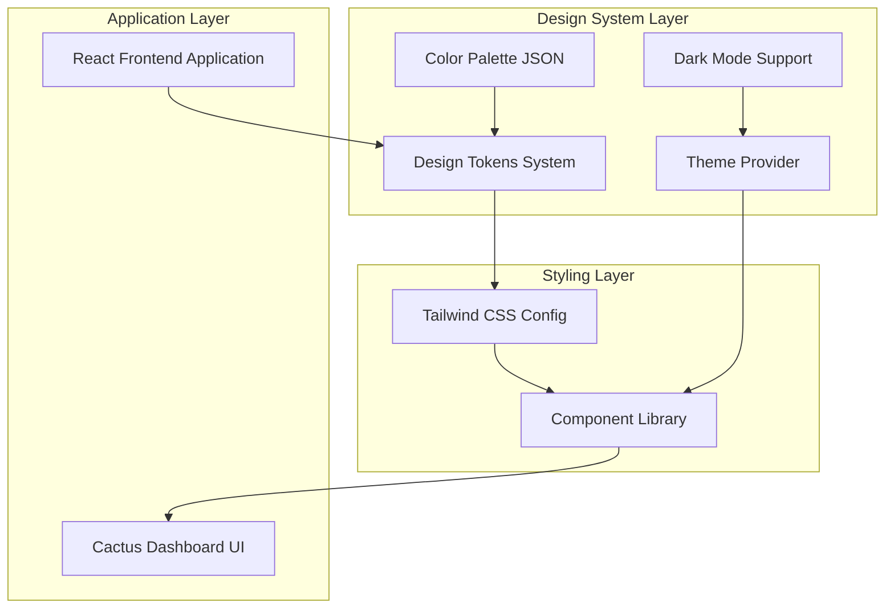
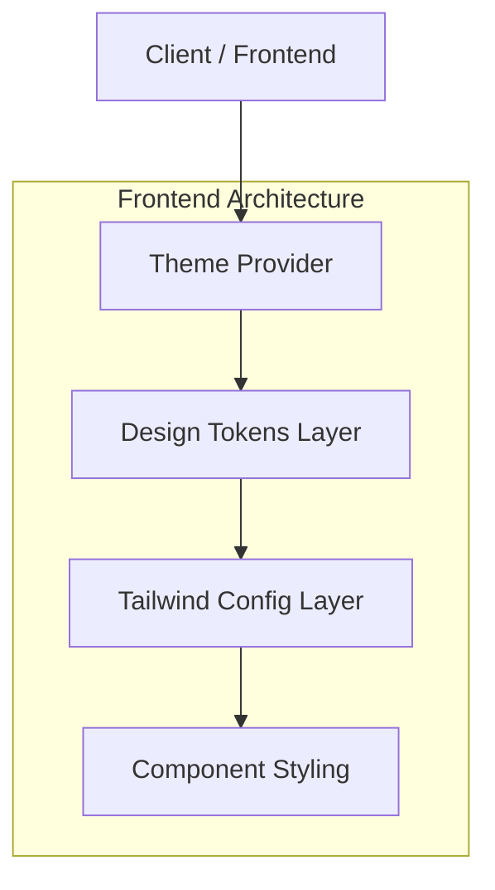
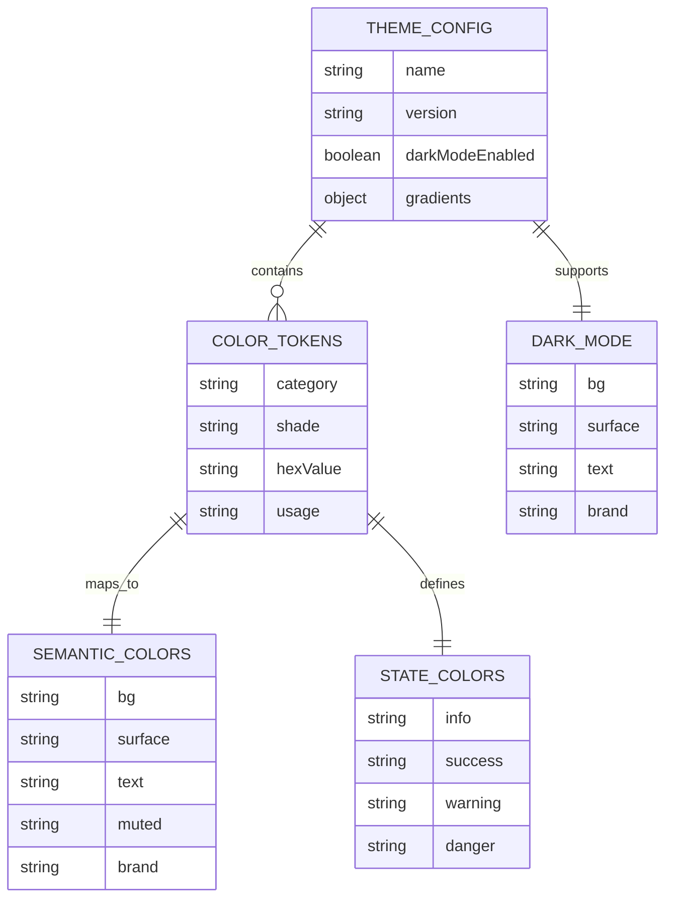

# Arquitectura Técnica - Paleta Cactus Dashboard

## 1. Arquitectura de Diseño



## 2. Descripción de Tecnologías

- **Frontend**: React@18 + TypeScript + Tailwind CSS@3 + Vite
- **Design System**: Design Tokens + Theme Provider
- **Styling**: Tailwind CSS con configuración personalizada
- **Estado**: Context API para tema y modo oscuro

## 3. Definiciones de Rutas

| Ruta | Propósito |
|------|----------|
| /dashboard | Dashboard principal con nueva paleta Cactus |
| /team | Vista de equipo con colores temáticos |
| /metrics | Métricas con colores de charts específicos |
| /settings | Configuración con soporte para modo oscuro |
| /profile | Perfil de usuario con estados semánticos |

## 4. Definiciones de API

### 4.1 Design Tokens API

**Estructura de Tokens**
```typescript
interface CactusDashboardTokens {
  colors: {
    cactus: ColorScale;
    oasis: Partial<ColorScale>;
    terracotta: Partial<ColorScale>;
    pear: Partial<ColorScale>;
    sunlight: Partial<ColorScale>;
    error: Partial<ColorScale>;
    neutral: ColorScale;
  };
  semantics: SemanticColors;
  states: StateColors;
  dark: DarkModeColors;
  charts: ChartColors;
  gradients: GradientColors;
}

interface ColorScale {
  50?: string;
  100?: string;
  200?: string;
  300?: string;
  400?: string;
  500: string;
  600?: string;
  700?: string;
  800?: string;
  900?: string;
  950?: string;
}

interface SemanticColors {
  bg: string;
  surface: string;
  text: string;
  muted: string;
  brand: string;
  brandStrong: string;
  onBrandStrong: string;
}

interface StateColors {
  info: string;
  success: string;
  warning: string;
  danger: string;
  onState: string;
  bdSub: string;
  bdStrong: string;
}
```

### 4.2 Theme Provider API

**Context de Tema**
```typescript
interface ThemeContextType {
  theme: 'light' | 'dark';
  toggleTheme: () => void;
  colors: CactusDashboardTokens;
}

// Hook personalizado
const useTheme = (): ThemeContextType => {
  const context = useContext(ThemeContext);
  if (!context) {
    throw new Error('useTheme debe usarse dentro de ThemeProvider');
  }
  return context;
};
```

## 5. Arquitectura del Servidor



## 6. Modelo de Datos

### 6.1 Definición del Modelo de Datos



### 6.2 Definición de Lenguaje de Datos

**Configuración de Design Tokens**
```typescript
// tokens/cactus-dashboard.ts
export const CactusDashboardTokens = {
  colors: {
    cactus: {
      50: '#F0FFF6',
      100: '#DFFBEA',
      200: '#C8F6DC',
      300: '#A6EDC8',
      400: '#7FE5B0',
      500: '#55DFA0',
      600: '#2CCB86',
      700: '#16B273',
      800: '#0E8E5B',
      900: '#0C7048',
      950: '#0A5A3A'
    },
    oasis: {
      500: '#2AADC7',
      600: '#1E92AB',
      700: '#18778C',
      800: '#145E6F'
    },
    terracotta: {
      500: '#DC6A52',
      600: '#C45542',
      700: '#A34539'
    },
    pear: {
      500: '#8E63EB',
      600: '#7448D4',
      700: '#5F3CB1'
    },
    sunlight: {
      500: '#FFB300',
      600: '#E79F00',
      700: '#C48600'
    },
    error: {
      600: '#BA3737',
      700: '#992E2E'
    },
    neutral: {
      0: '#FFFFFF',
      50: '#F8FAF9',
      100: '#F2F5F4',
      200: '#E6EBE9',
      300: '#D5DDDA',
      400: '#BFCBC7',
      500: '#A5B5B0',
      600: '#7F9190',
      700: '#5D6E6C',
      800: '#3B4A49',
      900: '#1E2726',
      950: '#0E1413'
    }
  },
  semantics: {
    bg: 'neutral.50',
    surface: 'neutral.0',
    text: 'neutral.900',
    muted: 'neutral.600',
    brand: 'cactus.500',
    brandStrong: 'cactus.900',
    onBrandStrong: 'neutral.0'
  },
  states: {
    info: 'oasis.700',
    success: 'cactus.700',
    warning: 'sunlight.700',
    danger: 'error.600',
    onState: 'neutral.0',
    bdSub: 'neutral.200',
    bdStrong: 'neutral.300'
  },
  dark: {
    bg: 'neutral.950',
    surface: 'neutral.900',
    text: 'neutral.50',
    muted: 'neutral.300',
    brand: 'cactus.600',
    brandStrong: 'cactus.500'
  },
  charts: {
    ordinal: [
      '#16B273', '#18778C', '#A34539', '#5F3CB1', '#C48600',
      '#0C7048', '#2AADC7', '#DC6A52', '#8E63EB', '#FFB300'
    ]
  },
  gradients: {
    brand: 'linear-gradient(135deg, #F0FFF6 0%, #55DFA0 40%, #0C7048 100%)'
  }
};
```

**Configuración de Tailwind CSS**
```javascript
// tailwind.config.js
const { CactusDashboardTokens } = require('./tokens/cactus-dashboard');

module.exports = {
  content: ['./src/**/*.{js,ts,jsx,tsx}'],
  darkMode: 'class',
  theme: {
    extend: {
      colors: {
        // Colores principales
        cactus: CactusDashboardTokens.colors.cactus,
        oasis: CactusDashboardTokens.colors.oasis,
        terracotta: CactusDashboardTokens.colors.terracotta,
        pear: CactusDashboardTokens.colors.pear,
        sunlight: CactusDashboardTokens.colors.sunlight,
        error: CactusDashboardTokens.colors.error,
        neutral: CactusDashboardTokens.colors.neutral,
        
        // Colores semánticos
        'bg-primary': 'var(--color-bg)',
        'surface-primary': 'var(--color-surface)',
        'text-primary': 'var(--color-text)',
        'text-muted': 'var(--color-muted)',
        'brand-primary': 'var(--color-brand)',
        'brand-strong': 'var(--color-brand-strong)',
        
        // Estados
        'state-info': 'var(--color-info)',
        'state-success': 'var(--color-success)',
        'state-warning': 'var(--color-warning)',
        'state-danger': 'var(--color-danger)'
      },
      backgroundImage: {
        'gradient-brand': CactusDashboardTokens.gradients.brand
      }
    }
  },
  plugins: []
};
```

**Variables CSS para Modo Oscuro**
```css
/* styles/globals.css */
:root {
  --color-bg: theme('colors.neutral.50');
  --color-surface: theme('colors.neutral.0');
  --color-text: theme('colors.neutral.900');
  --color-muted: theme('colors.neutral.600');
  --color-brand: theme('colors.cactus.500');
  --color-brand-strong: theme('colors.cactus.900');
  --color-info: theme('colors.oasis.700');
  --color-success: theme('colors.cactus.700');
  --color-warning: theme('colors.sunlight.700');
  --color-danger: theme('colors.error.600');
}

.dark {
  --color-bg: theme('colors.neutral.950');
  --color-surface: theme('colors.neutral.900');
  --color-text: theme('colors.neutral.50');
  --color-muted: theme('colors.neutral.300');
  --color-brand: theme('colors.cactus.600');
  --color-brand-strong: theme('colors.cactus.500');
}
```