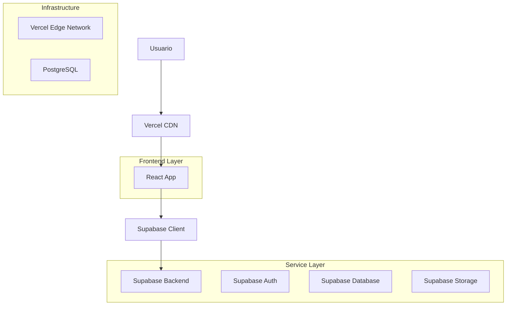
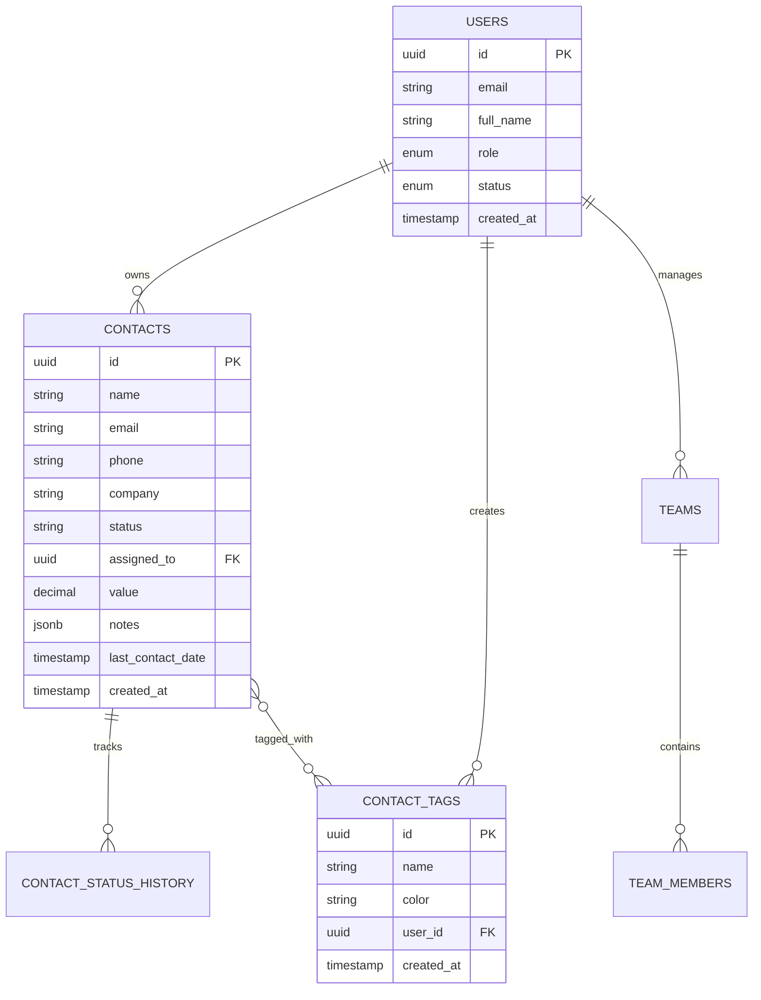

# Arquitectura de Producción - CRM Cactus Dashboard

## 1. Arquitectura General

### 1.1 Stack Tecnológico de Producción


### 1.2 Tecnologías Principales
- **Frontend**: React 18 + TypeScript + Vite
- **Styling**: Tailwind CSS + Lucide Icons
- **Backend**: Supabase (PostgreSQL + Auth + Real-time)
- **Deployment**: Vercel
- **State Management**: Zustand
- **Build Tool**: Vite

## 2. Configuración de Base de Datos

### 2.1 Esquema de Producción


### 2.2 Políticas RLS de Producción
```sql
-- Contactos: Acceso por usuario
CREATE POLICY "contacts_user_isolation" ON public.contacts
  FOR ALL TO authenticated
  USING (assigned_to = auth.uid())
  WITH CHECK (assigned_to = auth.uid());

-- Etiquetas: Por usuario creador
CREATE POLICY "tags_user_isolation" ON public.contact_tags
  FOR ALL TO authenticated
  USING (user_id = auth.uid())
  WITH CHECK (user_id = auth.uid());

-- Historial: Solo lectura de contactos propios
CREATE POLICY "history_read_own" ON public.contact_status_history
  FOR SELECT TO authenticated
  USING (
    EXISTS (
      SELECT 1 FROM public.contacts c
      WHERE c.id = contact_status_history.contact_id
      AND c.assigned_to = auth.uid()
    )
  );
```

## 3. Configuración de Variables de Entorno

### 3.1 Variables Críticas de Producción
```env
# Supabase Configuration
VITE_SUPABASE_URL=https://pphrkrtjxwjvxokcwhjz.supabase.co
VITE_SUPABASE_ANON_KEY=eyJhbGciOiJIUzI1NiIsInR5cCI6IkpXVCJ9...

# Environment
VITE_APP_ENV=production
VITE_APP_VERSION=1.0.0

# Feature Flags
VITE_ENABLE_DEBUG=false
VITE_ENABLE_ANALYTICS=true
```

### 3.2 Configuración de Supabase
```typescript
// src/config/supabase.ts
export const supabase = createClient(
  import.meta.env.VITE_SUPABASE_URL,
  import.meta.env.VITE_SUPABASE_ANON_KEY,
  {
    auth: {
      autoRefreshToken: true,
      persistSession: true,
      detectSessionInUrl: true,
      flowType: 'pkce'
    },
    db: {
      schema: 'public'
    },
    global: {
      headers: {
        'X-Client-Info': 'cactus-dashboard@1.0.0'
      }
    }
  }
);
```

## 4. Optimizaciones de Producción

### 4.1 Performance Frontend
```typescript
// Lazy loading de páginas
const CRMPage = lazy(() => import('./pages/CRM'));
const Dashboard = lazy(() => import('./pages/Dashboard'));
const TeamManagement = lazy(() => import('./pages/TeamManagement'));

// Code splitting por rutas
const router = createBrowserRouter([
  {
    path: '/crm',
    element: <Suspense fallback={<LoadingSpinner />}><CRMPage /></Suspense>
  }
]);
```

### 4.2 Optimización de Queries
```typescript
// Paginación en contactos
const loadContacts = async (page = 0, limit = 50) => {
  const { data, error } = await supabase
    .from('contacts')
    .select('*')
    .eq('assigned_to', user.id)
    .order('created_at', { ascending: false })
    .range(page * limit, (page + 1) * limit - 1);
};

// Índices optimizados
CREATE INDEX CONCURRENTLY idx_contacts_user_created 
ON contacts(assigned_to, created_at DESC);
```

### 4.3 Caching Strategy
```typescript
// Cache de etiquetas en memoria
const useTagsCache = () => {
  const [cache, setCache] = useState<Map<string, ContactTag[]>>(new Map());
  
  const getCachedTags = useCallback((userId: string) => {
    if (cache.has(userId)) {
      return cache.get(userId);
    }
    // Fetch from Supabase if not cached
  }, [cache]);
};
```

## 5. Monitoreo y Observabilidad

### 5.1 Error Tracking
```typescript
// Error boundary con logging
class ErrorBoundary extends Component {
  componentDidCatch(error: Error, errorInfo: ErrorInfo) {
    // Log to external service in production
    if (import.meta.env.VITE_APP_ENV === 'production') {
      console.error('Production Error:', error, errorInfo);
      // Send to monitoring service
    }
  }
}
```

### 5.2 Performance Monitoring
```typescript
// Métricas de performance
const trackPerformance = (action: string, duration: number) => {
  if (import.meta.env.VITE_ENABLE_ANALYTICS === 'true') {
    // Track performance metrics
    console.log(`Performance: ${action} took ${duration}ms`);
  }
};
```

## 6. Seguridad en Producción

### 6.1 Configuración de Headers
```typescript
// vercel.json
{
  "headers": [
    {
      "source": "/(.*)",
      "headers": [
        {
          "key": "X-Content-Type-Options",
          "value": "nosniff"
        },
        {
          "key": "X-Frame-Options",
          "value": "DENY"
        },
        {
          "key": "X-XSS-Protection",
          "value": "1; mode=block"
        }
      ]
    }
  ]
}
```

### 6.2 Validación de Datos
```typescript
// Validación robusta en frontend
const validateContact = (contact: Partial<Contact>) => {
  const schema = z.object({
    name: z.string().min(1).max(255),
    email: z.string().email().optional(),
    phone: z.string().min(1).max(50),
    company: z.string().min(1).max(255)
  });
  
  return schema.parse(contact);
};
```

## 7. Backup y Recuperación

### 7.1 Estrategia de Backup
```sql
-- Backup automático diario en Supabase
-- Configurado en Supabase Dashboard
-- Retención: 7 días para plan gratuito

-- Backup manual antes de despliegues
pg_dump --host=db.pphrkrtjxwjvxokcwhjz.supabase.co \
        --port=5432 \
        --username=postgres \
        --dbname=postgres \
        --file=backup_$(date +%Y%m%d).sql
```

### 7.2 Plan de Recuperación
1. **Identificar problema**: Logs de Vercel + Supabase
2. **Rollback inmediato**: Revertir deployment en Vercel
3. **Restaurar datos**: Desde backup más reciente
4. **Verificar integridad**: Ejecutar tests de smoke
5. **Comunicar**: Notificar a usuarios del estado

## 8. Escalabilidad

### 8.1 Límites Actuales
- **Supabase Free Tier**: 500MB DB, 2GB bandwidth/mes
- **Vercel Hobby**: 100GB bandwidth/mes
- **Usuarios concurrentes**: ~100 (estimado)

### 8.2 Plan de Escalamiento
```typescript
// Preparación para múltiples tenants
interface TenantConfig {
  id: string;
  name: string;
  supabaseUrl: string;
  features: string[];
}

// Database sharding por empresa
const getSupabaseClient = (tenantId: string) => {
  const config = getTenantConfig(tenantId);
  return createClient(config.supabaseUrl, config.anonKey);
};
```

## 9. Métricas de Éxito

### 9.1 KPIs Técnicos
- **Uptime**: > 99.5%
- **Response Time**: < 2s carga inicial
- **Error Rate**: < 1%
- **Build Time**: < 3 minutos

### 9.2 KPIs de Negocio
- **Usuarios activos diarios**: Tracking
- **Contactos creados/día**: Métrica clave
- **Tasa de conversión**: Dashboard principal
- **Retención de usuarios**: Análisis semanal

---

**Documento Técnico de Producción**
**Versión**: 1.0
**Fecha**: $(date)
**Mantenido por**: Equipo de Desarrollo Cactus