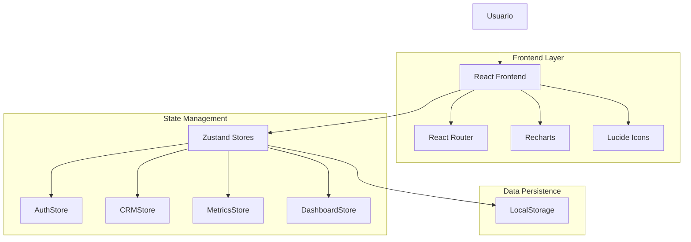
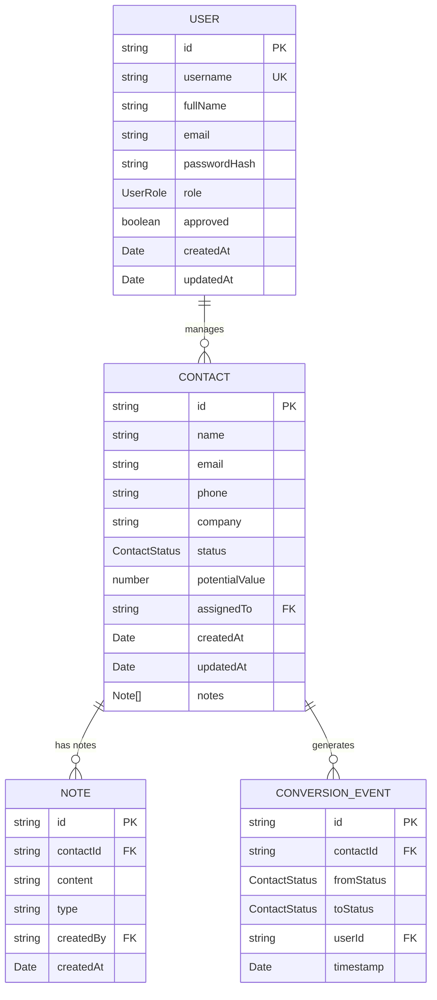

# Documentación de Arquitectura Técnica - CRM Cactus Dashboard

## 1. Diseño de Arquitectura



## 2. Descripción de Tecnologías

* **Frontend**: React\@18 + TypeScript + TailwindCSS\@3 + Vite

* **Routing**: React Router\@6

* **State Management**: Zustand con persistencia en LocalStorage

* **Charts**: Recharts para gráficos dinámicos y responsivos

* **Icons**: Lucide React para iconografía consistente

* **Styling**: TailwindCSS con clases utilitarias y diseño responsivo

## 3. Definiciones de Rutas

| Ruta | Propósito |
|------|----------|
| / | Página de inicio, redirección automática según estado de autenticación |
| /login | Página de inicio de sesión con validación de credenciales y manejo de sesiones |
| /register | Página de registro de usuarios con sistema de aprobación diferenciado por rol |
| /dashboard | Dashboard principal con métricas en tiempo real, gráficos dinámicos y actividad reciente |
| /crm | Página de gestión de contactos con filtros, estados, notas y tracking de conversiones |

## 4. Definiciones de Stores (Zustand)

### 4.1 AuthStore

**Estado:**
```typescript
interface AuthState {
  user: User | null;
  users: User[];
  isAuthenticated: boolean;
  isLoading: boolean;
}
```

**Acciones:**
- `login(username: string, password: string)`: Autenticación de usuario
- `register(userData: RegisterData)`: Registro de nuevo usuario
- `logout()`: Cerrar sesión y limpiar estado
- `approveUser(userId: string)`: Aprobar usuario pendiente
- `rejectUser(userId: string)`: Rechazar usuario pendiente
- `deleteUser(userId: string)`: Eliminar usuario del sistema

### 4.2 CRMStore

**Estado:**
```typescript
interface CRMState {
  contacts: Contact[];
  filteredContacts: Contact[];
  searchTerm: string;
  statusFilter: ContactStatus | 'all';
}
```

**Acciones:**
- `addContact(contact: Omit<Contact, 'id'>)`: Agregar nuevo contacto
- `updateContact(id: string, updates: Partial<Contact>)`: Actualizar contacto existente
- `deleteContact(id: string)`: Eliminar contacto
- `setSearchTerm(term: string)`: Filtrar por término de búsqueda
- `setStatusFilter(status: ContactStatus | 'all')`: Filtrar por estado
- `addNote(contactId: string, note: Omit<Note, 'id'>)`: Agregar nota a contacto

### 4.3 MetricsStore

**Estado:**
```typescript
interface MetricsState {
  totalContacts: number;
  activeProspects: number;
  conversionsThisMonth: number;
  conversionRate: number;
  averageTimeToConvert: number;
  pipelineDistribution: PipelineData[];
  conversionEvents: ConversionEvent[];
}
```

**Acciones:**
- `calculateMetrics()`: Recalcular todas las métricas
- `recordConversion(event: ConversionEvent)`: Registrar evento de conversión
- `getMetricsForUser(userId: string)`: Obtener métricas específicas de usuario
- `getTeamMetrics()`: Obtener métricas consolidadas del equipo

## 5. Modelo de Datos (TypeScript Interfaces)

### 5.1 Definición del Modelo de Datos



### 5.2 Definiciones de Tipos TypeScript

**Tipos Base**
```typescript
type ContactStatus = 
  | 'prospecto'
  | 'contactado'
  | 'primera_reunion'
  | 'segunda_reunion'
  | 'apertura'
  | 'cliente'
  | 'cuenta_vacia';

type UserRole = 'advisor' | 'manager' | 'admin';

type TimeFrame = 'day' | 'week' | 'month' | 'year';

type ChartType = 'bar' | 'line' | 'pie' | 'area';
```

**Interfaces Principales**
```typescript
interface User {
  id: string;
  username: string;
  fullName: string;
  email?: string;
  passwordHash: string;
  role: UserRole;
  approved: boolean;
  createdAt: Date;
  updatedAt: Date;
}

interface Contact {
  id: string;
  name: string;
  email?: string;
  phone?: string;
  company?: string;
  status: ContactStatus;
  potentialValue?: number;
  assignedTo?: string;
  createdAt: Date;
  updatedAt: Date;
  notes: Note[];
}

interface Note {
  id: string;
  contactId: string;
  content: string;
  type: 'llamada' | 'reunion' | 'email' | 'general';
  createdBy: string;
  createdAt: Date;
}

interface ConversionEvent {
  id: string;
  contactId: string;
  fromStatus: ContactStatus;
  toStatus: ContactStatus;
  userId: string;
  timestamp: Date;
}
```

**Interfaces de Métricas**
```typescript
interface MetricsSnapshot {
  totalContacts: number;
  activeProspects: number;
  conversionsThisMonth: number;
  conversionRate: number;
  averageTimeToConvert: number;
  pipelineDistribution: PipelineData[];
  timestamp: Date;
}

interface PipelineData {
  status: ContactStatus;
  count: number;
  percentage: number;
  color: string;
}

interface ChartDataPoint {
  name: string;
  value: number;
  date?: string;
  color?: string;
}
```

**Configuración de Persistencia Zustand**
```typescript
const persistConfig = {
  name: 'cactus-crm-storage',
  storage: createJSONStorage(() => localStorage),
  partialize: (state: any) => ({
    user: state.user,
    isAuthenticated: state.isAuthenticated,
    contacts: state.contacts,
    users: state.users
  })
};
```

