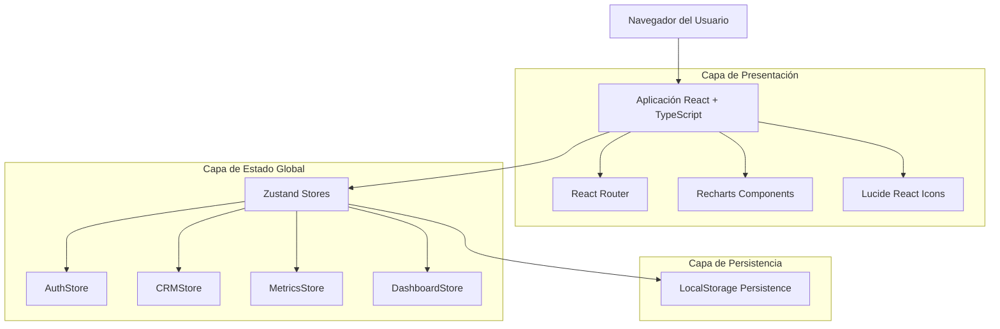
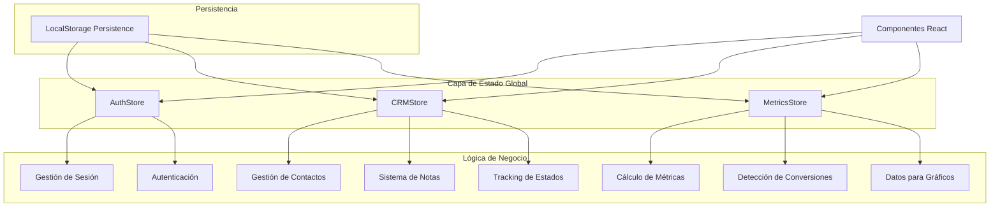
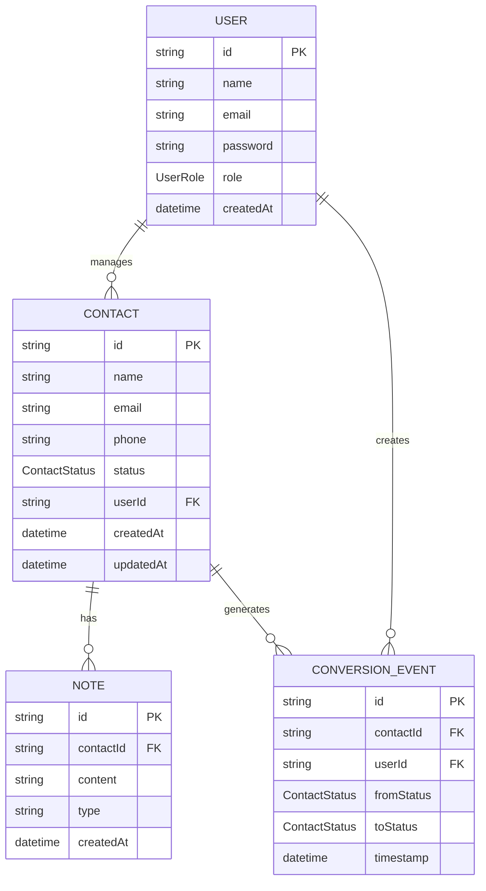

# Arquitectura Técnica - Dashboard CRM con Métricas en Tiempo Real

## 1. Diseño de Arquitectura



## 2. Descripción de Tecnologías

* **Frontend:** React\@18 + TypeScript + TailwindCSS@3 + Vite

* **Enrutamiento:** React Router DOM para navegación SPA

* **Estado Global:** Zustand con middleware de persistencia en LocalStorage

* **Gráficos:** Recharts para visualizaciones dinámicas y responsivas

* **Iconografía:** Lucide React para iconos consistentes y temáticos

* **Persistencia:** LocalStorage para datos de usuario y configuraciones

## 3. Definiciones de Rutas

| Ruta | Propósito |
|------|----------|
| / | Página de inicio con navegación principal y acceso rápido |
| /login | Página de autenticación de usuarios |
| /register | Página de registro de nuevos usuarios |
| /dashboard | Dashboard principal con métricas en tiempo real, gráficos dinámicos y KPIs |
| /crm | Gestión completa de contactos con tracking de estados y conversiones automáticas |

## 4. Definiciones de Stores (Zustand)

### 4.1 AuthStore

**Gestión de autenticación**
```typescript
interface AuthState {
  user: User | null
  isAuthenticated: boolean
  login: (email: string, password: string) => Promise<boolean>
  register: (userData: RegisterData) => Promise<boolean>
  logout: () => void
}
```

**Acciones principales:**
| Acción | Parámetros | Descripción |
|--------|------------|-------------|
| login | email: string, password: string | Autentica usuario y actualiza estado |
| register | userData: RegisterData | Registra nuevo usuario |
| logout | - | Limpia sesión y redirige |

### 4.2 CRMStore

**Gestión de contactos y notas**
```typescript
interface CRMState {
  contacts: Contact[]
  notes: Note[]
  addContact: (contact: Omit<Contact, 'id'>) => void
  updateContactStatus: (id: string, status: ContactStatus) => void
  deleteContact: (id: string) => void
  addNote: (contactId: string, content: string, type: string) => void
}
```

**Acciones principales:**
| Acción | Parámetros | Descripción |
|--------|------------|-------------|
| addContact | contact: Omit<Contact, 'id'> | Añade nuevo contacto con ID generado |
| updateContactStatus | id: string, status: ContactStatus | Actualiza estado y detecta conversiones |
| addNote | contactId: string, content: string, type: string | Añade nota con timestamp automático |

### 4.3 MetricsStore

**Cálculo y tracking de métricas**
```typescript
interface MetricsState {
  metrics: MetricsSnapshot
  timeFrame: TimeFrame
  calculateMetrics: () => void
  detectConversions: () => ConversionEvent[]
  updateTimeFrame: (timeFrame: TimeFrame) => void
}
```

**Métricas calculadas:**
| Métrica | Tipo | Descripción |
|---------|------|-------------|
| totalContacts | number | Total de contactos activos |
| conversions | number | Conversiones en período actual |
| conversionRate | number | Tasa de conversión porcentual |
| pipelineData | PipelineData[] | Distribución por estados |

## 5. Arquitectura de Stores



## 6. Modelo de Datos

### 6.1 Definición del Modelo de Datos



### 6.2 Definiciones de Tipos TypeScript

**Tipos Base**
```typescript
type ContactStatus = 'prospecto' | 'contactado' | 'reunion' | 'propuesta' | 'cerrado'
type UserRole = 'asesor' | 'manager' | 'admin'
type TimeFrame = 'day' | 'week' | 'month' | 'quarter'
type ChartType = 'line' | 'bar' | 'pie' | 'area'
```

**Interfaces Principales**
```typescript
interface User {
  id: string
  name: string
  email: string
  password: string
  role: UserRole
  createdAt: Date
}

interface Contact {
  id: string
  name: string
  email: string
  phone: string
  status: ContactStatus
  userId: string
  createdAt: Date
  updatedAt: Date
}

interface Note {
  id: string
  contactId: string
  content: string
  type: string
  createdAt: Date
}

interface ConversionEvent {
  id: string
  contactId: string
  userId: string
  fromStatus: ContactStatus
  toStatus: ContactStatus
  timestamp: Date
}
```

**Interfaces de Métricas y Dashboard**
```typescript
interface MetricsSnapshot {
  totalContacts: number
  conversions: number
  conversionRate: number
  pipelineData: PipelineData[]
  calculatedAt: Date
}

interface PipelineData {
  status: ContactStatus
  count: number
  percentage: number
  color: string
}

interface ChartDataPoint {
  name: string
  value: number
  date?: Date
  color?: string
}
```

**Interfaces de Stores Zustand**
```typescript
interface AuthState {
  user: User | null
  isAuthenticated: boolean
  login: (email: string, password: string) => Promise<boolean>
  register: (userData: RegisterData) => Promise<boolean>
  logout: () => void
}

interface CRMState {
  contacts: Contact[]
  notes: Note[]
  addContact: (contact: Omit<Contact, 'id'>) => void
  updateContactStatus: (id: string, status: ContactStatus) => void
  deleteContact: (id: string) => void
  addNote: (contactId: string, content: string, type: string) => void
}

interface MetricsState {
  metrics: MetricsSnapshot
  timeFrame: TimeFrame
  calculateMetrics: () => void
  detectConversions: () => ConversionEvent[]
  updateTimeFrame: (timeFrame: TimeFrame) => void
}
```

**Configuración de Persistencia Zustand**
```typescript
const persistConfig = {
  name: 'cactus-crm-storage',
  storage: createJSONStorage(() => localStorage),
  partialize: (state) => ({
    contacts: state.contacts,
    notes: state.notes,
    user: state.user,
    isAuthenticated: state.isAuthenticated
  })
}


```

### 6.3 Configuración de Persistencia

```typescript
// Configuración de Zustand con persistencia
const crmStore = create<CRMState>()(n  persist(
    (set, get) => ({
      // State inicial
      contacts: [],
      selectedContact: null,
      filters: defaultFilters,
      isLoading: false,
      
      // Actions con lógica de conversión automática
      updateContactStatus: async (id: string, newStatus: ContactStatus) => {
        const contact = get().contacts.find(c => c.id === id);
        if (!contact) throw new Error('Contact not found');
        
        const oldStatus = contact.status;
        const updatedContact = {
          ...contact,
          status: newStatus,
          updatedAt: new Date()
        };
        
        // Actualizar contacto
        set(state => ({
          contacts: state.contacts.map(c => 
            c.id === id ? updatedContact : c
          )
        }));
        
        // Registrar conversión si aplica
        const conversionEvent = checkForConversion(oldStatus, newStatus, contact);
        if (conversionEvent) {
          // Notificar al metrics store
          useMetricsStore.getState().recordConversion(conversionEvent);
          return conversionEvent;
        }
        
        return null;
      }
    }),
    {
      name: 'crm-storage',
      partialize: (state) => ({
        contacts: state.contacts,
        filters: state.filters
      })
    }
  )
);

// Función auxiliar para detectar conversiones
function checkForConversion(
  fromStatus: ContactStatus, 
  toStatus: ContactStatus, 
  contact: Contact
): ConversionEvent | null {
  const conversionPaths = [
    { from: 'Prospecto', to: 'Contactado' },
    { from: 'Contactado', to: 'Primera reunión' },
    { from: 'Primera reunión', to: 'Segunda reunión' },
    { from: 'Segunda reunión', to: 'Apertura' },
    { from: 'Apertura', to: 'Cliente' }
  ];
  
  const isConversion = conversionPaths.some(
    path => path.from === fromStatus && path.to === toStatus
  );
  
  if (isConversion) {
    return {
      id: generateId(),
      contactId: contact.id,
      fromStatus,
      toStatus,
      timestamp: new Date(),
      userId: contact.assignedTo,
      value: contact.value
    };
  }
  
  return null;
}
```

