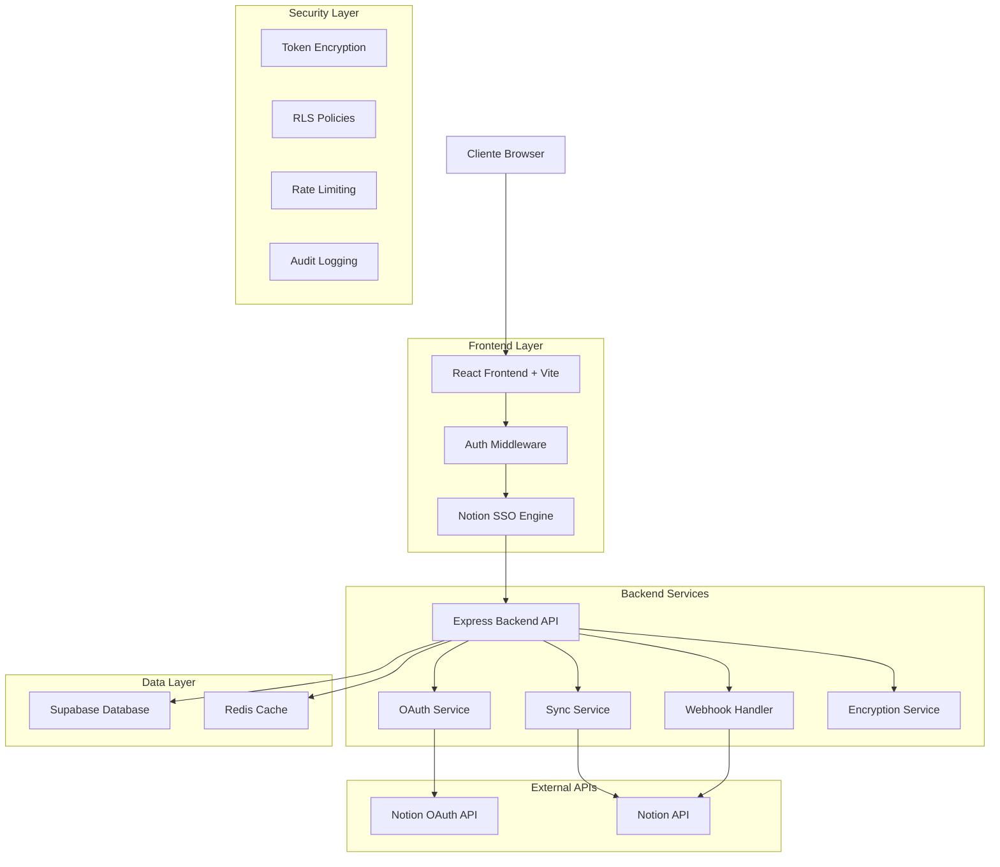
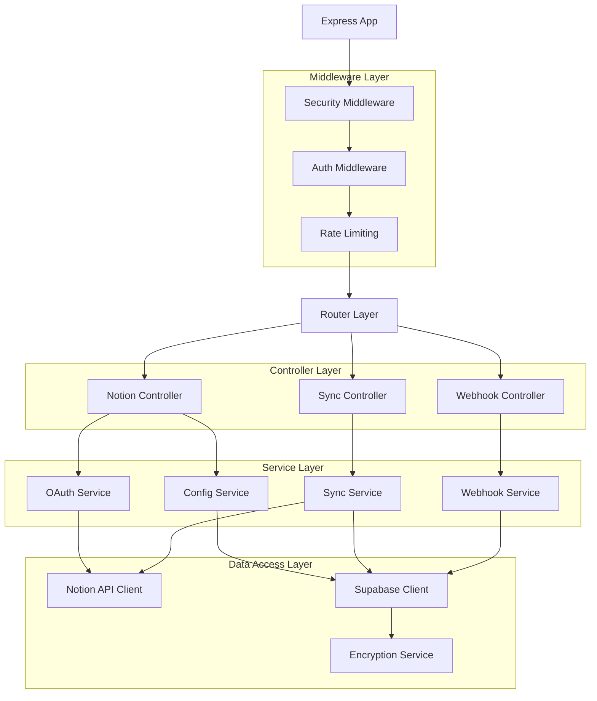
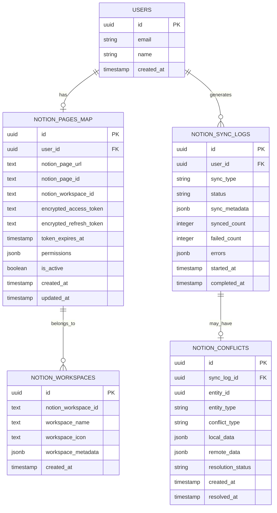

# Arquitectura Técnica - Sistema de Integración Notion CRM con SSO Avanzado

## 1. Diseño de Arquitectura



## 2. Descripción de Tecnologías

### Frontend Stack
- **React@18** + **TypeScript@5** + **Vite@5** - Framework principal con tooling moderno
- **React Router DOM@7** - Navegación SPA con lazy loading
- **Zustand@5** - Estado global ligero y performante
- **TailwindCSS@3** - Styling utility-first con design system
- **Lucide React** - Iconografía consistente y optimizada
- **React Query@5** - Cache y sincronización de estado servidor

### Backend Stack
- **Express@4** + **TypeScript@5** - API REST con tipado fuerte
- **@supabase/supabase-js@2** - Cliente de base de datos y auth
- **@notionhq/client@2** - SDK oficial de Notion
- **jsonwebtoken@9** - Manejo de JWT para auth
- **crypto-js@4** - Encriptación de tokens sensibles
- **redis@4** - Cache distribuido y session store

### Base de Datos y Cache
- **Supabase (PostgreSQL@15)** - Base de datos principal con RLS
- **Redis@7** - Cache de sesiones y rate limiting

### Seguridad y Monitoreo
- **helmet@7** - Headers de seguridad HTTP
- **cors@2** - Configuración CORS estricta
- **express-rate-limit@7** - Rate limiting por endpoint
- **winston@3** - Logging estructurado y auditoría

## 3. Definiciones de Rutas

### Frontend Routes
| Ruta | Propósito | Componente | Permisos |
|------|-----------|------------|----------|
| `/notion-crm` | Página principal de Notion CRM con SSO | `NotionCRM.tsx` | `authenticated` |
| `/notion-crm/setup` | Configuración inicial de OAuth | `NotionSetup.tsx` | `authenticated` |
| `/notion-crm/sync` | Dashboard de sincronización | `NotionSync.tsx` | `authenticated` |
| `/admin/notion` | Panel administrativo de Notion | `NotionAdmin.tsx` | `canManageTeam` |

### Backend API Routes
| Endpoint | Método | Propósito | Auth Required |
|----------|--------|-----------|---------------|
| `/api/notion/me` | GET | Obtener configuración del usuario | ✅ |
| `/api/notion/config` | POST/PUT | Actualizar configuración de usuario | ✅ |
| `/api/notion/oauth/start` | GET | Iniciar flujo OAuth 2.0 | ✅ |
| `/api/notion/oauth/callback` | GET | Callback de OAuth con PKCE | ✅ |
| `/api/notion/oauth/refresh` | POST | Renovar tokens expirados | ✅ |
| `/api/notion/oauth/revoke` | DELETE | Revocar acceso OAuth | ✅ |
| `/api/notion/sync/contacts` | POST | Sincronizar contactos a Notion | ✅ |
| `/api/notion/sync/tasks` | POST | Sincronizar tareas a Notion | ✅ |
| `/api/notion/webhooks/notion` | POST | Webhook de cambios desde Notion | 🔐 |
| `/api/notion/workspaces` | GET | Listar workspaces disponibles | ✅ |
| `/api/notion/pages` | GET | Listar páginas del workspace | ✅ |

## 4. Definiciones de API

### 4.1 Autenticación y Configuración

**Obtener configuración del usuario**
```typescript
GET /api/notion/me
```

Headers:
```typescript
Authorization: Bearer <supabase_jwt_token>
Content-Type: application/json
```

Response (200):
```typescript
{
  "user_id": "uuid",
  "notion_page_url": "https://notion.so/workspace/page",
  "workspace_id": "workspace_uuid",
  "is_connected": true,
  "last_sync": "2024-01-20T10:30:00Z",
  "sync_enabled": true,
  "permissions": ["read", "write"]
}
```

**Iniciar OAuth 2.0 con PKCE**
```typescript
GET /api/notion/oauth/start
```

Query Parameters:
```typescript
{
  "redirect_uri": "https://app.cactus.com/notion-crm",
  "state": "random_csrf_token"
}
```

Response (302): Redirect a Notion OAuth

### 4.2 Sincronización de Datos

**Sincronizar contactos a Notion**
```typescript
POST /api/notion/sync/contacts
```

Request Body:
```typescript
{
  "contact_ids": ["uuid1", "uuid2"],
  "sync_mode": "incremental" | "full",
  "target_database_id": "notion_database_id"
}
```

Response (200):
```typescript
{
  "sync_id": "sync_uuid",
  "status": "processing" | "completed" | "failed",
  "synced_count": 25,
  "failed_count": 2,
  "errors": [
    {
      "contact_id": "uuid",
      "error": "Duplicate entry",
      "code": "NOTION_DUPLICATE"
    }
  ]
}
```

### 4.3 Webhooks

**Webhook de Notion**
```typescript
POST /api/notion/webhooks/notion
```

Headers:
```typescript
Notion-Webhook-Signature: <hmac_signature>
Content-Type: application/json
```

Request Body:
```typescript
{
  "object": "event",
  "id": "event_id",
  "created_time": "2024-01-20T10:30:00Z",
  "last_edited_time": "2024-01-20T10:30:00Z",
  "type": "page.updated" | "database.updated",
  "page": {
    "id": "page_id",
    "properties": { /* page properties */ }
  }
}
```

## 5. Arquitectura del Servidor



### 5.1 Servicios Principales

**OAuth Service**
```typescript
class OAuthService {
  async startOAuthFlow(userId: string, redirectUri: string): Promise<string>
  async handleCallback(code: string, state: string): Promise<TokenResponse>
  async refreshToken(userId: string): Promise<TokenResponse>
  async revokeToken(userId: string): Promise<void>
}
```

**Sync Service**
```typescript
class SyncService {
  async syncContactsToNotion(userId: string, contactIds: string[]): Promise<SyncResult>
  async syncTasksToNotion(userId: string, taskIds: string[]): Promise<SyncResult>
  async handleNotionWebhook(event: NotionWebhookEvent): Promise<void>
  async detectConflicts(userId: string): Promise<Conflict[]>
}
```

**Encryption Service**
```typescript
class EncryptionService {
  encrypt(data: string, userId: string): string
  decrypt(encryptedData: string, userId: string): string
  generateUserKey(userId: string): string
  rotateKeys(): Promise<void>
}
```

## 6. Modelo de Datos

### 6.1 Definición del Modelo de Datos



### 6.2 Lenguaje de Definición de Datos

**Tabla notion_pages_map (Actualizada)**
```sql
-- Migración: Actualizar tabla notion_pages_map para SSO avanzado
CREATE TABLE IF NOT EXISTS public.notion_pages_map (
    id UUID DEFAULT gen_random_uuid() PRIMARY KEY,
    user_id UUID NOT NULL REFERENCES auth.users(id) ON DELETE CASCADE,
    notion_page_url TEXT,
    notion_page_id TEXT,
    notion_workspace_id TEXT,
    encrypted_access_token TEXT, -- Token OAuth encriptado
    encrypted_refresh_token TEXT, -- Refresh token encriptado
    token_expires_at TIMESTAMPTZ, -- Expiración del access token
    permissions JSONB DEFAULT '[]'::jsonb, -- Permisos otorgados
    sync_enabled BOOLEAN DEFAULT true, -- Sincronización habilitada
    last_sync_at TIMESTAMPTZ, -- Última sincronización exitosa
    is_active BOOLEAN DEFAULT true,
    created_at TIMESTAMPTZ DEFAULT NOW(),
    updated_at TIMESTAMPTZ DEFAULT NOW(),
    
    UNIQUE(user_id) -- Un usuario, una configuración
);

-- Tabla para workspaces de Notion
CREATE TABLE IF NOT EXISTS public.notion_workspaces (
    id UUID DEFAULT gen_random_uuid() PRIMARY KEY,
    notion_workspace_id TEXT UNIQUE NOT NULL,
    workspace_name TEXT NOT NULL,
    workspace_icon TEXT,
    workspace_metadata JSONB DEFAULT '{}'::jsonb,
    created_at TIMESTAMPTZ DEFAULT NOW()
);

-- Tabla para logs de sincronización
CREATE TABLE IF NOT EXISTS public.notion_sync_logs (
    id UUID DEFAULT gen_random_uuid() PRIMARY KEY,
    user_id UUID NOT NULL REFERENCES auth.users(id) ON DELETE CASCADE,
    sync_type TEXT NOT NULL CHECK (sync_type IN ('contacts', 'tasks', 'notes', 'full')),
    status TEXT NOT NULL CHECK (status IN ('pending', 'processing', 'completed', 'failed', 'cancelled')),
    sync_metadata JSONB DEFAULT '{}'::jsonb,
    synced_count INTEGER DEFAULT 0,
    failed_count INTEGER DEFAULT 0,
    errors JSONB DEFAULT '[]'::jsonb,
    started_at TIMESTAMPTZ DEFAULT NOW(),
    completed_at TIMESTAMPTZ
);

-- Tabla para conflictos de sincronización
CREATE TABLE IF NOT EXISTS public.notion_conflicts (
    id UUID DEFAULT gen_random_uuid() PRIMARY KEY,
    sync_log_id UUID NOT NULL REFERENCES notion_sync_logs(id) ON DELETE CASCADE,
    entity_id UUID NOT NULL, -- ID de la entidad en conflicto
    entity_type TEXT NOT NULL CHECK (entity_type IN ('contact', 'task', 'note')),
    conflict_type TEXT NOT NULL CHECK (conflict_type IN ('duplicate', 'modified', 'deleted')),
    local_data JSONB NOT NULL, -- Datos locales
    remote_data JSONB NOT NULL, -- Datos remotos
    resolution_status TEXT DEFAULT 'pending' CHECK (resolution_status IN ('pending', 'resolved_local', 'resolved_remote', 'resolved_merge')),
    created_at TIMESTAMPTZ DEFAULT NOW(),
    resolved_at TIMESTAMPTZ
);

-- Índices optimizados
CREATE INDEX IF NOT EXISTS idx_notion_pages_map_user_id ON notion_pages_map(user_id);
CREATE INDEX IF NOT EXISTS idx_notion_pages_map_workspace_id ON notion_pages_map(notion_workspace_id);
CREATE INDEX IF NOT EXISTS idx_notion_pages_map_active ON notion_pages_map(is_active) WHERE is_active = true;
CREATE INDEX IF NOT EXISTS idx_notion_sync_logs_user_id ON notion_sync_logs(user_id);
CREATE INDEX IF NOT EXISTS idx_notion_sync_logs_status ON notion_sync_logs(status);
CREATE INDEX IF NOT EXISTS idx_notion_sync_logs_started_at ON notion_sync_logs(started_at DESC);
CREATE INDEX IF NOT EXISTS idx_notion_conflicts_sync_log_id ON notion_conflicts(sync_log_id);
CREATE INDEX IF NOT EXISTS idx_notion_conflicts_status ON notion_conflicts(resolution_status);

-- Políticas RLS (Row Level Security)
ALTER TABLE notion_pages_map ENABLE ROW LEVEL SECURITY;
ALTER TABLE notion_sync_logs ENABLE ROW LEVEL SECURITY;
ALTER TABLE notion_conflicts ENABLE ROW LEVEL SECURITY;

-- Políticas para notion_pages_map
CREATE POLICY "Users can manage own notion config" ON notion_pages_map
    FOR ALL USING (auth.uid() = user_id);

-- Políticas para notion_sync_logs
CREATE POLICY "Users can view own sync logs" ON notion_sync_logs
    FOR SELECT USING (auth.uid() = user_id);

CREATE POLICY "System can insert sync logs" ON notion_sync_logs
    FOR INSERT WITH CHECK (auth.uid() = user_id);

-- Políticas para notion_conflicts
CREATE POLICY "Users can view own conflicts" ON notion_conflicts
    FOR SELECT USING (
        EXISTS (
            SELECT 1 FROM notion_sync_logs nsl 
            WHERE nsl.id = sync_log_id AND nsl.user_id = auth.uid()
        )
    );

-- Permisos para roles
GRANT SELECT ON notion_workspaces TO authenticated;
GRANT ALL PRIVILEGES ON notion_pages_map TO authenticated;
GRANT SELECT, INSERT ON notion_sync_logs TO authenticated;
GRANT SELECT, UPDATE ON notion_conflicts TO authenticated;

-- Funciones para triggers
CREATE OR REPLACE FUNCTION update_notion_pages_map_updated_at()
RETURNS TRIGGER AS $$
BEGIN
    NEW.updated_at = NOW();
    RETURN NEW;
END;
$$ LANGUAGE plpgsql;

-- Triggers
CREATE TRIGGER update_notion_pages_map_updated_at_trigger
    BEFORE UPDATE ON notion_pages_map
    FOR EACH ROW
    EXECUTE FUNCTION update_notion_pages_map_updated_at();
```

## 7. Configuración de Seguridad

### 7.1 Variables de Entorno

```bash
# Notion OAuth Configuration
NOTION_CLIENT_ID="notion_oauth_client_id"
NOTION_CLIENT_SECRET="notion_oauth_client_secret"
NOTION_REDIRECT_URI="https://app.cactus.com/api/notion/oauth/callback"
NOTION_WEBHOOK_SECRET="webhook_secret_from_notion"

# Encryption
ENCRYPTION_KEY="32_character_random_key_for_aes_256"
ENCRYPTION_ALGORITHM="aes-256-gcm"

# Redis Configuration
REDIS_URL="redis://localhost:6379"
REDIS_SESSION_PREFIX="notion_session:"
REDIS_CACHE_TTL=3600

# Rate Limiting
RATE_LIMIT_WINDOW_MS=900000 # 15 minutes
RATE_LIMIT_MAX_REQUESTS=100
RATE_LIMIT_OAUTH_MAX=5 # OAuth attempts per window

# Monitoring
LOG_LEVEL="info"
AUDIT_LOG_ENABLED=true
METRICS_ENABLED=true
```

### 7.2 Configuración de CORS y Seguridad

```typescript
// Security middleware configuration
const securityConfig = {
  cors: {
    origin: process.env.FRONTEND_URL,
    credentials: true,
    optionsSuccessStatus: 200
  },
  helmet: {
    contentSecurityPolicy: {
      directives: {
        defaultSrc: ["'self'"],
        frameSrc: ["'self'", "https://*.notion.so", "https://*.notion.site"],
        connectSrc: ["'self'", "https://api.notion.com"],
        imgSrc: ["'self'", "data:", "https://*.notion.so"]
      }
    }
  },
  rateLimiting: {
    windowMs: 15 * 60 * 1000, // 15 minutes
    max: 100, // limit each IP to 100 requests per windowMs
    standardHeaders: true,
    legacyHeaders: false
  }
};
```

## 8. Monitoreo y Observabilidad

### 8.1 Métricas Clave

```typescript
// Métricas de aplicación
interface NotionMetrics {
  // Performance
  sso_login_duration: Histogram;
  api_request_duration: Histogram;
  sync_operation_duration: Histogram;
  
  // Business
  active_oauth_connections: Gauge;
  daily_sync_operations: Counter;
  sync_success_rate: Gauge;
  
  // Errors
  oauth_failures: Counter;
  sync_failures: Counter;
  api_errors: Counter;
  
  // Security
  failed_auth_attempts: Counter;
  token_refresh_operations: Counter;
  suspicious_activity_alerts: Counter;
}
```

### 8.2 Logging Estructurado

```typescript
// Estructura de logs
interface LogEntry {
  timestamp: string;
  level: 'info' | 'warn' | 'error' | 'debug';
  service: 'notion-oauth' | 'notion-sync' | 'notion-webhook';
  user_id?: string;
  session_id?: string;
  operation: string;
  duration_ms?: number;
  metadata: Record<string, any>;
  error?: {
    message: string;
    stack?: string;
    code?: string;
  };
}
```

### 8.3 Alertas y Notificaciones

```typescript
// Configuración de alertas
const alertConfig = {
  oauth_failure_rate: {
    threshold: 0.05, // 5% failure rate
    window: '5m',
    severity: 'warning'
  },
  sync_failure_rate: {
    threshold: 0.02, // 2% failure rate
    window: '10m',
    severity: 'critical'
  },
  token_expiry_soon: {
    threshold: '24h', // 24 hours before expiry
    severity: 'info'
  },
  suspicious_activity: {
    threshold: 1, // immediate alert
    severity: 'critical'
  }
};
```

Esta arquitectura técnica proporciona una base sólida y escalable para el sistema de integración Notion CRM con SSO automático, priorizando la seguridad, el rendimiento y la experiencia del usuario.