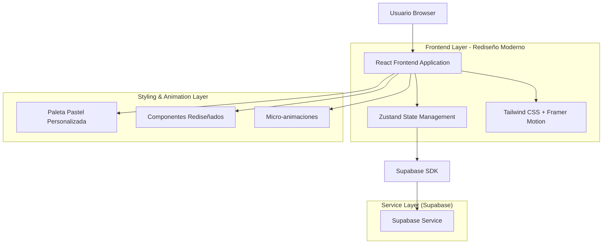
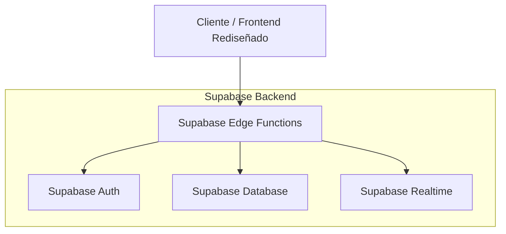
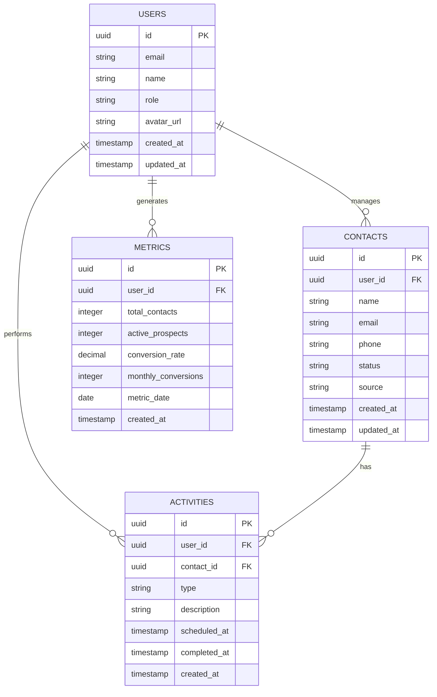

# Arquitectura Técnica - Rediseño Moderno CRM Cactus Dashboard

## 1. Diseño de Arquitectura



## 2. Descripción de Tecnologías

- **Frontend:** React@18 + TypeScript + Vite
- **Styling:** Tailwind CSS@3 + Paleta Pastel Personalizada
- **Animaciones:** Framer Motion@10 + CSS Transitions
- **State Management:** Zustand (existente)
- **Icons:** Emojis de alta resolución + Lucide React
- **Backend:** Supabase (PostgreSQL + Auth + Real-time)

## 3. Definiciones de Rutas

| Ruta | Propósito | Rediseño Aplicado |
|------|-----------|------------------|
| / | Página principal con dashboard moderno | Métricas con emojis, paleta pastel, espaciado generoso |
| /login | Página de autenticación minimalista | Formulario limpio, colores suaves, micro-animaciones |
| /dashboard | Dashboard principal rediseñado | Layout simplificado, tarjetas elegantes, navegación intuitiva |
| /crm | Gestión de contactos moderna | Tabla limpia, filtros visuales, estados con emojis |
| /team | Panel de equipo renovado | Métricas consolidadas, comparativas visuales |
| /admin | Panel administrativo elegante | Interface limpia, formularios minimalistas |
| /profile | Perfil de usuario contemporáneo | Configuración personal con diseño moderno |

## 4. Definiciones de API

### 4.1 API Principal

**Autenticación de usuarios**
```
POST /auth/v1/token
```

Request:
| Parámetro | Tipo | Requerido | Descripción |
|-----------|------|-----------|-------------|
| email | string | true | Email del usuario |
| password | string | true | Contraseña |

Response:
| Parámetro | Tipo | Descripción |
|-----------|------|-------------|
| access_token | string | Token de acceso JWT |
| user | object | Información del usuario |

**Métricas en tiempo real**
```
GET /rest/v1/metrics
```

Response:
| Parámetro | Tipo | Descripción |
|-----------|------|-------------|
| totalContacts | number | Total de contactos |
| activeProspects | number | Prospectos activos |
| conversionRate | number | Tasa de conversión |
| monthlyConversions | number | Conversiones del mes |

## 5. Arquitectura del Servidor



## 6. Modelo de Datos

### 6.1 Definición del Modelo de Datos



### 6.2 Lenguaje de Definición de Datos

**Tabla de Usuarios (users)**
```sql
-- Crear tabla de usuarios
CREATE TABLE users (
    id UUID PRIMARY KEY DEFAULT gen_random_uuid(),
    email VARCHAR(255) UNIQUE NOT NULL,
    name VARCHAR(100) NOT NULL,
    role VARCHAR(20) DEFAULT 'advisor' CHECK (role IN ('advisor', 'manager', 'admin')),
    avatar_url TEXT,
    created_at TIMESTAMP WITH TIME ZONE DEFAULT NOW(),
    updated_at TIMESTAMP WITH TIME ZONE DEFAULT NOW()
);

-- Políticas de seguridad para el rediseño
ALTER TABLE users ENABLE ROW LEVEL SECURITY;

CREATE POLICY "Users can view own profile" ON users
    FOR SELECT USING (auth.uid() = id);

CREATE POLICY "Users can update own profile" ON users
    FOR UPDATE USING (auth.uid() = id);

-- Permisos para roles anónimos y autenticados
GRANT SELECT ON users TO anon;
GRANT ALL PRIVILEGES ON users TO authenticated;
```

**Tabla de Contactos (contacts)**
```sql
-- Crear tabla de contactos
CREATE TABLE contacts (
    id UUID PRIMARY KEY DEFAULT gen_random_uuid(),
    user_id UUID REFERENCES users(id) ON DELETE CASCADE,
    name VARCHAR(100) NOT NULL,
    email VARCHAR(255),
    phone VARCHAR(20),
    status VARCHAR(20) DEFAULT 'prospect' CHECK (status IN ('prospect', 'active', 'converted', 'inactive')),
    source VARCHAR(50),
    notes TEXT,
    created_at TIMESTAMP WITH TIME ZONE DEFAULT NOW(),
    updated_at TIMESTAMP WITH TIME ZONE DEFAULT NOW()
);

-- Índices para optimización
CREATE INDEX idx_contacts_user_id ON contacts(user_id);
CREATE INDEX idx_contacts_status ON contacts(status);
CREATE INDEX idx_contacts_created_at ON contacts(created_at DESC);

-- Políticas de seguridad
ALTER TABLE contacts ENABLE ROW LEVEL SECURITY;

CREATE POLICY "Users can manage own contacts" ON contacts
    FOR ALL USING (auth.uid() = user_id);

CREATE POLICY "Managers can view team contacts" ON contacts
    FOR SELECT USING (
        EXISTS (
            SELECT 1 FROM users 
            WHERE users.id = auth.uid() 
            AND users.role IN ('manager', 'admin')
        )
    );

-- Permisos
GRANT SELECT ON contacts TO anon;
GRANT ALL PRIVILEGES ON contacts TO authenticated;
```

**Tabla de Actividades (activities)**
```sql
-- Crear tabla de actividades
CREATE TABLE activities (
    id UUID PRIMARY KEY DEFAULT gen_random_uuid(),
    user_id UUID REFERENCES users(id) ON DELETE CASCADE,
    contact_id UUID REFERENCES contacts(id) ON DELETE CASCADE,
    type VARCHAR(50) NOT NULL CHECK (type IN ('call', 'meeting', 'email', 'follow_up', 'note')),
    description TEXT,
    scheduled_at TIMESTAMP WITH TIME ZONE,
    completed_at TIMESTAMP WITH TIME ZONE,
    created_at TIMESTAMP WITH TIME ZONE DEFAULT NOW()
);

-- Índices
CREATE INDEX idx_activities_user_id ON activities(user_id);
CREATE INDEX idx_activities_contact_id ON activities(contact_id);
CREATE INDEX idx_activities_scheduled_at ON activities(scheduled_at);
CREATE INDEX idx_activities_type ON activities(type);

-- Políticas de seguridad
ALTER TABLE activities ENABLE ROW LEVEL SECURITY;

CREATE POLICY "Users can manage own activities" ON activities
    FOR ALL USING (auth.uid() = user_id);

-- Permisos
GRANT SELECT ON activities TO anon;
GRANT ALL PRIVILEGES ON activities TO authenticated;
```

**Tabla de Métricas (metrics)**
```sql
-- Crear tabla de métricas para el dashboard rediseñado
CREATE TABLE metrics (
    id UUID PRIMARY KEY DEFAULT gen_random_uuid(),
    user_id UUID REFERENCES users(id) ON DELETE CASCADE,
    total_contacts INTEGER DEFAULT 0,
    active_prospects INTEGER DEFAULT 0,
    conversion_rate DECIMAL(5,2) DEFAULT 0.00,
    monthly_conversions INTEGER DEFAULT 0,
    metric_date DATE DEFAULT CURRENT_DATE,
    created_at TIMESTAMP WITH TIME ZONE DEFAULT NOW()
);

-- Índices
CREATE INDEX idx_metrics_user_id ON metrics(user_id);
CREATE INDEX idx_metrics_date ON metrics(metric_date DESC);

-- Constraint para evitar duplicados por usuario y fecha
CREATE UNIQUE INDEX idx_metrics_user_date ON metrics(user_id, metric_date);

-- Políticas de seguridad
ALTER TABLE metrics ENABLE ROW LEVEL SECURITY;

CREATE POLICY "Users can view own metrics" ON metrics
    FOR SELECT USING (auth.uid() = user_id);

CREATE POLICY "System can insert metrics" ON metrics
    FOR INSERT WITH CHECK (true);

-- Permisos
GRANT SELECT ON metrics TO anon;
GRANT ALL PRIVILEGES ON metrics TO authenticated;
```

**Función para calcular métricas automáticamente**
```sql
-- Función para actualizar métricas diarias
CREATE OR REPLACE FUNCTION update_daily_metrics()
RETURNS void AS $$
BEGIN
    INSERT INTO metrics (user_id, total_contacts, active_prospects, conversion_rate, monthly_conversions, metric_date)
    SELECT 
        u.id as user_id,
        COALESCE(contact_counts.total, 0) as total_contacts,
        COALESCE(contact_counts.active, 0) as active_prospects,
        COALESCE(conversion_stats.rate, 0.00) as conversion_rate,
        COALESCE(conversion_stats.monthly, 0) as monthly_conversions,
        CURRENT_DATE as metric_date
    FROM users u
    LEFT JOIN (
        SELECT 
            user_id,
            COUNT(*) as total,
            COUNT(CASE WHEN status IN ('prospect', 'active') THEN 1 END) as active
        FROM contacts 
        GROUP BY user_id
    ) contact_counts ON u.id = contact_counts.user_id
    LEFT JOIN (
        SELECT 
            c.user_id,
            CASE 
                WHEN COUNT(*) > 0 THEN 
                    ROUND((COUNT(CASE WHEN c.status = 'converted' THEN 1 END) * 100.0 / COUNT(*)), 2)
                ELSE 0.00 
            END as rate,
            COUNT(CASE 
                WHEN c.status = 'converted' 
                AND c.updated_at >= DATE_TRUNC('month', CURRENT_DATE) 
                THEN 1 
            END) as monthly
        FROM contacts c
        GROUP BY c.user_id
    ) conversion_stats ON u.id = conversion_stats.user_id
    ON CONFLICT (user_id, metric_date) 
    DO UPDATE SET
        total_contacts = EXCLUDED.total_contacts,
        active_prospects = EXCLUDED.active_prospects,
        conversion_rate = EXCLUDED.conversion_rate,
        monthly_conversions = EXCLUDED.monthly_conversions,
        created_at = NOW();
END;
$$ LANGUAGE plpgsql;
```

**Datos iniciales para desarrollo**
```sql
-- Insertar usuarios de prueba
INSERT INTO users (email, name, role) VALUES
('gio@cactuscrm.com', 'Gio Admin', 'admin'),
('manager@cactuscrm.com', 'Manager Demo', 'manager'),
('advisor@cactuscrm.com', 'Advisor Demo', 'advisor');

-- Insertar contactos de ejemplo
INSERT INTO contacts (user_id, name, email, phone, status, source) 
SELECT 
    u.id,
    'Contacto ' || generate_series(1, 10),
    'contacto' || generate_series(1, 10) || '@example.com',
    '+34 6' || LPAD(generate_series(1, 10)::text, 8, '0'),
    CASE (generate_series(1, 10) % 4)
        WHEN 0 THEN 'prospect'
        WHEN 1 THEN 'active'
        WHEN 2 THEN 'converted'
        ELSE 'inactive'
    END,
    CASE (generate_series(1, 10) % 3)
        WHEN 0 THEN 'web'
        WHEN 1 THEN 'referral'
        ELSE 'social'
    END
FROM users u WHERE u.role = 'advisor';
```

## 7. Especificaciones de Implementación del Rediseño

### 7.1 Configuración de Tailwind Personalizada

```javascript
// Extensión de tailwind.config.js para paleta pastel
module.exports = {
  theme: {
    extend: {
      colors: {
        // Paleta Pastel Moderna
        pastel: {
          mint: {
            50: '#F0FDF4',
            100: '#E8F5E8',
            200: '#D1F2D1',
            300: '#A7E6A7',
            400: '#7DD87D',
            500: '#4ADE80',
          },
          lavender: {
            50: '#FAF5FF',
            100: '#F0E6FF',
            200: '#E1CCFF',
            300: '#C7A6FF',
            400: '#A855F7',
            500: '#9333EA',
          },
          peach: {
            50: '#FFF7ED',
            100: '#FFE5D9',
            200: '#FFCAB0',
            300: '#FFA876',
            400: '#FF8A3D',
            500: '#F97316',
          },
          sky: {
            50: '#F0F9FF',
            100: '#E3F2FD',
            200: '#BBDEFB',
            300: '#90CAF9',
            400: '#42A5F5',
            500: '#2196F3',
          }
        }
      },
      spacing: {
        '18': '4.5rem',
        '88': '22rem',
      },
      animation: {
        'fade-in-up': 'fadeInUp 0.3s ease-out',
        'scale-in': 'scaleIn 0.2s ease-out',
        'slide-in-right': 'slideInRight 0.3s ease-out',
      }
    }
  }
}
```

### 7.2 Componentes Rediseñados

**MetricCard Moderno:**
- Padding: 24px
- Border radius: 16px
- Box shadow: 0 4px 12px rgba(0,0,0,0.05)
- Hover effect: transform scale(1.02)
- Emoji size: 32px
- Typography: Inter font family

**Sidebar Minimalista:**
- Width: 240px (expanded) / 64px (collapsed)
- Background: Linear gradient pastel
- Item padding: 12px 16px
- Active state: Background pastel + border left
- Transition: all 0.2s ease

**Header Simplificado:**
- Height: 64px
- Background: White with subtle shadow
- Title: Single, no redundancy
- Avatar: 40px circular with dropdown
- Notifications: Badge with pastel background

Esta arquitectura técnica proporciona la base sólida para implementar el rediseño moderno, minimalista y fresco del CRM Cactus Dashboard, manteniendo la funcionalidad existente mientras mejora significativamente la experiencia visual y de usuario.