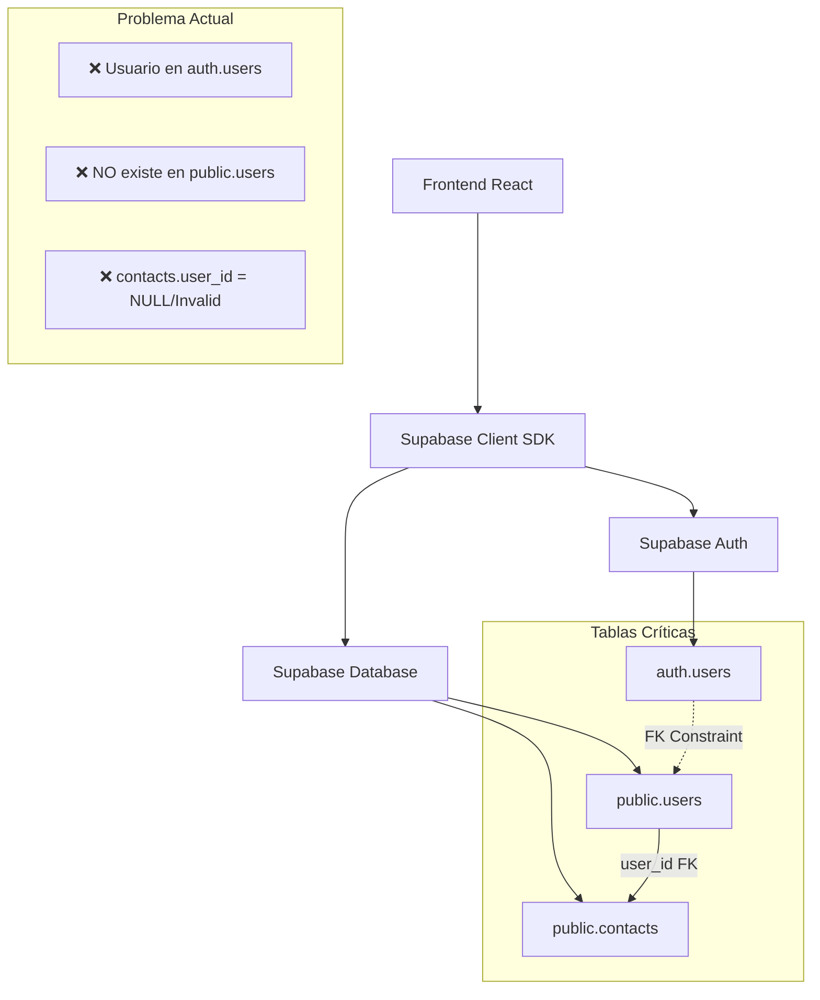
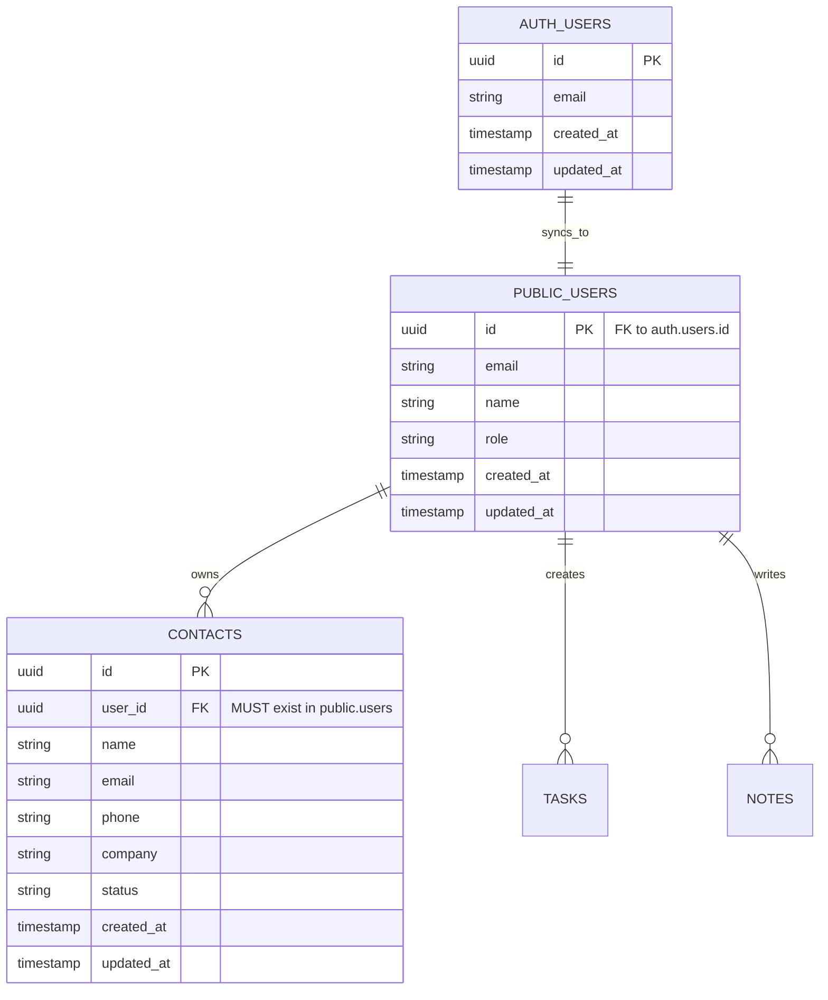
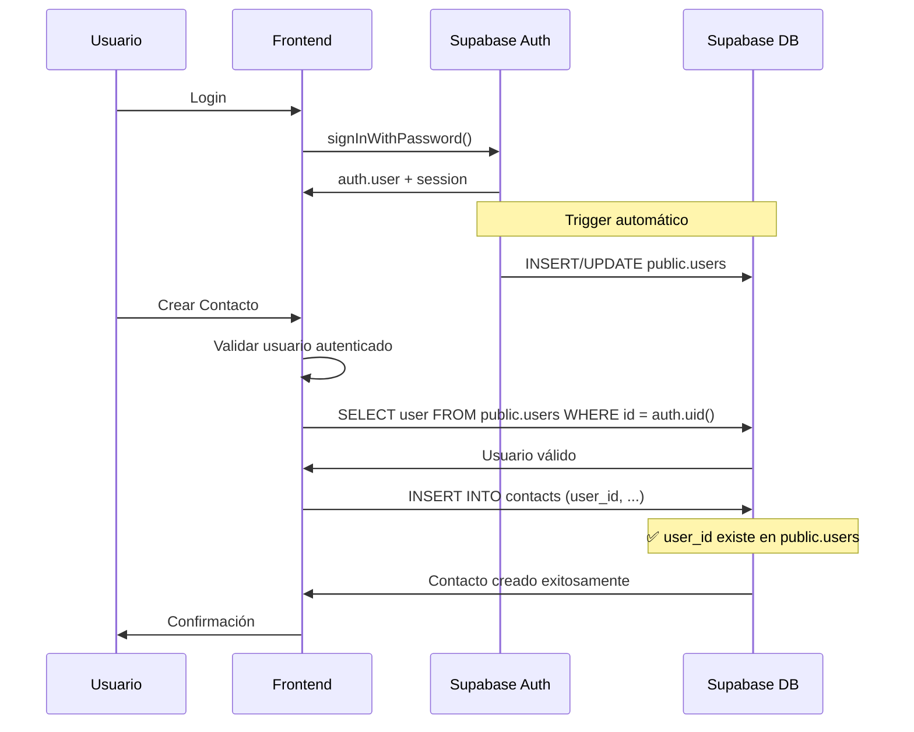

# Arquitectura Técnica - Reparación Sistema CRM

## 1. Arquitectura de Datos Actual



## 2. Descripción de Tecnologías

- **Frontend:** React@18 + TypeScript + Vite + TailwindCSS
- **Backend:** Supabase (PostgreSQL + Auth + RLS)
- **Estado:** Zustand stores
- **Validación:** Zod schemas

## 3. Definiciones de Rutas Críticas

| Ruta | Propósito | Estado Actual |
|------|-----------|---------------|
| `/crm` | Página principal CRM con lista de contactos | ✅ Funcional |
| `/crm/new` | Formulario crear nuevo contacto | ❌ **BLOQUEADO** |
| `/crm/edit/:id` | Editar contacto existente | ⚠️ Parcial |
| `/login` | Autenticación de usuarios | ✅ Funcional |
| `/profile` | Perfil de usuario | ⚠️ Requiere verificación |

## 4. APIs Críticas Afectadas

### 4.1 API de Contactos (Supabase)

**Crear Contacto**
```typescript
// ACTUAL (FALLA)
const { data, error } = await supabase
  .from('contacts')
  .insert({
    user_id: user.id, // ❌ Este user.id no existe en public.users
    name: contactData.name,
    email: contactData.email,
    phone: contactData.phone
  });
```

**Error Response:**
```json
{
  "code": "23503",
  "details": "Key is not present in table 'users'.",
  "hint": null,
  "message": "insert or update on table 'contacts' violates foreign key constraint 'contacts_user_id_fkey'"
}
```

### 4.2 API de Autenticación

**Obtener Usuario Actual**
```typescript
// Verificar usuario autenticado
const { data: { user }, error } = await supabase.auth.getUser();

// Verificar usuario en public.users
const { data: publicUser } = await supabase
  .from('users')
  .select('*')
  .eq('id', user.id)
  .single();
```

### 4.3 API de Sincronización (NUEVA - REQUERIDA)

**Sincronizar Usuario**
```typescript
POST /api/sync-user
```

Request:
| Param | Type | Required | Description |
|-------|------|----------|-------------|
| user_id | string | true | ID del usuario de auth.users |
| email | string | true | Email del usuario |

Response:
| Param | Type | Description |
|-------|------|-------------|
| success | boolean | Estado de la sincronización |
| user | object | Datos del usuario sincronizado |

Example:
```json
{
  "user_id": "550e8400-e29b-41d4-a716-446655440000",
  "email": "usuario@empresa.com"
}
```

## 5. Modelo de Datos Corregido

### 5.1 Diagrama de Entidades



### 5.2 DDL de Reparación

**Verificar y Crear Tabla Users**
```sql
-- Verificar estructura actual
SELECT column_name, data_type, is_nullable 
FROM information_schema.columns 
WHERE table_name = 'users' AND table_schema = 'public';

-- Crear tabla si no existe o corregir estructura
CREATE TABLE IF NOT EXISTS public.users (
    id UUID PRIMARY KEY REFERENCES auth.users(id) ON DELETE CASCADE,
    email VARCHAR(255) NOT NULL,
    name VARCHAR(255),
    role VARCHAR(50) DEFAULT 'user',
    created_at TIMESTAMP WITH TIME ZONE DEFAULT NOW(),
    updated_at TIMESTAMP WITH TIME ZONE DEFAULT NOW()
);

-- Índices para performance
CREATE INDEX IF NOT EXISTS idx_users_email ON public.users(email);
CREATE INDEX IF NOT EXISTS idx_users_role ON public.users(role);
```

**Verificar y Corregir Tabla Contacts**
```sql
-- Verificar foreign key constraint
SELECT constraint_name, table_name, column_name, foreign_table_name, foreign_column_name
FROM information_schema.key_column_usage kcu
JOIN information_schema.table_constraints tc ON kcu.constraint_name = tc.constraint_name
WHERE tc.constraint_type = 'FOREIGN KEY' AND kcu.table_name = 'contacts';

-- Recrear constraint si es necesario
ALTER TABLE public.contacts 
DROP CONSTRAINT IF EXISTS contacts_user_id_fkey;

ALTER TABLE public.contacts 
ADD CONSTRAINT contacts_user_id_fkey 
FOREIGN KEY (user_id) REFERENCES public.users(id) ON DELETE CASCADE;

-- Índices para performance
CREATE INDEX IF NOT EXISTS idx_contacts_user_id ON public.contacts(user_id);
CREATE INDEX IF NOT EXISTS idx_contacts_email ON public.contacts(email);
CREATE INDEX IF NOT EXISTS idx_contacts_status ON public.contacts(status);
```

**Función de Sincronización Automática**
```sql
-- Función para sincronizar usuarios automáticamente
CREATE OR REPLACE FUNCTION sync_auth_user_to_public()
RETURNS TRIGGER AS $$
BEGIN
    -- Insertar o actualizar usuario en public.users
    INSERT INTO public.users (id, email, name, created_at, updated_at)
    VALUES (
        NEW.id, 
        NEW.email, 
        COALESCE(NEW.raw_user_meta_data->>'name', split_part(NEW.email, '@', 1)),
        NEW.created_at,
        NOW()
    )
    ON CONFLICT (id) DO UPDATE SET
        email = NEW.email,
        updated_at = NOW();
    
    RETURN NEW;
END;
$$ LANGUAGE plpgsql SECURITY DEFINER;

-- Trigger para ejecutar la función
DROP TRIGGER IF EXISTS sync_user_trigger ON auth.users;
CREATE TRIGGER sync_user_trigger
    AFTER INSERT OR UPDATE ON auth.users
    FOR EACH ROW EXECUTE FUNCTION sync_auth_user_to_public();
```

**Migración de Datos Existentes**
```sql
-- Sincronizar usuarios existentes de auth a public
INSERT INTO public.users (id, email, name, created_at, updated_at)
SELECT 
    au.id,
    au.email,
    COALESCE(au.raw_user_meta_data->>'name', split_part(au.email, '@', 1)) as name,
    au.created_at,
    NOW() as updated_at
FROM auth.users au
LEFT JOIN public.users pu ON au.id = pu.id
WHERE pu.id IS NULL
ON CONFLICT (id) DO NOTHING;
```

**Políticas RLS Corregidas**
```sql
-- Habilitar RLS
ALTER TABLE public.users ENABLE ROW LEVEL SECURITY;
ALTER TABLE public.contacts ENABLE ROW LEVEL SECURITY;

-- Políticas para users
DROP POLICY IF EXISTS "Users can view own profile" ON public.users;
CREATE POLICY "Users can view own profile" ON public.users
    FOR ALL USING (auth.uid() = id);

DROP POLICY IF EXISTS "Users can update own profile" ON public.users;
CREATE POLICY "Users can update own profile" ON public.users
    FOR UPDATE USING (auth.uid() = id);

-- Políticas para contacts
DROP POLICY IF EXISTS "Users can manage own contacts" ON public.contacts;
CREATE POLICY "Users can manage own contacts" ON public.contacts
    FOR ALL USING (auth.uid() = user_id);

-- Permisos para roles
GRANT SELECT, INSERT, UPDATE, DELETE ON public.users TO authenticated;
GRANT SELECT, INSERT, UPDATE, DELETE ON public.contacts TO authenticated;
GRANT USAGE, SELECT ON ALL SEQUENCES IN SCHEMA public TO authenticated;

-- Permisos limitados para anon (si es necesario)
GRANT SELECT ON public.users TO anon;
```

## 6. Flujo de Datos Corregido



## 7. Implementación Frontend

### 7.1 Hook de Validación de Usuario
```typescript
// hooks/useUserValidation.ts
import { useEffect, useState } from 'react';
import { supabase } from '@/lib/supabase';

export const useUserValidation = () => {
  const [isUserValid, setIsUserValid] = useState<boolean | null>(null);
  const [isLoading, setIsLoading] = useState(true);
  
  useEffect(() => {
    const validateUser = async () => {
      try {
        const { data: { user } } = await supabase.auth.getUser();
        
        if (!user) {
          setIsUserValid(false);
          return;
        }
        
        // Verificar usuario en public.users
        const { data: publicUser, error } = await supabase
          .from('users')
          .select('id')
          .eq('id', user.id)
          .single();
          
        if (error || !publicUser) {
          // Intentar crear usuario automáticamente
          const { error: insertError } = await supabase
            .from('users')
            .insert({
              id: user.id,
              email: user.email,
              name: user.user_metadata?.name || user.email?.split('@')[0]
            });
            
          setIsUserValid(!insertError);
        } else {
          setIsUserValid(true);
        }
      } catch (error) {
        console.error('Error validating user:', error);
        setIsUserValid(false);
      } finally {
        setIsLoading(false);
      }
    };
    
    validateUser();
  }, []);
  
  return { isUserValid, isLoading };
};
```

### 7.2 Servicio CRM Mejorado
```typescript
// services/crmService.ts
import { supabase } from '@/lib/supabase';
import type { Contact } from '@/types/crm';

export class CRMService {
  static async validateUserExists(): Promise<boolean> {
    const { data: { user } } = await supabase.auth.getUser();
    
    if (!user) throw new Error('Usuario no autenticado');
    
    const { data: publicUser } = await supabase
      .from('users')
      .select('id')
      .eq('id', user.id)
      .single();
      
    return !!publicUser;
  }
  
  static async ensureUserExists(): Promise<string> {
    const { data: { user } } = await supabase.auth.getUser();
    
    if (!user) throw new Error('Usuario no autenticado');
    
    const { data: publicUser } = await supabase
      .from('users')
      .select('id')
      .eq('id', user.id)
      .single();
      
    if (!publicUser) {
      const { error } = await supabase
        .from('users')
        .insert({
          id: user.id,
          email: user.email,
          name: user.user_metadata?.name || user.email?.split('@')[0]
        });
        
      if (error) {
        throw new Error(`Error creando usuario: ${error.message}`);
      }
    }
    
    return user.id;
  }
  
  static async createContact(contactData: Omit<Contact, 'id' | 'user_id' | 'created_at' | 'updated_at'>): Promise<Contact> {
    // Asegurar que el usuario existe
    const userId = await this.ensureUserExists();
    
    const { data, error } = await supabase
      .from('contacts')
      .insert({
        user_id: userId,
        ...contactData
      })
      .select()
      .single();
      
    if (error) {
      throw new Error(`Error creando contacto: ${error.message}`);
    }
    
    return data;
  }
}
```

## 8. Testing y Validación

### 8.1 Tests de Integración
```typescript
// tests/crm.integration.test.ts
import { describe, it, expect, beforeEach } from 'vitest';
import { supabase } from '@/lib/supabase';
import { CRMService } from '@/services/crmService';

describe('CRM Integration Tests', () => {
  beforeEach(async () => {
    // Setup test user
    await supabase.auth.signInWithPassword({
      email: 'test@example.com',
      password: 'testpassword'
    });
  });
  
  it('should validate user exists before creating contact', async () => {
    const isValid = await CRMService.validateUserExists();
    expect(isValid).toBe(true);
  });
  
  it('should create contact successfully', async () => {
    const contactData = {
      name: 'Test Contact',
      email: 'contact@test.com',
      phone: '123456789'
    };
    
    const contact = await CRMService.createContact(contactData);
    
    expect(contact).toBeDefined();
    expect(contact.name).toBe(contactData.name);
    expect(contact.user_id).toBeDefined();
  });
});
```

## 9. Monitoreo y Alertas

### 9.1 Métricas Clave
- **Tasa de error en creación de contactos:** < 1%
- **Tiempo de respuesta API contactos:** < 500ms
- **Usuarios no sincronizados:** 0
- **Violaciones de foreign key:** 0

### 9.2 Queries de Monitoreo
```sql
-- Dashboard de salud del sistema
SELECT 
    'Total Users Auth' as metric,
    count(*) as value
FROM auth.users
UNION ALL
SELECT 
    'Total Users Public' as metric,
    count(*) as value
FROM public.users
UNION ALL
SELECT 
    'Unsynced Users' as metric,
    count(*) as value
FROM auth.users au
LEFT JOIN public.users pu ON au.id = pu.id
WHERE pu.id IS NULL
UNION ALL
SELECT 
    'Total Contacts' as metric,
    count(*) as value
FROM public.contacts;
```

## 10. Checklist de Implementación

### Fase 1: Preparación (30 min)
- [ ] Backup de base de datos
- [ ] Verificar usuarios actuales
- [ ] Documentar estado actual

### Fase 2: Reparación DB (45 min)
- [ ] Ejecutar DDL de corrección
- [ ] Crear función de sincronización
- [ ] Migrar usuarios existentes
- [ ] Configurar políticas RLS

### Fase 3: Frontend (60 min)
- [ ] Implementar hook de validación
- [ ] Actualizar servicio CRM
- [ ] Agregar manejo de errores
- [ ] Tests de integración

### Fase 4: Validación (30 min)
- [ ] Test creación de contactos
- [ ] Verificar políticas RLS
- [ ] Monitoreo de errores
- [ ] Documentación final

**Tiempo Total Estimado:** 2.5 horas  
**Riesgo:** Medio (con backup y rollback plan)  
**Impacto:** Crítico - Restaura funcionalidad completa del CRM