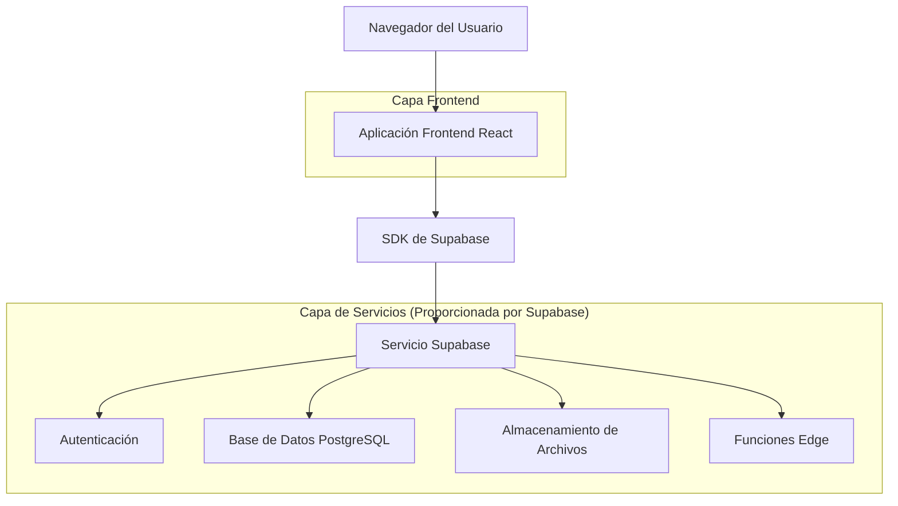
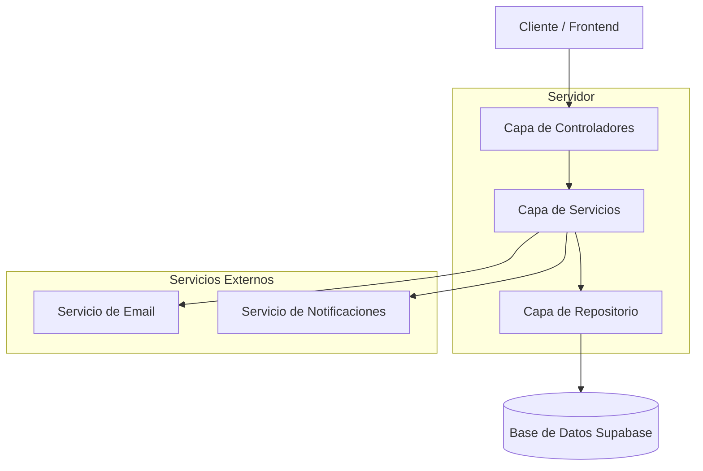
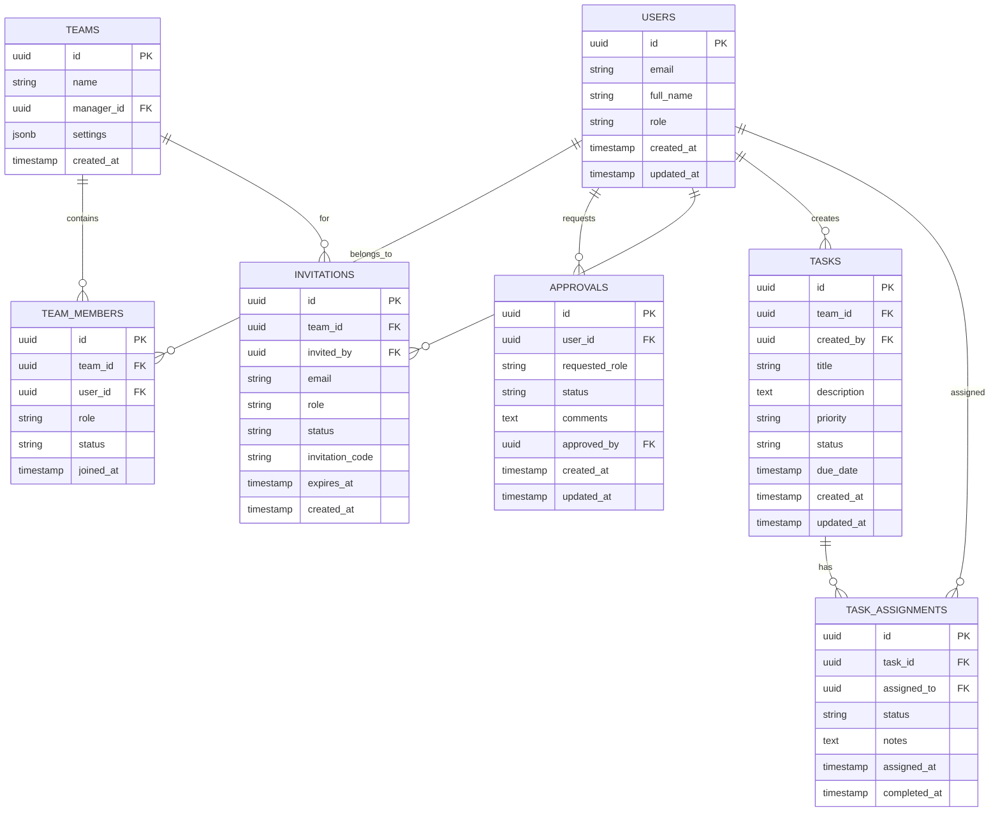

## 1. Diseño de Arquitectura



## 2. Descripción de Tecnologías
- Frontend: React@18 + TypeScript + TailwindCSS@3 + Vite
- Backend: Supabase (PostgreSQL + Auth + Storage + Edge Functions)
- Estado: Zustand para gestión de estado global
- UI: Lucide React para iconografía + Recharts para gráficos

## 3. Definiciones de Rutas

| Ruta | Propósito |
|------|----------|
| /team | Página principal "Mi Equipo" con funcionalidades extendidas para managers |
| /team/approvals | Panel de aprobaciones para administradores |
| /team/invitations | Centro de invitaciones para managers |
| /team/advisor/:id | Perfil detallado de asesor individual |
| /team/tasks | Panel de asignación y seguimiento de tareas |
| /team/metrics | Dashboard de métricas y reportes del equipo |
| /team/settings | Configuración del equipo y permisos |

## 4. Definiciones de API

### 4.1 APIs Principales

**Gestión de Aprobaciones**
```
GET /api/approvals
```

Request:
| Nombre del Parámetro | Tipo de Parámetro | Es Requerido | Descripción |
|---------------------|-------------------|--------------|-------------|
| status | string | false | Filtrar por estado (pending, approved, rejected) |
| limit | number | false | Número máximo de resultados |

Response:
| Nombre del Parámetro | Tipo de Parámetro | Descripción |
|---------------------|-------------------|-------------|
| approvals | array | Lista de solicitudes de aprobación |
| total | number | Total de solicitudes |

Ejemplo:
```json
{
  "approvals": [
    {
      "id": "uuid",
      "user_email": "manager@empresa.com",
      "requested_role": "manager",
      "status": "pending",
      "created_at": "2024-01-15T10:00:00Z"
    }
  ],
  "total": 5
}
```

**Gestión de Invitaciones**
```
POST /api/invitations
```

Request:
| Nombre del Parámetro | Tipo de Parámetro | Es Requerido | Descripción |
|---------------------|-------------------|--------------|-------------|
| email | string | true | Email del invitado |
| role | string | true | Rol asignado (advisor, manager) |
| team_id | string | true | ID del equipo |
| expires_at | string | false | Fecha de expiración |

Response:
| Nombre del Parámetro | Tipo de Parámetro | Descripción |
|---------------------|-------------------|-------------|
| success | boolean | Estado de la operación |
| invitation_id | string | ID de la invitación creada |

**Gestión de Tareas**
```
POST /api/tasks
```

Request:
| Nombre del Parámetro | Tipo de Parámetro | Es Requerido | Descripción |
|---------------------|-------------------|--------------|-------------|
| title | string | true | Título de la tarea |
| description | string | false | Descripción detallada |
| assigned_to | array | true | IDs de asesores asignados |
| priority | string | true | Prioridad (low, medium, high) |
| due_date | string | false | Fecha límite |

Response:
| Nombre del Parámetro | Tipo de Parámetro | Descripción |
|---------------------|-------------------|-------------|
| success | boolean | Estado de la operación |
| task_id | string | ID de la tarea creada |

## 5. Diagrama de Arquitectura del Servidor



## 6. Modelo de Datos

### 6.1 Definición del Modelo de Datos



### 6.2 Lenguaje de Definición de Datos

**Tabla de Usuarios (users)**
```sql
-- Extender tabla existente de usuarios
ALTER TABLE users ADD COLUMN IF NOT EXISTS full_name VARCHAR(255);
ALTER TABLE users ADD COLUMN IF NOT EXISTS role VARCHAR(50) DEFAULT 'advisor' CHECK (role IN ('advisor', 'manager', 'admin'));
ALTER TABLE users ADD COLUMN IF NOT EXISTS phone VARCHAR(20);
ALTER TABLE users ADD COLUMN IF NOT EXISTS department VARCHAR(100);

-- Índices
CREATE INDEX IF NOT EXISTS idx_users_role ON users(role);
CREATE INDEX IF NOT EXISTS idx_users_email ON users(email);
```

**Tabla de Equipos (teams)**
```sql
CREATE TABLE teams (
    id UUID PRIMARY KEY DEFAULT gen_random_uuid(),
    name VARCHAR(255) NOT NULL,
    manager_id UUID REFERENCES users(id) ON DELETE SET NULL,
    settings JSONB DEFAULT '{}',
    created_at TIMESTAMP WITH TIME ZONE DEFAULT NOW(),
    updated_at TIMESTAMP WITH TIME ZONE DEFAULT NOW()
);

-- Índices
CREATE INDEX idx_teams_manager_id ON teams(manager_id);
```

**Tabla de Miembros de Equipo (team_members)**
```sql
CREATE TABLE team_members (
    id UUID PRIMARY KEY DEFAULT gen_random_uuid(),
    team_id UUID REFERENCES teams(id) ON DELETE CASCADE,
    user_id UUID REFERENCES users(id) ON DELETE CASCADE,
    role VARCHAR(50) DEFAULT 'advisor' CHECK (role IN ('advisor', 'manager')),
    status VARCHAR(50) DEFAULT 'active' CHECK (status IN ('active', 'inactive', 'pending')),
    joined_at TIMESTAMP WITH TIME ZONE DEFAULT NOW(),
    UNIQUE(team_id, user_id)
);

-- Índices
CREATE INDEX idx_team_members_team_id ON team_members(team_id);
CREATE INDEX idx_team_members_user_id ON team_members(user_id);
```

**Tabla de Aprobaciones (approvals)**
```sql
CREATE TABLE approvals (
    id UUID PRIMARY KEY DEFAULT gen_random_uuid(),
    user_id UUID REFERENCES users(id) ON DELETE CASCADE,
    requested_role VARCHAR(50) NOT NULL CHECK (requested_role IN ('manager', 'admin')),
    status VARCHAR(50) DEFAULT 'pending' CHECK (status IN ('pending', 'approved', 'rejected')),
    comments TEXT,
    approved_by UUID REFERENCES users(id) ON DELETE SET NULL,
    created_at TIMESTAMP WITH TIME ZONE DEFAULT NOW(),
    updated_at TIMESTAMP WITH TIME ZONE DEFAULT NOW()
);

-- Índices
CREATE INDEX idx_approvals_user_id ON approvals(user_id);
CREATE INDEX idx_approvals_status ON approvals(status);
CREATE INDEX idx_approvals_created_at ON approvals(created_at DESC);
```

**Tabla de Invitaciones (invitations)**
```sql
CREATE TABLE invitations (
    id UUID PRIMARY KEY DEFAULT gen_random_uuid(),
    team_id UUID REFERENCES teams(id) ON DELETE CASCADE,
    invited_by UUID REFERENCES users(id) ON DELETE SET NULL,
    email VARCHAR(255) NOT NULL,
    role VARCHAR(50) DEFAULT 'advisor' CHECK (role IN ('advisor', 'manager')),
    status VARCHAR(50) DEFAULT 'pending' CHECK (status IN ('pending', 'accepted', 'rejected', 'expired')),
    invitation_code VARCHAR(100) UNIQUE NOT NULL DEFAULT encode(gen_random_bytes(32), 'hex'),
    expires_at TIMESTAMP WITH TIME ZONE DEFAULT (NOW() + INTERVAL '7 days'),
    created_at TIMESTAMP WITH TIME ZONE DEFAULT NOW()
);

-- Índices
CREATE INDEX idx_invitations_team_id ON invitations(team_id);
CREATE INDEX idx_invitations_email ON invitations(email);
CREATE INDEX idx_invitations_code ON invitations(invitation_code);
CREATE INDEX idx_invitations_status ON invitations(status);
```

**Tabla de Tareas (tasks)**
```sql
CREATE TABLE tasks (
    id UUID PRIMARY KEY DEFAULT gen_random_uuid(),
    team_id UUID REFERENCES teams(id) ON DELETE CASCADE,
    created_by UUID REFERENCES users(id) ON DELETE SET NULL,
    title VARCHAR(255) NOT NULL,
    description TEXT,
    priority VARCHAR(50) DEFAULT 'medium' CHECK (priority IN ('low', 'medium', 'high')),
    status VARCHAR(50) DEFAULT 'pending' CHECK (status IN ('pending', 'in_progress', 'completed', 'cancelled')),
    due_date TIMESTAMP WITH TIME ZONE,
    created_at TIMESTAMP WITH TIME ZONE DEFAULT NOW(),
    updated_at TIMESTAMP WITH TIME ZONE DEFAULT NOW()
);

-- Índices
CREATE INDEX idx_tasks_team_id ON tasks(team_id);
CREATE INDEX idx_tasks_created_by ON tasks(created_by);
CREATE INDEX idx_tasks_status ON tasks(status);
CREATE INDEX idx_tasks_due_date ON tasks(due_date);
```

**Tabla de Asignaciones de Tareas (task_assignments)**
```sql
CREATE TABLE task_assignments (
    id UUID PRIMARY KEY DEFAULT gen_random_uuid(),
    task_id UUID REFERENCES tasks(id) ON DELETE CASCADE,
    assigned_to UUID REFERENCES users(id) ON DELETE CASCADE,
    status VARCHAR(50) DEFAULT 'assigned' CHECK (status IN ('assigned', 'in_progress', 'completed')),
    notes TEXT,
    assigned_at TIMESTAMP WITH TIME ZONE DEFAULT NOW(),
    completed_at TIMESTAMP WITH TIME ZONE,
    UNIQUE(task_id, assigned_to)
);

-- Índices
CREATE INDEX idx_task_assignments_task_id ON task_assignments(task_id);
CREATE INDEX idx_task_assignments_assigned_to ON task_assignments(assigned_to);
CREATE INDEX idx_task_assignments_status ON task_assignments(status);

-- Permisos de Supabase
GRANT SELECT ON teams TO anon;
GRANT ALL PRIVILEGES ON teams TO authenticated;

GRANT SELECT ON team_members TO anon;
GRANT ALL PRIVILEGES ON team_members TO authenticated;

GRANT SELECT ON approvals TO anon;
GRANT ALL PRIVILEGES ON approvals TO authenticated;

GRANT SELECT ON invitations TO anon;
GRANT ALL PRIVILEGES ON invitations TO authenticated;

GRANT SELECT ON tasks TO anon;
GRANT ALL PRIVILEGES ON tasks TO authenticated;

GRANT SELECT ON task_assignments TO anon;
GRANT ALL PRIVILEGES ON task_assignments TO authenticated;
```