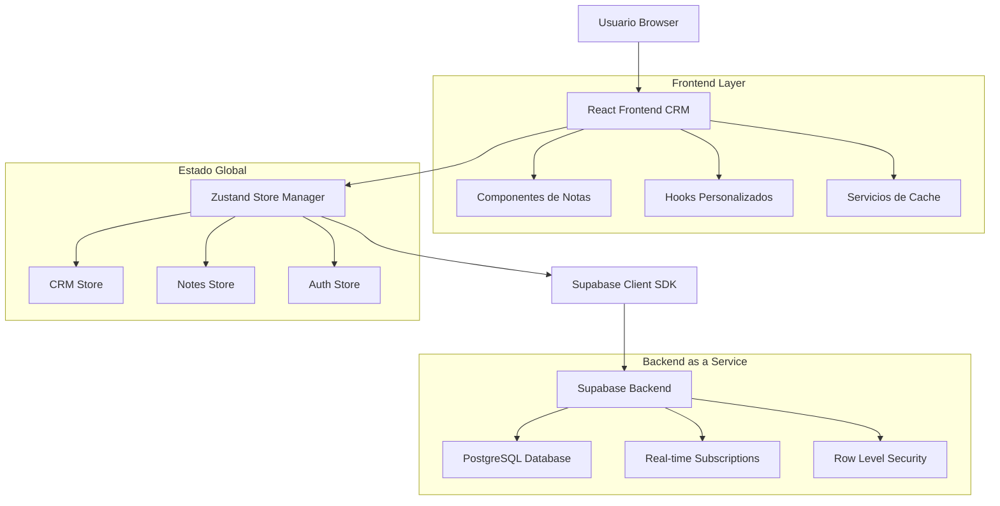
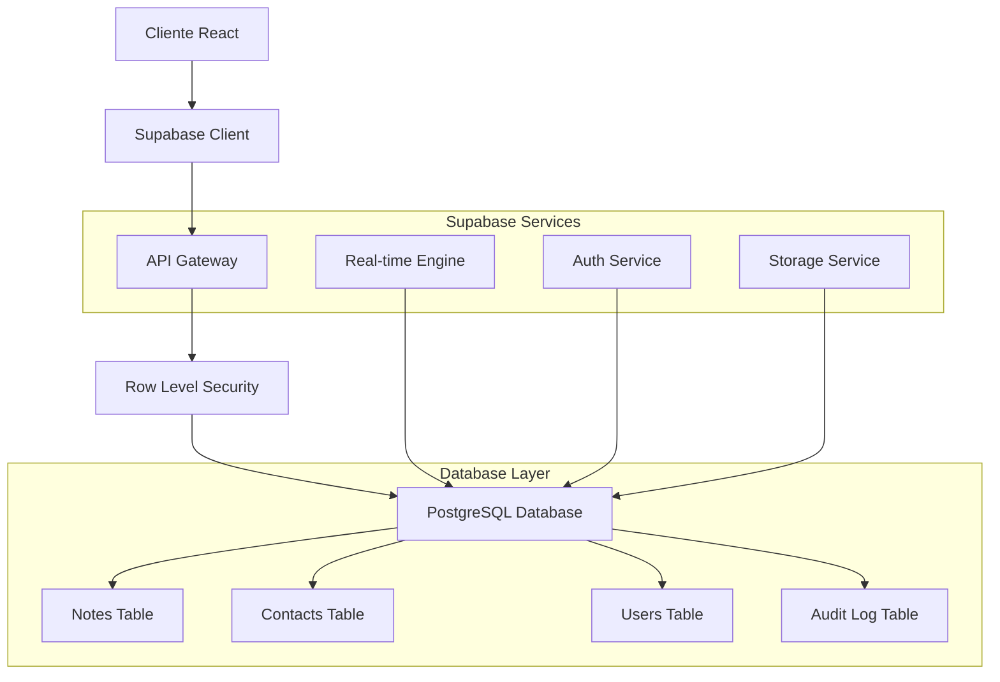
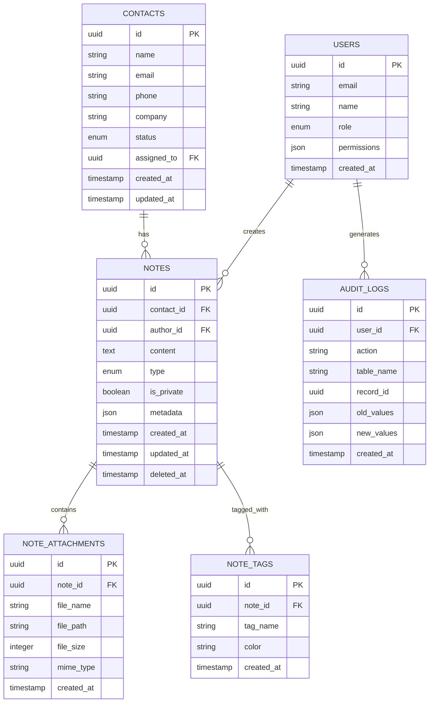

# Sistema de Gestión de Notas y Comentarios CRM - Arquitectura Técnica

## 1. Arquitectura del Sistema



## 2. Descripción de Tecnologías

- **Frontend**: React@18 + TypeScript + Tailwind CSS@3 + Vite
- **Estado Global**: Zustand para gestión de estado reactivo
- **Backend**: Supabase (PostgreSQL + Real-time + Auth + Storage)
- **UI Components**: Lucide React + Headless UI
- **Validación**: Zod para validación de esquemas
- **Testing**: Vitest + React Testing Library

## 3. Definición de Rutas

| Ruta | Propósito |
|------|----------|
| /crm | Página principal del CRM con lista de contactos |
| /crm/contact/:id | Vista detallada del contacto con panel de notas integrado |
| /crm/notes | Vista global de todas las notas (solo managers/admins) |
| /crm/notes/search | Página de búsqueda avanzada de notas |
| /crm/reports/notes | Dashboard de reportes y métricas de notas |
| /crm/settings/notes | Configuración de plantillas y permisos de notas |

## 4. Definiciones de API

### 4.1 API Core de Notas

**Crear Nota**
```
POST /api/notes
```

Request:
| Parámetro | Tipo | Requerido | Descripción |
|-----------|------|-----------|-------------|
| contact_id | string | true | ID del contacto asociado |
| content | string | true | Contenido de la nota (10-2000 caracteres) |
| type | enum | true | Tipo: 'call', 'meeting', 'email', 'general' |
| is_private | boolean | false | Si la nota es privada (default: false) |
| tags | string[] | false | Etiquetas para categorización |

Response:
| Parámetro | Tipo | Descripción |
|-----------|------|-------------|
| id | string | ID único de la nota |
| created_at | timestamp | Fecha de creación |
| updated_at | timestamp | Fecha de última actualización |
| author | object | Información del autor |

Ejemplo:
```json
{
  "contact_id": "contact_123",
  "content": "Llamada de seguimiento realizada. Cliente interesado en el producto premium.",
  "type": "call",
  "is_private": false,
  "tags": ["seguimiento", "interesado"]
}
```

**Obtener Notas por Contacto**
```
GET /api/contacts/:id/notes
```

Query Parameters:
| Parámetro | Tipo | Descripción |
|-----------|------|-------------|
| limit | number | Número máximo de notas (default: 50) |
| offset | number | Offset para paginación |
| type | string | Filtrar por tipo de nota |
| author_id | string | Filtrar por autor |
| date_from | date | Fecha inicio del rango |
| date_to | date | Fecha fin del rango |

**Actualizar Nota**
```
PUT /api/notes/:id
```

**Eliminar Nota**
```
DELETE /api/notes/:id
```

**Búsqueda Avanzada**
```
POST /api/notes/search
```

Request:
```json
{
  "query": "texto a buscar",
  "filters": {
    "type": ["call", "meeting"],
    "author_ids": ["user_123"],
    "date_range": {
      "start": "2024-01-01",
      "end": "2024-12-31"
    },
    "contact_status": ["Cliente", "Prospecto"]
  },
  "sort": {
    "field": "created_at",
    "direction": "desc"
  },
  "pagination": {
    "page": 1,
    "limit": 25
  }
}
```

## 5. Arquitectura del Servidor



## 6. Modelo de Datos

### 6.1 Diagrama de Entidades



### 6.2 Definición de Datos (DDL)

**Tabla de Notas Mejorada**
```sql
-- Crear tabla de notas con funcionalidades avanzadas
CREATE TABLE notes (
    id UUID PRIMARY KEY DEFAULT gen_random_uuid(),
    contact_id UUID NOT NULL REFERENCES contacts(id) ON DELETE CASCADE,
    author_id UUID NOT NULL REFERENCES auth.users(id) ON DELETE CASCADE,
    content TEXT NOT NULL CHECK (char_length(content) >= 10 AND char_length(content) <= 2000),
    type VARCHAR(20) NOT NULL CHECK (type IN ('call', 'meeting', 'email', 'general')),
    is_private BOOLEAN DEFAULT false,
    priority VARCHAR(10) DEFAULT 'normal' CHECK (priority IN ('low', 'normal', 'high', 'urgent')),
    metadata JSONB DEFAULT '{}',
    search_vector tsvector GENERATED ALWAYS AS (to_tsvector('spanish', content)) STORED,
    created_at TIMESTAMP WITH TIME ZONE DEFAULT NOW(),
    updated_at TIMESTAMP WITH TIME ZONE DEFAULT NOW(),
    deleted_at TIMESTAMP WITH TIME ZONE NULL
);

-- Índices para optimización
CREATE INDEX idx_notes_contact_id ON notes(contact_id) WHERE deleted_at IS NULL;
CREATE INDEX idx_notes_author_id ON notes(author_id) WHERE deleted_at IS NULL;
CREATE INDEX idx_notes_type ON notes(type) WHERE deleted_at IS NULL;
CREATE INDEX idx_notes_created_at ON notes(created_at DESC) WHERE deleted_at IS NULL;
CREATE INDEX idx_notes_search_vector ON notes USING GIN(search_vector);
CREATE INDEX idx_notes_priority ON notes(priority) WHERE deleted_at IS NULL;

-- Tabla de adjuntos
CREATE TABLE note_attachments (
    id UUID PRIMARY KEY DEFAULT gen_random_uuid(),
    note_id UUID NOT NULL REFERENCES notes(id) ON DELETE CASCADE,
    file_name VARCHAR(255) NOT NULL,
    file_path TEXT NOT NULL,
    file_size INTEGER NOT NULL CHECK (file_size <= 10485760), -- 10MB max
    mime_type VARCHAR(100) NOT NULL,
    created_at TIMESTAMP WITH TIME ZONE DEFAULT NOW()
);

-- Tabla de etiquetas
CREATE TABLE note_tags (
    id UUID PRIMARY KEY DEFAULT gen_random_uuid(),
    note_id UUID NOT NULL REFERENCES notes(id) ON DELETE CASCADE,
    tag_name VARCHAR(50) NOT NULL,
    color VARCHAR(7) DEFAULT '#16a34a',
    created_at TIMESTAMP WITH TIME ZONE DEFAULT NOW(),
    UNIQUE(note_id, tag_name)
);

-- Tabla de auditoría
CREATE TABLE audit_logs (
    id UUID PRIMARY KEY DEFAULT gen_random_uuid(),
    user_id UUID NOT NULL REFERENCES auth.users(id),
    action VARCHAR(20) NOT NULL CHECK (action IN ('CREATE', 'UPDATE', 'DELETE', 'VIEW')),
    table_name VARCHAR(50) NOT NULL,
    record_id UUID NOT NULL,
    old_values JSONB,
    new_values JSONB,
    ip_address INET,
    user_agent TEXT,
    created_at TIMESTAMP WITH TIME ZONE DEFAULT NOW()
);

-- Función para actualizar updated_at automáticamente
CREATE OR REPLACE FUNCTION update_updated_at_column()
RETURNS TRIGGER AS $$
BEGIN
    NEW.updated_at = NOW();
    RETURN NEW;
END;
$$ language 'plpgsql';

-- Trigger para updated_at
CREATE TRIGGER update_notes_updated_at BEFORE UPDATE ON notes
    FOR EACH ROW EXECUTE FUNCTION update_updated_at_column();

-- Función para auditoría automática
CREATE OR REPLACE FUNCTION audit_trigger_function()
RETURNS TRIGGER AS $$
BEGIN
    IF TG_OP = 'DELETE' THEN
        INSERT INTO audit_logs (user_id, action, table_name, record_id, old_values)
        VALUES (auth.uid(), 'DELETE', TG_TABLE_NAME, OLD.id, to_jsonb(OLD));
        RETURN OLD;
    ELSIF TG_OP = 'UPDATE' THEN
        INSERT INTO audit_logs (user_id, action, table_name, record_id, old_values, new_values)
        VALUES (auth.uid(), 'UPDATE', TG_TABLE_NAME, NEW.id, to_jsonb(OLD), to_jsonb(NEW));
        RETURN NEW;
    ELSIF TG_OP = 'INSERT' THEN
        INSERT INTO audit_logs (user_id, action, table_name, record_id, new_values)
        VALUES (auth.uid(), 'CREATE', TG_TABLE_NAME, NEW.id, to_jsonb(NEW));
        RETURN NEW;
    END IF;
    RETURN NULL;
END;
$$ LANGUAGE plpgsql;

-- Triggers de auditoría
CREATE TRIGGER notes_audit_trigger
    AFTER INSERT OR UPDATE OR DELETE ON notes
    FOR EACH ROW EXECUTE FUNCTION audit_trigger_function();

-- Políticas de seguridad RLS
ALTER TABLE notes ENABLE ROW LEVEL SECURITY;
ALTER TABLE note_attachments ENABLE ROW LEVEL SECURITY;
ALTER TABLE note_tags ENABLE ROW LEVEL SECURITY;
ALTER TABLE audit_logs ENABLE ROW LEVEL SECURITY;

-- Política para advisors: solo sus notas y notas de sus contactos
CREATE POLICY "Advisors can manage their own notes" ON notes
    FOR ALL USING (
        auth.uid() = author_id OR 
        contact_id IN (
            SELECT id FROM contacts WHERE assigned_to = auth.uid()
        )
    );

-- Política para managers: notas de su equipo
CREATE POLICY "Managers can access team notes" ON notes
    FOR ALL USING (
        EXISTS (
            SELECT 1 FROM auth.users 
            WHERE id = auth.uid() 
            AND raw_user_meta_data->>'role' IN ('manager', 'admin')
        )
    );

-- Política para adjuntos
CREATE POLICY "Users can manage attachments of accessible notes" ON note_attachments
    FOR ALL USING (
        note_id IN (
            SELECT id FROM notes WHERE 
            auth.uid() = author_id OR 
            contact_id IN (SELECT id FROM contacts WHERE assigned_to = auth.uid())
        )
    );

-- Datos iniciales
INSERT INTO note_tags (note_id, tag_name, color) VALUES
    (gen_random_uuid(), 'Urgente', '#ef4444'),
    (gen_random_uuid(), 'Seguimiento', '#f59e0b'),
    (gen_random_uuid(), 'Interesado', '#10b981'),
    (gen_random_uuid(), 'No Interesado', '#6b7280'),
    (gen_random_uuid(), 'Reunión Programada', '#8b5cf6');
```

## 7. Optimizaciones de Rendimiento

### 7.1 Frontend
- **Lazy Loading**: Componentes de notas cargados bajo demanda
- **Virtual Scrolling**: Para listas grandes de notas
- **Debouncing**: En búsquedas y autoguardado (300ms)
- **Memoización**: React.memo en componentes de notas
- **Cache Local**: IndexedDB para notas frecuentemente accedidas

### 7.2 Backend
- **Índices Compuestos**: Para consultas complejas
- **Paginación Cursor**: Para mejor rendimiento en listas grandes
- **Full-Text Search**: Usando PostgreSQL tsvector
- **Connection Pooling**: Optimización de conexiones a BD
- **CDN**: Para archivos adjuntos estáticos

### 7.3 Monitoreo
- **Métricas de Rendimiento**: Tiempo de carga, queries lentas
- **Error Tracking**: Sentry para errores en producción
- **Analytics**: Uso de funcionalidades, patrones de usuario
- **Health Checks**: Endpoints de salud del sistema