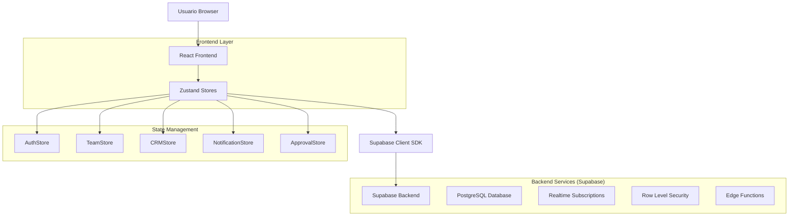
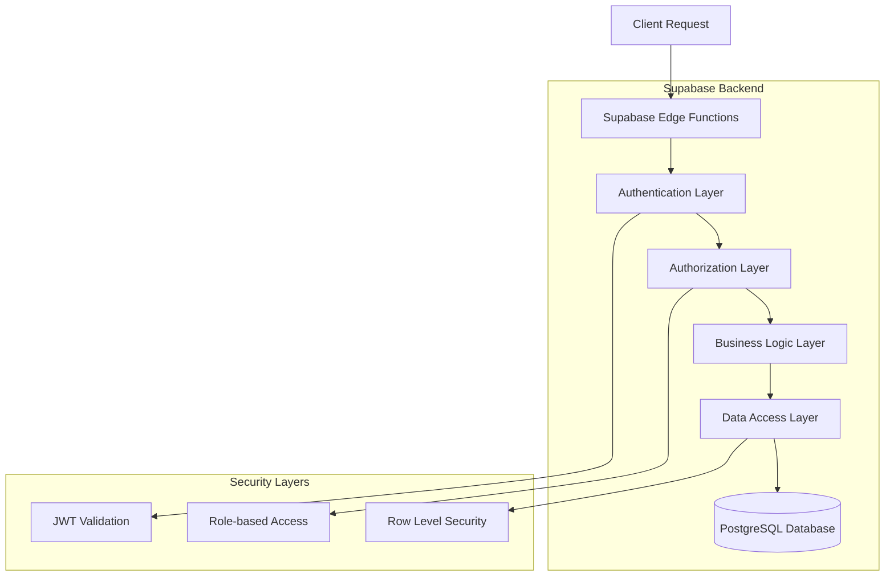
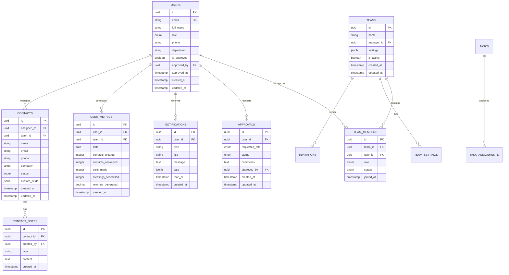

# Arquitectura Técnica: Sistema de Roles Robusto - CRM Cactus

## 1. Arquitectura General del Sistema



## 2. Descripción de Tecnologías

- **Frontend**: React@18 + TypeScript + Tailwind CSS + Vite
- **State Management**: Zustand con persistencia
- **Backend**: Supabase (PostgreSQL + Realtime + Auth)
- **UI Components**: Lucide React + Custom Components
- **Routing**: React Router DOM
- **Notifications**: Sonner + Custom Toast System

## 3. Definiciones de Rutas

| Ruta | Propósito | Permisos Requeridos |
|------|-----------|--------------------|
| `/login` | Página de inicio de sesión | Público |
| `/register` | Registro de nuevos usuarios | Público |
| `/dashboard` | Dashboard principal (dinámico por rol) | Autenticado |
| `/admin` | Panel de administración | Admin |
| `/admin/approvals` | Gestión de aprobaciones | Admin |
| `/manager/dashboard` | Dashboard específico de manager | Manager |
| `/manager/team` | Gestión de equipo | Manager |
| `/manager/reports` | Generación de reportes | Manager |
| `/crm` | Sistema CRM | Advisor, Manager, Admin |
| `/crm/contacts` | Lista de contactos | Advisor (propios), Manager (equipo), Admin (todos) |
| `/crm/contacts/:id` | Detalle de contacto | Según permisos de contacto |
| `/team` | Vista de equipo | Manager, Admin |
| `/profile` | Perfil de usuario | Autenticado |
| `/notifications` | Centro de notificaciones | Autenticado |

## 4. Definiciones de API

### 4.1 Autenticación y Usuarios

**Registro de Usuario**
```typescript
POST /auth/register
```

Request:
| Parámetro | Tipo | Requerido | Descripción |
|-----------|------|-----------|-------------|
| full_name | string | true | Nombre completo del usuario |
| email | string | true | Correo electrónico |
| password | string | true | Contraseña (mín. 6 caracteres) |
| role | enum | true | 'advisor' \| 'manager' \| 'admin' |
| phone | string | false | Número de teléfono |
| department | string | false | Departamento |

Response:
```json
{
  "user": {
    "id": "uuid",
    "email": "user@example.com",
    "full_name": "Juan Pérez",
    "role": "advisor",
    "is_approved": true,
    "created_at": "2024-01-01T00:00:00Z"
  },
  "session": {
    "access_token": "jwt_token",
    "refresh_token": "refresh_token"
  }
}
```

**Aprobación de Usuario**
```typescript
POST /api/users/{userId}/approve
```

Request:
| Parámetro | Tipo | Requerido | Descripción |
|-----------|------|-----------|-------------|
| comments | string | false | Comentarios de aprobación |
| approved_by | string | true | ID del administrador |

Response:
```json
{
  "success": true,
  "user": {
    "id": "uuid",
    "is_approved": true,
    "approved_at": "2024-01-01T00:00:00Z",
    "approved_by": "admin_uuid"
  }
}
```

### 4.2 Gestión de Equipos

**Obtener Métricas de Equipo**
```typescript
GET /api/teams/{teamId}/metrics
```

Query Parameters:
| Parámetro | Tipo | Descripción |
|-----------|------|-------------|
| start_date | string | Fecha inicio (ISO 8601) |
| end_date | string | Fecha fin (ISO 8601) |
| granularity | enum | 'daily' \| 'weekly' \| 'monthly' |

Response:
```json
{
  "team_metrics": {
    "total_contacts": 150,
    "total_conversions": 25,
    "conversion_rate": 16.67,
    "total_revenue": 125000.00,
    "member_metrics": [
      {
        "user_id": "uuid",
        "user_name": "Juan Pérez",
        "contacts_created": 30,
        "conversions": 5,
        "revenue": 25000.00
      }
    ]
  }
}
```

### 4.3 Sistema de Notificaciones

**Crear Notificación**
```typescript
POST /api/notifications
```

Request:
| Parámetro | Tipo | Requerido | Descripción |
|-----------|------|-----------|-------------|
| user_id | string | true | ID del usuario destinatario |
| type | enum | true | 'approval_request' \| 'approval_result' \| 'team_update' |
| title | string | true | Título de la notificación |
| message | string | true | Mensaje de la notificación |
| data | object | false | Datos adicionales |

Response:
```json
{
  "id": "uuid",
  "created_at": "2024-01-01T00:00:00Z",
  "status": "sent"
}
```

## 5. Arquitectura del Servidor



## 6. Modelo de Datos

### 6.1 Diagrama de Entidad-Relación



### 6.2 Definiciones DDL

**Tabla de Usuarios Mejorada**
```sql
-- Crear tabla de usuarios con campos adicionales
CREATE TABLE users (
    id UUID PRIMARY KEY DEFAULT gen_random_uuid(),
    email VARCHAR(255) UNIQUE NOT NULL,
    full_name VARCHAR(255) NOT NULL,
    role VARCHAR(50) DEFAULT 'advisor' CHECK (role IN ('advisor', 'manager', 'admin')),
    phone VARCHAR(20),
    department VARCHAR(100),
    is_approved BOOLEAN DEFAULT false,
    approved_by UUID REFERENCES users(id) ON DELETE SET NULL,
    approved_at TIMESTAMP WITH TIME ZONE,
    avatar_url TEXT,
    last_login TIMESTAMP WITH TIME ZONE,
    created_at TIMESTAMP WITH TIME ZONE DEFAULT NOW(),
    updated_at TIMESTAMP WITH TIME ZONE DEFAULT NOW()
);

-- Índices para optimización
CREATE INDEX idx_users_role ON users(role);
CREATE INDEX idx_users_email ON users(email);
CREATE INDEX idx_users_approved ON users(is_approved);
CREATE INDEX idx_users_created_at ON users(created_at DESC);
```

**Sistema de Notificaciones**
```sql
-- Tabla de notificaciones
CREATE TABLE notifications (
    id UUID PRIMARY KEY DEFAULT gen_random_uuid(),
    user_id UUID REFERENCES users(id) ON DELETE CASCADE,
    type VARCHAR(50) NOT NULL CHECK (type IN (
        'approval_request', 'approval_approved', 'approval_rejected',
        'team_invitation', 'team_update', 'contact_assigned',
        'metric_milestone', 'system_announcement'
    )),
    title VARCHAR(255) NOT NULL,
    message TEXT NOT NULL,
    data JSONB DEFAULT '{}',
    priority VARCHAR(20) DEFAULT 'normal' CHECK (priority IN ('low', 'normal', 'high', 'urgent')),
    read_at TIMESTAMP WITH TIME ZONE,
    expires_at TIMESTAMP WITH TIME ZONE,
    created_at TIMESTAMP WITH TIME ZONE DEFAULT NOW()
);

-- Índices para notificaciones
CREATE INDEX idx_notifications_user_id ON notifications(user_id);
CREATE INDEX idx_notifications_type ON notifications(type);
CREATE INDEX idx_notifications_read_at ON notifications(read_at);
CREATE INDEX idx_notifications_created_at ON notifications(created_at DESC);
```

**Métricas de Usuario**
```sql
-- Tabla de métricas diarias por usuario
CREATE TABLE user_metrics (
    id UUID PRIMARY KEY DEFAULT gen_random_uuid(),
    user_id UUID REFERENCES users(id) ON DELETE CASCADE,
    team_id UUID REFERENCES teams(id) ON DELETE CASCADE,
    date DATE NOT NULL,
    contacts_created INTEGER DEFAULT 0,
    contacts_updated INTEGER DEFAULT 0,
    contacts_converted INTEGER DEFAULT 0,
    calls_made INTEGER DEFAULT 0,
    emails_sent INTEGER DEFAULT 0,
    meetings_scheduled INTEGER DEFAULT 0,
    meetings_completed INTEGER DEFAULT 0,
    revenue_generated DECIMAL(12,2) DEFAULT 0,
    pipeline_value DECIMAL(12,2) DEFAULT 0,
    created_at TIMESTAMP WITH TIME ZONE DEFAULT NOW(),
    updated_at TIMESTAMP WITH TIME ZONE DEFAULT NOW(),
    UNIQUE(user_id, date)
);

-- Índices para métricas
CREATE INDEX idx_user_metrics_user_id ON user_metrics(user_id);
CREATE INDEX idx_user_metrics_team_id ON user_metrics(team_id);
CREATE INDEX idx_user_metrics_date ON user_metrics(date DESC);
CREATE INDEX idx_user_metrics_revenue ON user_metrics(revenue_generated DESC);
```

**Configuración de Equipos**
```sql
-- Tabla de configuraciones de equipo
CREATE TABLE team_settings (
    id UUID PRIMARY KEY DEFAULT gen_random_uuid(),
    team_id UUID REFERENCES teams(id) ON DELETE CASCADE,
    setting_key VARCHAR(100) NOT NULL,
    setting_value JSONB NOT NULL,
    description TEXT,
    updated_by UUID REFERENCES users(id) ON DELETE SET NULL,
    updated_at TIMESTAMP WITH TIME ZONE DEFAULT NOW(),
    UNIQUE(team_id, setting_key)
);

-- Configuraciones por defecto
INSERT INTO team_settings (team_id, setting_key, setting_value, description) VALUES
('default-team-id', 'auto_assign_contacts', 'true', 'Asignación automática de contactos'),
('default-team-id', 'daily_report_enabled', 'true', 'Reportes diarios habilitados'),
('default-team-id', 'conversion_goal', '20', 'Meta de conversiones mensuales'),
('default-team-id', 'revenue_goal', '50000', 'Meta de ingresos mensuales');
```

**Políticas de Seguridad (RLS)**
```sql
-- Habilitar RLS en todas las tablas
ALTER TABLE users ENABLE ROW LEVEL SECURITY;
ALTER TABLE teams ENABLE ROW LEVEL SECURITY;
ALTER TABLE team_members ENABLE ROW LEVEL SECURITY;
ALTER TABLE contacts ENABLE ROW LEVEL SECURITY;
ALTER TABLE user_metrics ENABLE ROW LEVEL SECURITY;
ALTER TABLE notifications ENABLE ROW LEVEL SECURITY;

-- Política para usuarios - Solo pueden ver/editar su propio perfil
CREATE POLICY "users_own_profile" ON users
    FOR ALL USING (auth.uid() = id);

-- Política para administradores - Pueden ver todos los usuarios
CREATE POLICY "admins_all_users" ON users
    FOR ALL USING (
        EXISTS (
            SELECT 1 FROM users 
            WHERE id = auth.uid() 
            AND role = 'admin' 
            AND is_approved = true
        )
    );

-- Política para contactos - Advisors solo ven los suyos
CREATE POLICY "advisors_own_contacts" ON contacts
    FOR ALL USING (
        assigned_to = auth.uid() OR
        EXISTS (
            SELECT 1 FROM users 
            WHERE id = auth.uid() 
            AND role IN ('manager', 'admin') 
            AND is_approved = true
        )
    );

-- Política para métricas - Usuarios ven las suyas, managers las del equipo
CREATE POLICY "user_metrics_access" ON user_metrics
    FOR SELECT USING (
        user_id = auth.uid() OR
        EXISTS (
            SELECT 1 FROM team_members tm
            JOIN users u ON u.id = auth.uid()
            WHERE tm.team_id = user_metrics.team_id
            AND tm.user_id = auth.uid()
            AND u.role IN ('manager', 'admin')
            AND u.is_approved = true
        )
    );

-- Política para notificaciones - Solo el destinatario puede verlas
CREATE POLICY "notifications_own" ON notifications
    FOR ALL USING (user_id = auth.uid());
```

**Permisos de Supabase**
```sql
-- Permisos básicos para usuarios anónimos
GRANT SELECT ON users TO anon;
GRANT SELECT ON teams TO anon;

-- Permisos completos para usuarios autenticados
GRANT ALL PRIVILEGES ON users TO authenticated;
GRANT ALL PRIVILEGES ON teams TO authenticated;
GRANT ALL PRIVILEGES ON team_members TO authenticated;
GRANT ALL PRIVILEGES ON contacts TO authenticated;
GRANT ALL PRIVILEGES ON user_metrics TO authenticated;
GRANT ALL PRIVILEGES ON notifications TO authenticated;
GRANT ALL PRIVILEGES ON approvals TO authenticated;
GRANT ALL PRIVILEGES ON team_settings TO authenticated;
```

## 7. Funciones y Triggers

**Función para actualizar timestamp**
```sql
-- Función para actualizar updated_at automáticamente
CREATE OR REPLACE FUNCTION update_updated_at_column()
RETURNS TRIGGER AS $$
BEGIN
    NEW.updated_at = NOW();
    RETURN NEW;
END;
$$ language 'plpgsql';

-- Aplicar a todas las tablas relevantes
CREATE TRIGGER update_users_updated_at BEFORE UPDATE ON users
    FOR EACH ROW EXECUTE FUNCTION update_updated_at_column();

CREATE TRIGGER update_teams_updated_at BEFORE UPDATE ON teams
    FOR EACH ROW EXECUTE FUNCTION update_updated_at_column();

CREATE TRIGGER update_contacts_updated_at BEFORE UPDATE ON contacts
    FOR EACH ROW EXECUTE FUNCTION update_updated_at_column();
```

**Función para notificaciones automáticas**
```sql
-- Función para crear notificación de aprobación
CREATE OR REPLACE FUNCTION notify_approval_request()
RETURNS TRIGGER AS $$
BEGIN
    -- Notificar a todos los administradores
    INSERT INTO notifications (user_id, type, title, message, data)
    SELECT 
        id,
        'approval_request',
        'Nueva solicitud de aprobación',
        'Un usuario ha solicitado ser promovido a ' || NEW.requested_role,
        json_build_object(
            'approval_id', NEW.id,
            'user_id', NEW.user_id,
            'requested_role', NEW.requested_role
        )
    FROM users 
    WHERE role = 'admin' AND is_approved = true;
    
    RETURN NEW;
END;
$$ LANGUAGE plpgsql;

-- Trigger para notificaciones de aprobación
CREATE TRIGGER approval_notification_trigger
    AFTER INSERT ON approvals
    FOR EACH ROW
    EXECUTE FUNCTION notify_approval_request();
```

## 8. Edge Functions (Supabase)

**Función para procesamiento de métricas**
```typescript
// supabase/functions/process-daily-metrics/index.ts
import { serve } from 'https://deno.land/std@0.168.0/http/server.ts'
import { createClient } from 'https://esm.sh/@supabase/supabase-js@2'

serve(async (req) => {
  const supabase = createClient(
    Deno.env.get('SUPABASE_URL') ?? '',
    Deno.env.get('SUPABASE_SERVICE_ROLE_KEY') ?? ''
  )

  try {
    // Obtener métricas del día anterior
    const yesterday = new Date()
    yesterday.setDate(yesterday.getDate() - 1)
    const dateStr = yesterday.toISOString().split('T')[0]

    // Calcular métricas por usuario
    const { data: users } = await supabase
      .from('users')
      .select('id, team_id')
      .eq('is_approved', true)
      .neq('role', 'admin')

    for (const user of users || []) {
      // Calcular métricas del usuario para el día
      const metrics = await calculateUserMetrics(supabase, user.id, dateStr)
      
      // Insertar o actualizar métricas
      await supabase
        .from('user_metrics')
        .upsert({
          user_id: user.id,
          team_id: user.team_id,
          date: dateStr,
          ...metrics
        })
    }

    return new Response(JSON.stringify({ success: true }), {
      headers: { 'Content-Type': 'application/json' },
    })
  } catch (error) {
    return new Response(JSON.stringify({ error: error.message }), {
      status: 500,
      headers: { 'Content-Type': 'application/json' },
    })
  }
})

async function calculateUserMetrics(supabase: any, userId: string, date: string) {
  // Implementar lógica de cálculo de métricas
  const startOfDay = `${date}T00:00:00Z`
  const endOfDay = `${date}T23:59:59Z`
  
  const { data: contacts } = await supabase
    .from('contacts')
    .select('*')
    .eq('assigned_to', userId)
    .gte('created_at', startOfDay)
    .lte('created_at', endOfDay)

  return {
    contacts_created: contacts?.length || 0,
    contacts_converted: contacts?.filter(c => c.status === 'converted').length || 0,
    revenue_generated: contacts?.reduce((sum, c) => sum + (c.value || 0), 0) || 0
  }
}
```

## 9. Configuración de Realtime

**Suscripciones en tiempo real**
```typescript
// services/realtimeService.ts
import { supabase } from '../config/supabase'

export class RealtimeService {
  private subscriptions: any[] = []

  // Suscribirse a notificaciones del usuario
  subscribeToNotifications(userId: string, callback: (payload: any) => void) {
    const subscription = supabase
      .channel('notifications')
      .on(
        'postgres_changes',
        {
          event: 'INSERT',
          schema: 'public',
          table: 'notifications',
          filter: `user_id=eq.${userId}`
        },
        callback
      )
      .subscribe()

    this.subscriptions.push(subscription)
    return subscription
  }

  // Suscribirse a cambios en aprobaciones
  subscribeToApprovals(callback: (payload: any) => void) {
    const subscription = supabase
      .channel('approvals')
      .on(
        'postgres_changes',
        {
          event: '*',
          schema: 'public',
          table: 'approvals'
        },
        callback
      )
      .subscribe()

    this.subscriptions.push(subscription)
    return subscription
  }

  // Limpiar todas las suscripciones
  cleanup() {
    this.subscriptions.forEach(sub => {
      supabase.removeChannel(sub)
    })
    this.subscriptions = []
  }
}
```

---

**Resumen Técnico:**
Esta arquitectura proporciona una base sólida y escalable para el sistema de roles robusto, utilizando las mejores prácticas de seguridad, rendimiento y mantenibilidad. La integración con Supabase permite aprovechar funcionalidades avanzadas como RLS, Realtime y Edge Functions para crear una experiencia de usuario fluida y segura.