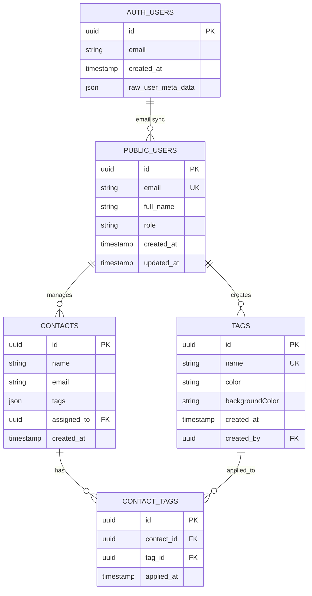
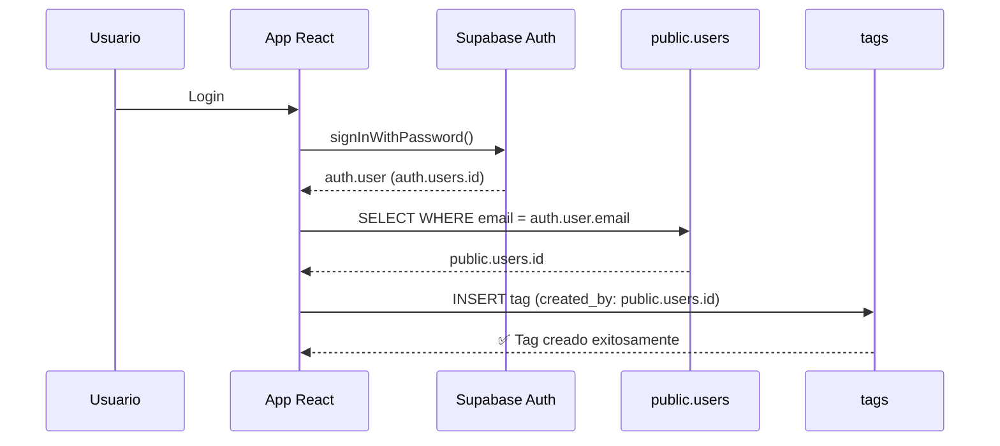
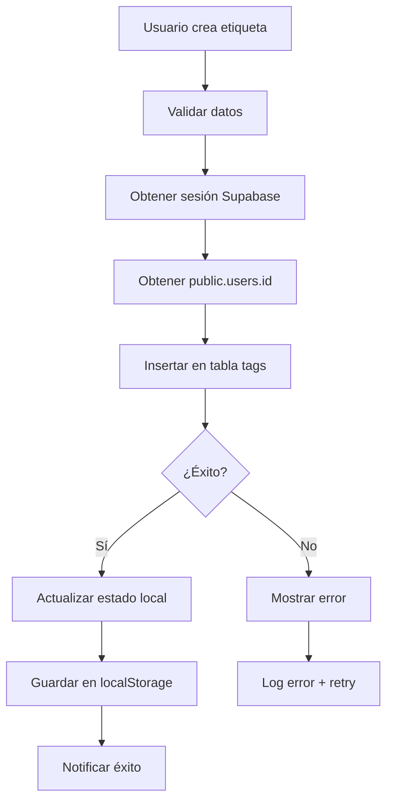

# Arquitectura Técnica: Sistema de Etiquetas CRM Cactus (Corregida)

## 1. Arquitectura de Datos

### 1.1 Diagrama de Relaciones Corregido



### 1.2 Corrección Implementada

**Problema Original:**
```sql
-- ❌ INCORRECTO: Referencia a auth.users
CREATE TABLE tags (
    created_by UUID REFERENCES auth.users(id)
);
```

**Solución Implementada:**
```sql
-- ✅ CORRECTO: Referencia a public.users
CREATE TABLE tags (
    created_by UUID REFERENCES public.users(id) ON DELETE SET NULL
);
```

## 2. Tecnologías y Stack

### 2.1 Frontend
- **React 18** + TypeScript
- **Tailwind CSS** para estilos
- **Zustand** para gestión de estado
- **Vite** como bundler

### 2.2 Backend
- **Supabase** como BaaS (Backend as a Service)
- **PostgreSQL** como base de datos
- **Row Level Security (RLS)** para autorización
- **Supabase Auth** para autenticación

### 2.3 Arquitectura de Autenticación



## 3. Definiciones de API

### 3.1 Operaciones de Etiquetas

#### Crear Etiqueta
```typescript
interface CreateTagRequest {
  name: string;
  color: string;
  backgroundColor: string;
}

interface CreateTagResponse {
  success: boolean;
  tag?: Tag;
  error?: string;
}
```

#### Estructura de Datos
```typescript
interface Tag {
  id: string;
  name: string;
  color: string;
  backgroundColor: string;
  createdAt: string;
  createdBy: string; // public.users.id
}
```

### 3.2 Queries Supabase

```sql
-- Crear etiqueta (con RLS)
INSERT INTO public.tags (name, color, backgroundColor, created_by)
VALUES ($1, $2, $3, get_current_user_id());

-- Obtener etiquetas del usuario
SELECT t.*, u.full_name as creator_name
FROM public.tags t
INNER JOIN public.users u ON t.created_by = u.id
WHERE t.created_by = get_current_user_id();

-- Función auxiliar para obtener user_id
CREATE FUNCTION get_current_user_id() RETURNS UUID AS $$
  SELECT u.id FROM public.users u
  INNER JOIN auth.users au ON u.email = au.email
  WHERE au.id = auth.uid()
$$ LANGUAGE sql SECURITY DEFINER;
```

## 4. Políticas de Seguridad (RLS)

### 4.1 Políticas para Tabla Tags

```sql
-- SELECT: Ver todas las etiquetas
CREATE POLICY "Users can view all tags" ON public.tags
    FOR SELECT TO authenticated USING (true);

-- INSERT: Crear etiquetas propias
CREATE POLICY "Users can create tags" ON public.tags
    FOR INSERT TO authenticated
    WITH CHECK (created_by = get_current_user_id());

-- UPDATE: Actualizar etiquetas propias
CREATE POLICY "Users can update their own tags" ON public.tags
    FOR UPDATE TO authenticated
    USING (created_by = get_current_user_id())
    WITH CHECK (created_by = get_current_user_id());

-- DELETE: Eliminar etiquetas propias
CREATE POLICY "Users can delete their own tags" ON public.tags
    FOR DELETE TO authenticated
    USING (created_by = get_current_user_id());
```

### 4.2 Permisos de Roles

```sql
-- Permisos básicos
GRANT SELECT ON public.tags TO anon;
GRANT ALL PRIVILEGES ON public.tags TO authenticated;

-- Función auxiliar
GRANT EXECUTE ON FUNCTION get_current_user_id() TO authenticated;
```

## 5. Flujo de Datos

### 5.1 Creación de Etiquetas



### 5.2 Manejo de Errores

```typescript
// Tipos de errores específicos
interface TagError {
  code: string;
  message: string;
  type: 'VALIDATION' | 'PERMISSION' | 'NETWORK' | 'DATABASE';
  actionRequired?: 'RETRY' | 'LOGIN' | 'CONTACT_ADMIN';
}

// Manejo en crmStore.ts
const handleTagError = (error: any): TagError => {
  if (error.code === '23503') {
    return {
      code: 'FOREIGN_KEY_VIOLATION',
      message: 'Error de integridad de datos',
      type: 'DATABASE',
      actionRequired: 'CONTACT_ADMIN'
    };
  }
  // ... otros casos
};
```

## 6. Monitoreo y Observabilidad

### 6.1 Métricas Clave

```sql
-- Vista para monitoreo de salud
CREATE VIEW tags_health_metrics AS
SELECT 
    COUNT(*) as total_tags,
    COUNT(DISTINCT created_by) as unique_creators,
    COUNT(CASE WHEN created_at > NOW() - INTERVAL '24 hours' THEN 1 END) as tags_last_24h,
    COUNT(u.id) as tags_with_valid_creator,
    COUNT(*) - COUNT(u.id) as orphaned_tags,
    ROUND((COUNT(u.id)::DECIMAL / NULLIF(COUNT(*), 0)) * 100, 2) as integrity_percentage
FROM public.tags t
LEFT JOIN public.users u ON t.created_by = u.id;
```

### 6.2 Alertas y Logging

```typescript
// Logger específico para tags
const tagLogger = {
  success: (operation: string, data: any) => {
    console.log(`✅ [TAGS] ${operation}:`, data);
  },
  error: (operation: string, error: Error, context?: any) => {
    console.error(`❌ [TAGS] ${operation} failed:`, {
      error: error.message,
      stack: error.stack,
      context
    });
  },
  warn: (operation: string, message: string, data?: any) => {
    console.warn(`⚠️ [TAGS] ${operation}:`, message, data);
  }
};
```

## 7. Mejores Prácticas Implementadas

### 7.1 Consistencia de Datos
- ✅ Foreign key constraints correctas
- ✅ Índices para rendimiento
- ✅ Validación en frontend y backend
- ✅ Transacciones para operaciones críticas

### 7.2 Seguridad
- ✅ Row Level Security (RLS) habilitado
- ✅ Políticas granulares por operación
- ✅ Validación de permisos en cada request
- ✅ Función auxiliar con SECURITY DEFINER

### 7.3 Rendimiento
- ✅ Índices en columnas frecuentemente consultadas
- ✅ Paginación en listados grandes
- ✅ Cache local con localStorage
- ✅ Optimización de queries

### 7.4 Mantenibilidad
- ✅ Documentación completa
- ✅ Tipos TypeScript estrictos
- ✅ Logging estructurado
- ✅ Tests de integridad

## 8. Plan de Migración y Rollback

### 8.1 Proceso de Migración
1. **Backup**: Crear tabla `tags_backup_YYYYMMDD`
2. **Constraint**: Eliminar y recrear foreign key
3. **Políticas**: Actualizar RLS policies
4. **Función**: Crear `get_current_user_id()`
5. **Verificación**: Tests de integridad
6. **Monitoreo**: Observar métricas post-migración

### 8.2 Plan de Rollback
```sql
-- En caso de emergencia
BEGIN;
  -- Restaurar constraint original
  ALTER TABLE public.tags DROP CONSTRAINT tags_created_by_fkey;
  ALTER TABLE public.tags ADD CONSTRAINT tags_created_by_fkey 
    FOREIGN KEY (created_by) REFERENCES auth.users(id);
  
  -- Restaurar datos si es necesario
  TRUNCATE public.tags;
  INSERT INTO public.tags SELECT * FROM tags_backup_20250117;
COMMIT;
```

## 9. Próximos Pasos

### 9.1 Mejoras Planificadas
- [ ] Implementar soft delete para etiquetas
- [ ] Agregar categorías de etiquetas
- [ ] Sistema de etiquetas compartidas por equipo
- [ ] Búsqueda full-text en etiquetas
- [ ] Exportación/importación de etiquetas

### 9.2 Optimizaciones
- [ ] Cache distribuido con Redis
- [ ] Índices parciales para queries específicos
- [ ] Compresión de datos históricos
- [ ] Métricas de uso por usuario

---

**Estado**: ✅ Implementado y Funcional  
**Última actualización**: 2025-01-17  
**Responsable**: Equipo de Desarrollo  
**Próxima revisión**: 2025-02-17