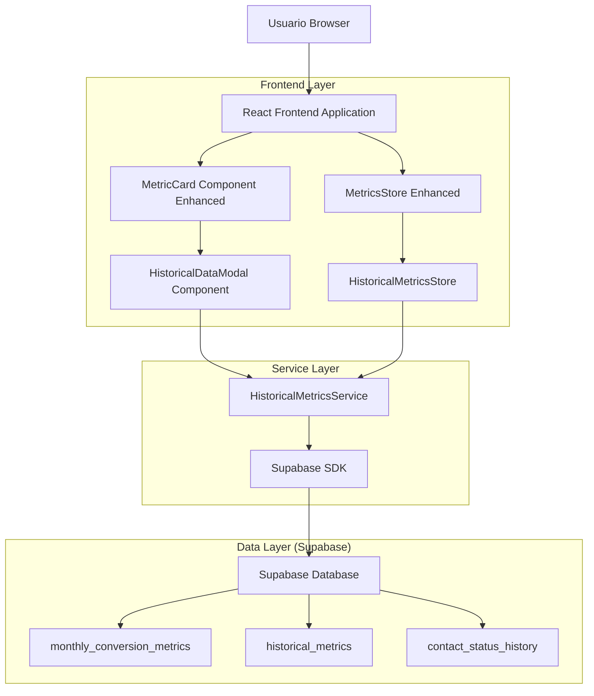
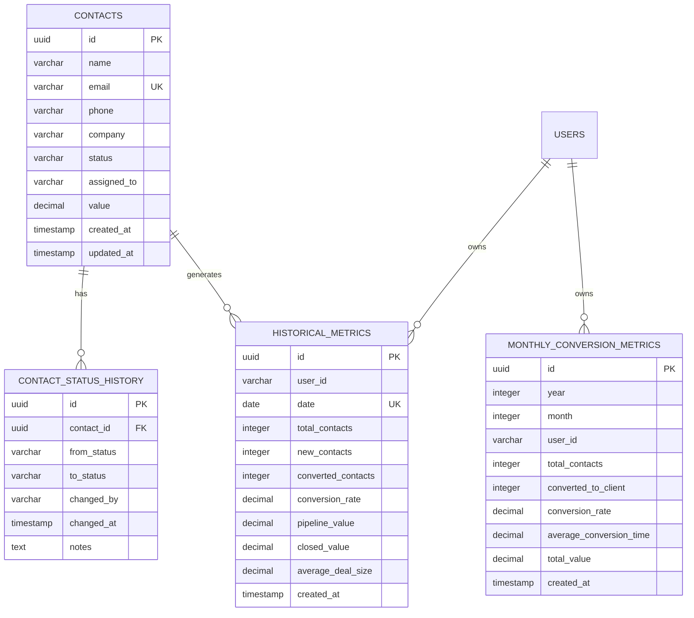

## 1. Diseño de Arquitectura



## 2. Descripción de Tecnologías

- Frontend: React@18 + TypeScript + TailwindCSS@3 + Vite + Zustand + Chart.js
- Backend: Supabase (PostgreSQL + Auth + Real-time)
- Librerías adicionales: Lucide React (iconos), date-fns (manejo de fechas), react-hook-form (formularios)

## 3. Definiciones de Rutas

| Ruta | Propósito |
|------|----------|
| /dashboard | Dashboard principal con métricas interactivas y acceso a datos históricos |
| /analytics | Vista dedicada de análisis temporal con gráficos avanzados |
| /settings/data-retention | Configuración de retención de datos históricos |
| /settings/alerts | Configuración de alertas y notificaciones de métricas |

## 4. Definiciones de API

### 4.1 API Principal

**Obtener métricas históricas por rango de fechas**
```
GET /api/historical-metrics
```

Request:
| Nombre Parámetro | Tipo Parámetro | Requerido | Descripción |
|------------------|----------------|-----------|-------------|
| startDate | string (ISO) | true | Fecha de inicio del rango |
| endDate | string (ISO) | true | Fecha de fin del rango |
| userId | string | false | ID del usuario (opcional para filtrar) |
| granularity | 'daily' \| 'monthly' | true | Granularidad de los datos |
| metricType | string | false | Tipo específico de métrica |

Response:
| Nombre Parámetro | Tipo Parámetro | Descripción |
|------------------|----------------|-------------|
| success | boolean | Estado de la respuesta |
| data | HistoricalMetric[] | Array de métricas históricas |
| pagination | PaginationInfo | Información de paginación |

Ejemplo:
```json
{
  "startDate": "2024-01-01T00:00:00Z",
  "endDate": "2024-01-31T23:59:59Z",
  "userId": "user-123",
  "granularity": "daily"
}
```

**Obtener métricas de conversión mensuales**
```
GET /api/monthly-conversion-metrics
```

Request:
| Nombre Parámetro | Tipo Parámetro | Requerido | Descripción |
|------------------|----------------|-----------|-------------|
| year | number | true | Año de las métricas |
| month | number | false | Mes específico (1-12) |
| userId | string | false | ID del usuario |

Response:
| Nombre Parámetro | Tipo Parámetro | Descripción |
|------------------|----------------|-------------|
| success | boolean | Estado de la respuesta |
| data | MonthlyConversionMetric[] | Métricas de conversión mensual |

**Calcular y almacenar métricas del período actual**
```
POST /api/calculate-current-metrics
```

Request:
| Nombre Parámetro | Tipo Parámetro | Requerido | Descripción |
|------------------|----------------|-----------|-------------|
| userId | string | false | ID del usuario para cálculo específico |
| forceRecalculate | boolean | false | Forzar recálculo de métricas existentes |

Response:
| Nombre Parámetro | Tipo Parámetro | Descripción |
|------------------|----------------|-------------|
| success | boolean | Estado de la operación |
| metrics | HistoricalMetricsEntry | Métricas calculadas |

## 5. Arquitectura del Servidor

```mermaid
graph TD
    A[Cliente / Frontend] --> B[Capa de Componentes]
    B --> C[Capa de Servicios]
    C --> D[Capa de Almacén (Zustand)]
    D --> E[Supabase SDK]
    E --> F[(Base de Datos Supabase)]
    
    subgraph Servidor Frontend
        B
        C
        D
    end
    
    subgraph "Servicios Supabase"
        E
        F
        G[Real-time Subscriptions]
        H[Auth Service]
    end
```

## 6. Modelo de Datos

### 6.1 Definición del Modelo de Datos



### 6.2 Lenguaje de Definición de Datos

**Tabla de Métricas Históricas Mejorada (historical_metrics)**
```sql
-- Crear tabla mejorada para métricas históricas
CREATE TABLE IF NOT EXISTS historical_metrics_enhanced (
    id UUID PRIMARY KEY DEFAULT gen_random_uuid(),
    user_id VARCHAR(255),
    team_id VARCHAR(255),
    date DATE NOT NULL,
    granularity VARCHAR(10) DEFAULT 'daily' CHECK (granularity IN ('daily', 'monthly')),
    
    -- Métricas de contactos
    total_contacts INTEGER DEFAULT 0 CHECK (total_contacts >= 0),
    new_contacts INTEGER DEFAULT 0 CHECK (new_contacts >= 0),
    active_contacts INTEGER DEFAULT 0 CHECK (active_contacts >= 0),
    pipeline_contacts INTEGER DEFAULT 0 CHECK (pipeline_contacts >= 0),
    
    -- Métricas de conversión
    converted_contacts INTEGER DEFAULT 0 CHECK (converted_contacts >= 0),
    conversion_rate DECIMAL(5,2) DEFAULT 0 CHECK (conversion_rate >= 0 AND conversion_rate <= 100),
    average_conversion_time DECIMAL(8,2) DEFAULT 0 CHECK (average_conversion_time >= 0),
    
    -- Métricas de valor
    pipeline_value DECIMAL(12,2) DEFAULT 0 CHECK (pipeline_value >= 0),
    closed_value DECIMAL(12,2) DEFAULT 0 CHECK (closed_value >= 0),
    average_deal_size DECIMAL(10,2) DEFAULT 0 CHECK (average_deal_size >= 0),
    total_value DECIMAL(12,2) DEFAULT 0 CHECK (total_value >= 0),
    
    -- Metadatos
    calculated_at TIMESTAMP WITH TIME ZONE DEFAULT NOW(),
    data_quality_score DECIMAL(3,2) DEFAULT 1.00 CHECK (data_quality_score >= 0 AND data_quality_score <= 1),
    
    created_at TIMESTAMP WITH TIME ZONE DEFAULT NOW(),
    updated_at TIMESTAMP WITH TIME ZONE DEFAULT NOW(),
    
    UNIQUE(user_id, date, granularity)
);

-- Crear índices optimizados
CREATE INDEX IF NOT EXISTS idx_historical_metrics_enhanced_user_date 
    ON historical_metrics_enhanced(user_id, date DESC);
CREATE INDEX IF NOT EXISTS idx_historical_metrics_enhanced_team_date 
    ON historical_metrics_enhanced(team_id, date DESC);
CREATE INDEX IF NOT EXISTS idx_historical_metrics_enhanced_granularity 
    ON historical_metrics_enhanced(granularity, date DESC);
CREATE INDEX IF NOT EXISTS idx_historical_metrics_enhanced_calculated_at 
    ON historical_metrics_enhanced(calculated_at DESC);

-- Tabla para configuración de retención de datos
CREATE TABLE IF NOT EXISTS data_retention_config (
    id UUID PRIMARY KEY DEFAULT gen_random_uuid(),
    user_id VARCHAR(255) UNIQUE,
    daily_retention_days INTEGER DEFAULT 90 CHECK (daily_retention_days > 0),
    monthly_retention_months INTEGER DEFAULT 24 CHECK (monthly_retention_months > 0),
    auto_archive_enabled BOOLEAN DEFAULT true,
    created_at TIMESTAMP WITH TIME ZONE DEFAULT NOW(),
    updated_at TIMESTAMP WITH TIME ZONE DEFAULT NOW()
);

-- Tabla para alertas de métricas
CREATE TABLE IF NOT EXISTS metric_alerts (
    id UUID PRIMARY KEY DEFAULT gen_random_uuid(),
    user_id VARCHAR(255) NOT NULL,
    metric_name VARCHAR(100) NOT NULL,
    threshold_type VARCHAR(20) CHECK (threshold_type IN ('above', 'below', 'change')),
    threshold_value DECIMAL(10,2) NOT NULL,
    is_active BOOLEAN DEFAULT true,
    last_triggered_at TIMESTAMP WITH TIME ZONE,
    created_at TIMESTAMP WITH TIME ZONE DEFAULT NOW(),
    updated_at TIMESTAMP WITH TIME ZONE DEFAULT NOW()
);

-- Función para limpiar datos antiguos automáticamente
CREATE OR REPLACE FUNCTION cleanup_old_historical_data()
RETURNS void AS $$
DECLARE
    config_record RECORD;
BEGIN
    FOR config_record IN 
        SELECT user_id, daily_retention_days, monthly_retention_months 
        FROM data_retention_config 
        WHERE auto_archive_enabled = true
    LOOP
        -- Limpiar datos diarios antiguos
        DELETE FROM historical_metrics_enhanced 
        WHERE user_id = config_record.user_id 
            AND granularity = 'daily'
            AND date < (CURRENT_DATE - INTERVAL '1 day' * config_record.daily_retention_days);
        
        -- Limpiar datos mensuales antiguos
        DELETE FROM historical_metrics_enhanced 
        WHERE user_id = config_record.user_id 
            AND granularity = 'monthly'
            AND date < (CURRENT_DATE - INTERVAL '1 month' * config_record.monthly_retention_months);
    END LOOP;
END;
$$ LANGUAGE plpgsql;

-- Datos iniciales para configuración de retención
INSERT INTO data_retention_config (user_id, daily_retention_days, monthly_retention_months)
SELECT DISTINCT assigned_to, 90, 24
FROM contacts 
WHERE assigned_to IS NOT NULL
ON CONFLICT (user_id) DO NOTHING;

-- Permisos de seguridad
GRANT SELECT, INSERT, UPDATE ON historical_metrics_enhanced TO authenticated;
GRANT SELECT, INSERT, UPDATE ON data_retention_config TO authenticated;
GRANT SELECT, INSERT, UPDATE, DELETE ON metric_alerts TO authenticated;
GRANT SELECT ON historical_metrics_enhanced TO anon;
```
