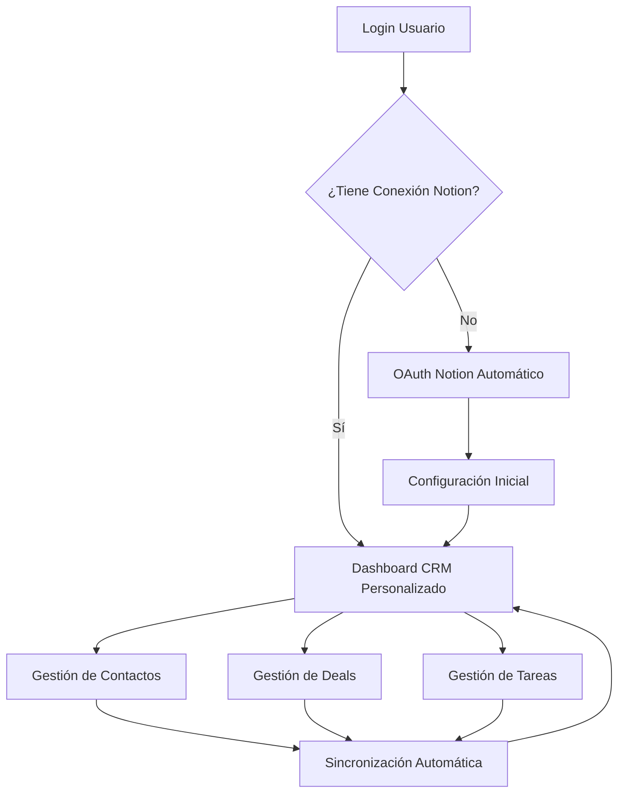

# Requerimientos del Producto: Sistema CRM Notion Optimizado

## 1. Descripción General del Producto

Sistema CRM integrado con Notion que permite a los usuarios gestionar contactos, oportunidades y tareas de manera eficiente, con autenticación automática y experiencia personalizada por usuario.

El producto resuelve los problemas de carga infinita, autenticación múltiple y falta de personalización en el CRM actual, proporcionando una experiencia fluida y automatizada.

Objetivo: Crear un sistema CRM de producción que maximice la eficiencia operativa y reduzca la fricción del usuario.

## 2. Funcionalidades Principales

### 2.1 Roles de Usuario

| Rol | Método de Registro | Permisos Principales |
|-----|-------------------|---------------------|
| Usuario CRM | Registro con email + OAuth Notion automático | Gestión completa de su CRM personal, acceso a datos propios |
| Administrador | Invitación del sistema | Gestión de usuarios, configuración global, monitoreo del sistema |

### 2.2 Módulos de Funcionalidad

Nuestro sistema CRM optimizado consta de las siguientes páginas principales:

1. **Dashboard CRM**: panel de control personalizado, métricas en tiempo real, acceso rápido a funciones principales.
2. **Gestión de Contactos**: lista de contactos sincronizada, creación/edición en tiempo real, filtros avanzados.
3. **Gestión de Oportunidades**: pipeline de ventas visual, seguimiento de deals, proyecciones de ingresos.
4. **Gestión de Tareas**: lista de tareas pendientes, asignación automática, recordatorios inteligentes.
5. **Configuración de Integración**: gestión de conexiones Notion, configuración de sincronización, diagnósticos del sistema.

### 2.3 Detalles de Páginas

| Página | Módulo | Descripción de Funcionalidad |
|--------|--------|------------------------------|
| Dashboard CRM | Panel Principal | Mostrar métricas clave (contactos, deals, tareas), gráficos de rendimiento, accesos rápidos a funciones principales |
| Dashboard CRM | Estado de Conexión | Indicador visual de estado Notion, botón de reconexión automática, alertas de sincronización |
| Gestión de Contactos | Lista de Contactos | Cargar contactos desde Notion con paginación, filtros por estado/empresa, búsqueda en tiempo real |
| Gestión de Contactos | Formulario de Contacto | Crear/editar contactos con validación, sincronización automática con Notion, manejo de errores |
| Gestión de Oportunidades | Pipeline Visual | Mostrar deals por etapa, drag & drop entre etapas, cálculo automático de probabilidades |
| Gestión de Oportunidades | Formulario de Deal | Crear/editar oportunidades, vinculación con contactos, seguimiento de fechas |
| Gestión de Tareas | Lista de Tareas | Mostrar tareas pendientes/completadas, filtros por prioridad/fecha, asignación automática |
| Gestión de Tareas | Formulario de Tarea | Crear/editar tareas, establecer prioridades, vincular con contactos/deals |
| Configuración | Gestión OAuth | Conectar/desconectar workspaces Notion, renovación automática de tokens, diagnósticos de conexión |
| Configuración | Sincronización | Configurar frecuencia de sync, mapeo de campos, resolución de conflictos |

## 3. Proceso Principal del Usuario

### Flujo de Usuario CRM:
1. El usuario inicia sesión en el sistema principal
2. El sistema detecta automáticamente si tiene conexión Notion activa
3. Si no tiene conexión, redirige automáticamente al flujo OAuth de Notion
4. Una vez conectado, redirige al Dashboard CRM personalizado
5. El usuario accede a sus datos sincronizados en tiempo real
6. Todas las acciones se sincronizan automáticamente con Notion
7. El sistema mantiene la sesión activa y renueva tokens automáticamente

### Flujo de Administrador:
1. Acceso a panel de administración con métricas globales
2. Gestión de usuarios y sus conexiones Notion
3. Monitoreo de estado del sistema y logs de errores
4. Configuración de parámetros globales de sincronización

## 4. Diseño de Interfaz de Usuario

### 4.1 Estilo de Diseño

- **Colores Primarios**: Azul #2563eb (primary), Verde #059669 (success), Rojo #dc2626 (error)
- **Colores Secundarios**: Gris #6b7280 (text), Gris claro #f3f4f6 (background)
- **Estilo de Botones**: Redondeados (rounded-lg), con estados hover y disabled
- **Tipografía**: Inter, tamaños 14px (body), 16px (headings), 12px (captions)
- **Layout**: Diseño de tarjetas con sombras sutiles, navegación lateral fija
- **Iconos**: Lucide React, estilo outline, tamaño 20px para acciones principales

### 4.2 Resumen de Diseño por Página

| Página | Módulo | Elementos de UI |
|--------|--------|-----------------|
| Dashboard CRM | Panel Principal | Cards con métricas, gráficos Chart.js, colores de estado (verde/rojo/amarillo), layout grid responsivo |
| Dashboard CRM | Estado Conexión | Badge con indicador circular, colores semánticos, botón de acción prominente |
| Gestión de Contactos | Lista | Tabla con paginación, filtros dropdown, búsqueda con debounce, estados de carga skeleton |
| Gestión de Contactos | Formulario | Modal overlay, validación en tiempo real, campos con iconos, botones de acción |
| Gestión de Oportunidades | Pipeline | Columnas drag & drop, cards con colores por etapa, progress bars, tooltips informativos |
| Gestión de Tareas | Lista | Checkboxes interactivos, badges de prioridad, fechas con formato relativo |
| Configuración | OAuth | Wizard de configuración, indicadores de progreso, mensajes de estado claros |

### 4.3 Responsividad

Diseño desktop-first con adaptación móvil completa. Navegación lateral se convierte en menú hamburguesa en móvil. Tablas se convierten en cards apiladas. Optimización táctil para botones y formularios.