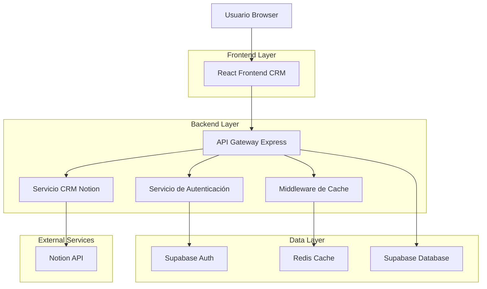
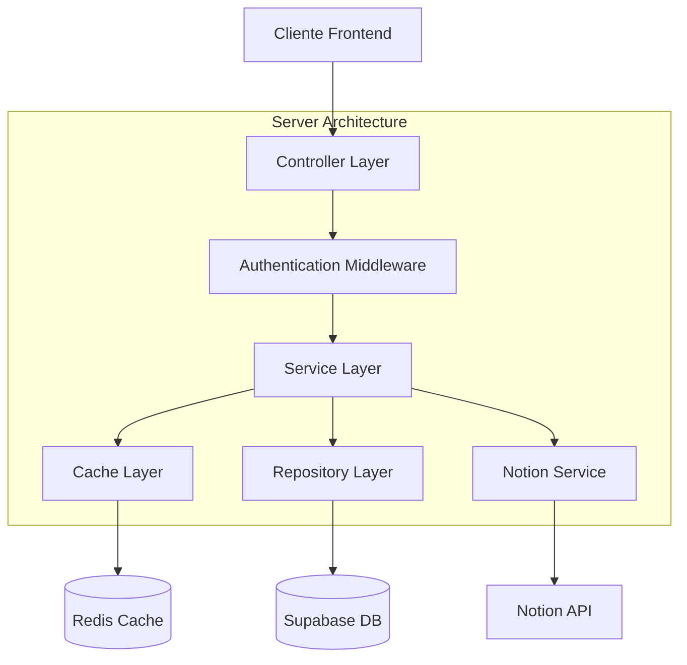
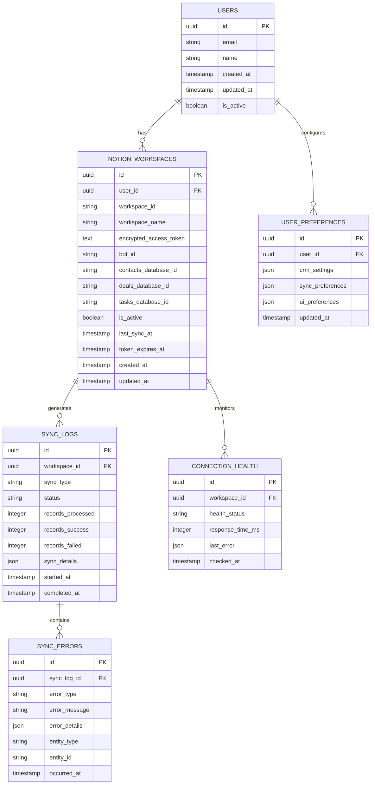

# Arquitectura Técnica: Sistema CRM Notion Optimizado

## 1. Diseño de Arquitectura



## 2. Descripción de Tecnologías

- Frontend: React@18 + TypeScript + TailwindCSS + Zustand + React Query
- Backend: Express@4 + TypeScript + Supabase SDK
- Database: Supabase (PostgreSQL)
- Cache: Redis para tokens y datos de Notion
- External APIs: Notion API v1, Supabase Auth

## 3. Definiciones de Rutas

| Ruta | Propósito |
|------|----------|
| /crm | Dashboard principal del CRM con redirección automática |
| /crm/contacts | Gestión de contactos sincronizada con Notion |
| /crm/deals | Gestión de oportunidades y pipeline de ventas |
| /crm/tasks | Gestión de tareas y seguimientos |
| /crm/settings | Configuración de integración Notion y diagnósticos |
| /auth/notion/callback | Callback OAuth de Notion para autenticación automática |

## 4. Definiciones de API

### 4.1 APIs Principales

**Autenticación automática con Notion**
```
POST /api/auth/notion/connect
```

Request:
| Parámetro | Tipo | Requerido | Descripción |
|-----------|------|-----------|-------------|
| code | string | true | Código OAuth de Notion |
| state | string | true | Estado de seguridad OAuth |

Response:
| Parámetro | Tipo | Descripción |
|-----------|------|-------------|
| success | boolean | Estado de la conexión |
| workspace | object | Datos del workspace conectado |
| redirect_url | string | URL de redirección al CRM personalizado |

**Verificación de estado de conexión**
```
GET /api/crm/connection/status
```

Response:
| Parámetro | Tipo | Descripción |
|-----------|------|-------------|
| connected | boolean | Estado de conexión con Notion |
| workspace_name | string | Nombre del workspace activo |
| last_sync | string | Timestamp de última sincronización |
| health_status | string | Estado de salud de la conexión |

**Sincronización automática de datos**
```
POST /api/crm/sync
```

Request:
| Parámetro | Tipo | Requerido | Descripción |
|-----------|------|-----------|-------------|
| force | boolean | false | Forzar sincronización completa |
| entities | array | false | Entidades específicas a sincronizar |

Response:
| Parámetro | Tipo | Descripción |
|-----------|------|-------------|
| sync_id | string | ID único de la sincronización |
| status | string | Estado del proceso |
| progress | object | Progreso de sincronización por entidad |

**Gestión de contactos optimizada**
```
GET /api/crm/contacts
```

Request:
| Parámetro | Tipo | Requerido | Descripción |
|-----------|------|-----------|-------------|
| page | number | false | Número de página para paginación |
| limit | number | false | Límite de resultados por página |
| search | string | false | Término de búsqueda |
| status | string | false | Filtro por estado del contacto |

Response:
| Parámetro | Tipo | Descripción |
|-----------|------|-------------|
| contacts | array | Lista de contactos |
| pagination | object | Información de paginación |
| cache_status | string | Estado del cache de datos |

## 5. Arquitectura del Servidor



## 6. Modelo de Datos

### 6.1 Definición del Modelo de Datos



### 6.2 Lenguaje de Definición de Datos

**Tabla de Workspaces Notion Optimizada**
```sql
-- Crear tabla de workspaces con campos optimizados
CREATE TABLE notion_workspaces (
    id UUID PRIMARY KEY DEFAULT gen_random_uuid(),
    user_id UUID NOT NULL REFERENCES auth.users(id) ON DELETE CASCADE,
    workspace_id VARCHAR(255) NOT NULL,
    workspace_name VARCHAR(255) NOT NULL,
    encrypted_access_token TEXT NOT NULL,
    bot_id VARCHAR(255),
    contacts_database_id VARCHAR(255),
    deals_database_id VARCHAR(255),
    tasks_database_id VARCHAR(255),
    is_active BOOLEAN DEFAULT true,
    last_sync_at TIMESTAMP WITH TIME ZONE,
    token_expires_at TIMESTAMP WITH TIME ZONE,
    created_at TIMESTAMP WITH TIME ZONE DEFAULT NOW(),
    updated_at TIMESTAMP WITH TIME ZONE DEFAULT NOW(),
    UNIQUE(user_id, workspace_id)
);

-- Crear tabla de logs de sincronización
CREATE TABLE sync_logs (
    id UUID PRIMARY KEY DEFAULT gen_random_uuid(),
    workspace_id UUID NOT NULL REFERENCES notion_workspaces(id) ON DELETE CASCADE,
    sync_type VARCHAR(50) NOT NULL CHECK (sync_type IN ('full', 'incremental', 'manual')),
    status VARCHAR(20) NOT NULL CHECK (status IN ('pending', 'running', 'completed', 'failed')),
    records_processed INTEGER DEFAULT 0,
    records_success INTEGER DEFAULT 0,
    records_failed INTEGER DEFAULT 0,
    sync_details JSONB,
    started_at TIMESTAMP WITH TIME ZONE DEFAULT NOW(),
    completed_at TIMESTAMP WITH TIME ZONE
);

-- Crear tabla de salud de conexiones
CREATE TABLE connection_health (
    id UUID PRIMARY KEY DEFAULT gen_random_uuid(),
    workspace_id UUID NOT NULL REFERENCES notion_workspaces(id) ON DELETE CASCADE,
    health_status VARCHAR(20) NOT NULL CHECK (health_status IN ('healthy', 'degraded', 'unhealthy')),
    response_time_ms INTEGER,
    last_error JSONB,
    checked_at TIMESTAMP WITH TIME ZONE DEFAULT NOW()
);

-- Crear tabla de preferencias de usuario
CREATE TABLE user_preferences (
    id UUID PRIMARY KEY DEFAULT gen_random_uuid(),
    user_id UUID NOT NULL REFERENCES auth.users(id) ON DELETE CASCADE,
    crm_settings JSONB DEFAULT '{}',
    sync_preferences JSONB DEFAULT '{"frequency": "hourly", "auto_sync": true}',
    ui_preferences JSONB DEFAULT '{"theme": "light", "density": "comfortable"}',
    updated_at TIMESTAMP WITH TIME ZONE DEFAULT NOW(),
    UNIQUE(user_id)
);

-- Crear tabla de errores de sincronización
CREATE TABLE sync_errors (
    id UUID PRIMARY KEY DEFAULT gen_random_uuid(),
    sync_log_id UUID NOT NULL REFERENCES sync_logs(id) ON DELETE CASCADE,
    error_type VARCHAR(50) NOT NULL,
    error_message TEXT NOT NULL,
    error_details JSONB,
    entity_type VARCHAR(50),
    entity_id VARCHAR(255),
    occurred_at TIMESTAMP WITH TIME ZONE DEFAULT NOW()
);

-- Crear índices para optimización
CREATE INDEX idx_notion_workspaces_user_active ON notion_workspaces(user_id, is_active);
CREATE INDEX idx_sync_logs_workspace_status ON sync_logs(workspace_id, status);
CREATE INDEX idx_sync_logs_created_at ON sync_logs(started_at DESC);
CREATE INDEX idx_connection_health_workspace ON connection_health(workspace_id, checked_at DESC);
CREATE INDEX idx_sync_errors_sync_log ON sync_errors(sync_log_id);

-- Configurar RLS (Row Level Security)
ALTER TABLE notion_workspaces ENABLE ROW LEVEL SECURITY;
ALTER TABLE sync_logs ENABLE ROW LEVEL SECURITY;
ALTER TABLE connection_health ENABLE ROW LEVEL SECURITY;
ALTER TABLE user_preferences ENABLE ROW LEVEL SECURITY;
ALTER TABLE sync_errors ENABLE ROW LEVEL SECURITY;

-- Políticas de seguridad
CREATE POLICY "Users can manage their own workspaces" ON notion_workspaces
    FOR ALL USING (auth.uid() = user_id);

CREATE POLICY "Users can view their sync logs" ON sync_logs
    FOR SELECT USING (EXISTS (
        SELECT 1 FROM notion_workspaces nw 
        WHERE nw.id = sync_logs.workspace_id AND nw.user_id = auth.uid()
    ));

CREATE POLICY "Users can view their connection health" ON connection_health
    FOR SELECT USING (EXISTS (
        SELECT 1 FROM notion_workspaces nw 
        WHERE nw.id = connection_health.workspace_id AND nw.user_id = auth.uid()
    ));

CREATE POLICY "Users can manage their preferences" ON user_preferences
    FOR ALL USING (auth.uid() = user_id);

CREATE POLICY "Users can view their sync errors" ON sync_errors
    FOR SELECT USING (EXISTS (
        SELECT 1 FROM sync_logs sl 
        JOIN notion_workspaces nw ON nw.id = sl.workspace_id 
        WHERE sl.id = sync_errors.sync_log_id AND nw.user_id = auth.uid()
    ));

-- Permisos para roles
GRANT SELECT ON notion_workspaces TO anon;
GRANT ALL PRIVILEGES ON notion_workspaces TO authenticated;
GRANT SELECT ON sync_logs TO anon;
GRANT ALL PRIVILEGES ON sync_logs TO authenticated;
GRANT SELECT ON connection_health TO anon;
GRANT ALL PRIVILEGES ON connection_health TO authenticated;
GRANT ALL PRIVILEGES ON user_preferences TO authenticated;
GRANT SELECT ON sync_errors TO authenticated;

-- Datos iniciales para configuración
INSERT INTO user_preferences (user_id, crm_settings, sync_preferences, ui_preferences)
SELECT 
    id,
    '{"default_view": "dashboard", "notifications": true}',
    '{"frequency": "hourly", "auto_sync": true, "batch_size": 100}',
    '{"theme": "light", "density": "comfortable", "sidebar_collapsed": false}'
FROM auth.users 
WHERE NOT EXISTS (
    SELECT 1 FROM user_preferences WHERE user_id = auth.users.id
);
```