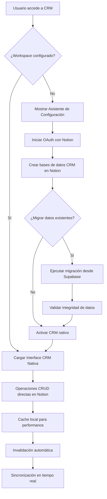

# Documento de Requisitos del Producto - Notion CRM Integration

## 1. Resumen del Producto

Sistema CRM nativo integrado completamente con Notion como base de datos principal. Los usuarios operan un CRM completo que utiliza las bases de datos de Notion como backend, eliminando la necesidad de sistemas locales separados y proporcionando una experiencia unificada.

- Soluciona la duplicación de sistemas CRM al migrar completamente a Notion como fuente única de verdad para todos los datos de contactos, deals, tareas e interacciones.
- Dirigido a equipos de ventas y gestión que desean centralizar toda su operación CRM en Notion manteniendo una interfaz optimizada para ventas.
- Genera valor al eliminar sistemas redundantes, reducir costos de infraestructura y proporcionar acceso directo a la potencia de Notion para análisis y reportes.

## 2. Funcionalidades Principales

### 2.1 Roles de Usuario

| Rol | Método de Registro | Permisos Principales |
|-----|-------------------|---------------------|
| Usuario Autenticado | Sistema existente de autenticación | Acceso a Notion CRM con URL personalizada o fallback |
| Administrador | Sistema existente | Gestión de configuraciones de Notion CRM para usuarios |

### 2.2 Módulos de Funcionalidad

Nuestro CRM nativo integrado con Notion consta de las siguientes páginas principales:

1. **Dashboard CRM**: panel principal nativo, métricas en tiempo real desde Notion, acceso directo a workspaces, resumen de actividades.
2. **Configuración de Workspace**: asistente de configuración inicial, autorización OAuth completa, creación automática de bases de datos CRM, migración de datos existentes.
3. **Gestión de Contactos**: interfaz CRM nativa operando directamente sobre bases de datos Notion, creación/edición en tiempo real, vista de pipeline integrada.
4. **Gestión de Deals**: pipeline de ventas completo, seguimiento de oportunidades, reportes automáticos, integración con contactos.
5. **Centro de Migración**: herramienta de migración desde sistemas anteriores, mapeo automático de datos, validación de integridad, monitoreo de progreso.
6. **Tareas e Interacciones**: gestión completa de seguimientos, historial de comunicaciones, recordatorios automáticos, integración con calendario.

### 2.3 Detalles de Página

| Página | Módulo | Descripción de Funcionalidad |
|--------|--------|------------------------------|
| Dashboard CRM | Panel Principal | Mostrar métricas en tiempo real desde bases de datos Notion, resumen de contactos, deals y tareas |
| Dashboard CRM | Acceso Rápido | Navegación directa a secciones CRM y acceso al workspace Notion original |
| Configuración Workspace | Asistente Setup | Guiar configuración inicial OAuth, detección de workspace, creación de bases de datos CRM |
| Configuración Workspace | Migración de Datos | Herramienta para migrar datos existentes desde Supabase a bases de datos Notion |
| Gestión Contactos | Interface Nativa | CRUD completo de contactos operando directamente sobre base de datos Notion |
| Gestión Contactos | Vista Pipeline | Integración con deals y oportunidades, seguimiento de interacciones |
| Gestión Deals | Pipeline Ventas | Gestión completa de oportunidades, etapas, montos, fechas de cierre |
| Gestión Deals | Reportes | Análisis automático de performance, conversión, forecasting desde datos Notion |
| Centro Migración | Análisis de Datos | Mapeo automático de estructuras existentes a formato Notion |
| Centro Migración | Transferencia | Migración por lotes con validación, verificación de integridad |
| Tareas e Interacciones | Gestión Seguimientos | Creación y gestión de tareas, recordatorios, historial de comunicaciones |
| Tareas e Interacciones | Integración Calendar | Sincronización con calendarios, programación de actividades |

## 3. Proceso Principal

### Flujo de Usuario Regular

1. **Acceso inicial**: Usuario navega a la sección "CRM" desde el dashboard principal
2. **Verificación de workspace**: Sistema verifica si el usuario tiene workspace Notion configurado
3. **Interface nativa**: Si está configurado, se carga la interface CRM nativa operando sobre Notion
4. **Configuración inicial**: Si no está configurado, se inicia el asistente de configuración de workspace
5. **Migración opcional**: Durante la configuración, opción de migrar datos existentes desde sistema anterior
6. **Operación CRM**: Usuario opera CRM completo con datos almacenados directamente en Notion

### Flujo de Conexión OAuth (PRO)

1. Usuario sin workspace configurado ve asistente de configuración
2. Click en "Configurar Workspace" inicia OAuth con Notion
3. Sistema redirige a OAuth de Notion para autorización completa
4. Notion redirige a callback con código de autorización
5. Sistema intercambia código por token y crea bases de datos CRM automáticamente
6. Usuario accede a CRM nativo operando directamente sobre sus datos Notion

## 4. Diseño de Interfaz de Usuario

### 4.1 Estilo de Diseño

- **Colores primarios**: Verde Cactus (#22c55e), Azul Notion (#2563eb)
- **Colores secundarios**: Gris claro (#f8fafc), Gris oscuro (#1e293b), Blanco (#ffffff)
- **Estilo de botones**: Redondeados con efectos hover, gradientes sutiles para CTAs principales
- **Fuente**: Inter, tamaños 14px (texto), 16px (botones), 20px (subtítulos), 28px (títulos principales)
- **Layout**: Dashboard moderno con sidebar, cards métricas, tablas optimizadas para CRM
- **Iconos**: Lucide React con estilo CRM profesional, iconografía Notion integrada

### 4.2 Resumen de Diseño de Página

| Nombre de Página | Nombre del Módulo | Elementos de UI |
|------------------|-------------------|-----------------|
| Dashboard CRM | Panel Principal | Cards de métricas, gráficos en tiempo real, accesos rápidos, indicadores de estado |
| Dashboard CRM | Navegación | Sidebar con secciones CRM, breadcrumbs, acceso directo a Notion workspace |
| Configuración Workspace | Asistente Setup | Wizard multi-paso, progress indicator, validación en tiempo real, preview de estructura |
| Configuración Workspace | Migración | Progress bars, logs en tiempo real, validación de datos, confirmaciones |
| Gestión Contactos | Lista Nativa | Tabla avanzada con filtros, búsqueda, ordenamiento, acciones bulk |
| Gestión Contactos | Formularios | Modal/drawer para CRUD, validación inline, autocompletado, vista previa |
| Gestión Deals | Pipeline Visual | Kanban board, drag & drop, métricas por etapa, filtros avanzados |
| Gestión Deals | Reportes | Dashboards interactivos, gráficos de conversión, forecasting, exportación |
| Centro Migración | Monitor | Progress tracking, logs detallados, rollback options, validación de integridad |
| Tareas e Interacciones | Timeline | Vista cronológica, recordatorios, integración calendar, notas contextuales |

### 4.3 Responsividad

La aplicación es desktop-first con adaptación completa móvil. Interface CRM optimizada para tablets con touch interactions, sidebar colapsible en móviles, tablas responsivas con scroll horizontal, modals adaptados a viewport móvil.