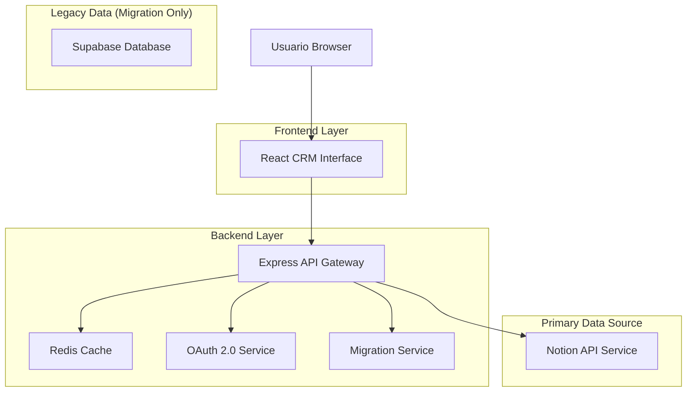
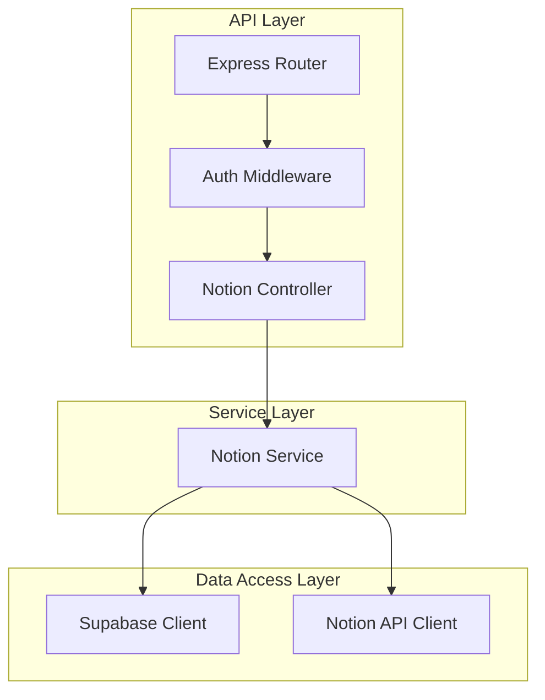
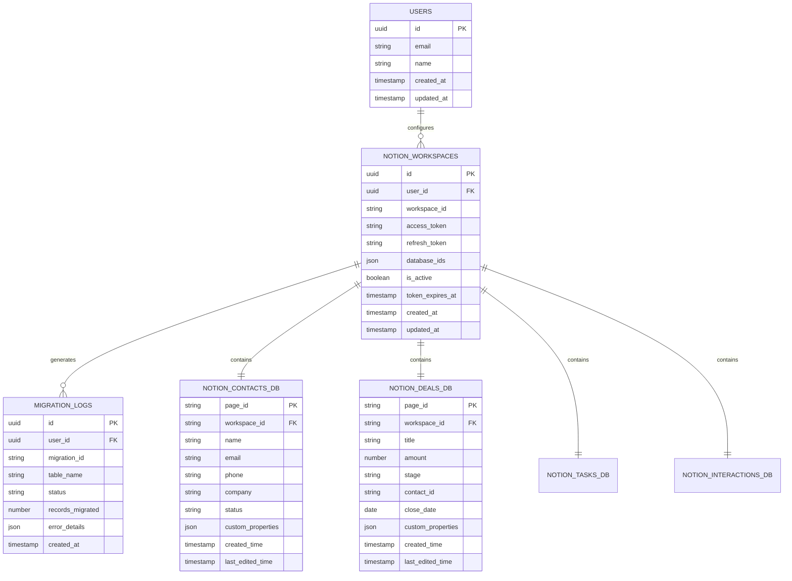

# Documento de Arquitectura Técnica - Notion CRM Integration

## 1. Diseño de Arquitectura



## 2. Descripción de Tecnologías

- Frontend: React@18 + TypeScript@5 + tailwindcss@3 + vite
- Backend: Express@4 + TypeScript@5 + cors + helmet
- Primary Database: Notion API v1 (Databases as Backend)
- Cache: Redis@7 (Performance optimization)
- Authentication: OAuth 2.0 + JWT
- Migration Tool: Custom service for Supabase → Notion

## 3. Definiciones de Rutas

| Ruta | Propósito |
|------|----------|
| /crm | CRM dashboard nativo operando sobre Notion |
| /crm/contacts | Gestión de contactos directamente en Notion |
| /crm/deals | Pipeline de ventas operando sobre Notion |
| /crm/tasks | Tareas y seguimientos en bases de datos Notion |
| /crm/workspace | Configuración y acceso al workspace Notion |
| /crm/settings | Configuración OAuth y permisos de workspace |
| /crm/migration | Herramienta de migración desde sistema anterior |

## 4. Definiciones de API

### 4.1 Core API

Configuración de Workspace
```
POST /api/crm/workspace/setup
```

Request:
| Param Name| Param Type  | isRequired  | Description |
|-----------|-------------|-------------|-------------|
| oauth_code | string     | true        | Código de autorización OAuth de Notion |
| workspace_id | string   | true        | ID del workspace de Notion |

Response:
| Param Name| Param Type  | Description |
|-----------|-------------|-------------|
| success   | boolean     | Estado de la configuración |
| databases | object      | Bases de datos CRM creadas en Notion |
| workspace | object      | Información del workspace configurado |

Operaciones de Contactos
```
GET /api/crm/contacts
```

Response:
| Param Name| Param Type  | Description |
|-----------|-------------|-------------|
| contacts  | array       | Lista de contactos desde Notion |
| total     | number      | Total de contactos |
| cached_at | string      | Timestamp del cache |

```
POST /api/crm/contacts
```

Request:
| Param Name| Param Type  | isRequired  | Description |
|-----------|-------------|-------------|-------------|
| name      | string      | true        | Nombre del contacto |
| email     | string      | true        | Email del contacto |
| company   | string      | false       | Empresa del contacto |
| phone     | string      | false       | Teléfono del contacto |

Response:
| Param Name| Param Type  | Description |
|-----------|-------------|-------------|
| id        | string      | ID del contacto en Notion |
| created   | boolean     | Estado de creación |

Migración de Datos
```
POST /api/crm/migration/start
```

Request:
| Param Name| Param Type  | isRequired  | Description |
|-----------|-------------|-------------|-------------|
| source    | string      | true        | "supabase" - fuente de datos |
| tables    | array       | true        | Tablas a migrar ["contacts", "deals", "tasks"] |

Response:
| Param Name| Param Type  | Description |
|-----------|-------------|-------------|
| migration_id | string   | ID del proceso de migración |
| status    | string      | Estado inicial "started" |
| estimated_time | number | Tiempo estimado en minutos |

## 5. Arquitectura del Servidor



## 6. Modelo de Datos

### 6.1 Definición del Modelo de Datos



### 6.2 Lenguaje de Definición de Datos

Tabla de configuración de Workspaces Notion (notion_workspaces)
```sql
-- Crear tabla
CREATE TABLE notion_workspaces (
    id UUID PRIMARY KEY DEFAULT gen_random_uuid(),
    user_id UUID REFERENCES auth.users(id) ON DELETE CASCADE,
    workspace_id TEXT NOT NULL,
    access_token TEXT NOT NULL,
    refresh_token TEXT,
    database_ids JSONB DEFAULT '{}',
    is_active BOOLEAN DEFAULT true,
    token_expires_at TIMESTAMP WITH TIME ZONE,
    created_at TIMESTAMP WITH TIME ZONE DEFAULT NOW(),
    updated_at TIMESTAMP WITH TIME ZONE DEFAULT NOW()
);

-- Crear índices
CREATE INDEX idx_notion_workspaces_user_id ON notion_workspaces(user_id);
CREATE INDEX idx_notion_workspaces_workspace_id ON notion_workspaces(workspace_id);
CREATE INDEX idx_notion_workspaces_active ON notion_workspaces(is_active);

-- Habilitar RLS
ALTER TABLE notion_workspaces ENABLE ROW LEVEL SECURITY;

-- Políticas RLS
CREATE POLICY "Users can manage own workspaces" ON notion_workspaces
    FOR ALL USING (auth.uid() = user_id);
```

Tabla de logs de migración (migration_logs)
```sql
-- Crear tabla
CREATE TABLE migration_logs (
    id UUID PRIMARY KEY DEFAULT gen_random_uuid(),
    user_id UUID REFERENCES auth.users(id) ON DELETE CASCADE,
    migration_id TEXT NOT NULL,
    table_name TEXT NOT NULL,
    status TEXT NOT NULL CHECK (status IN ('started', 'in_progress', 'completed', 'failed')),
    records_migrated INTEGER DEFAULT 0,
    error_details JSONB,
    created_at TIMESTAMP WITH TIME ZONE DEFAULT NOW()
);

-- Crear índices
CREATE INDEX idx_migration_logs_user_id ON migration_logs(user_id);
CREATE INDEX idx_migration_logs_migration_id ON migration_logs(migration_id);
CREATE INDEX idx_migration_logs_status ON migration_logs(status);

-- Habilitar RLS
ALTER TABLE migration_logs ENABLE ROW LEVEL SECURITY;

-- Políticas RLS
CREATE POLICY "Users can view own migration logs" ON migration_logs
    FOR SELECT USING (auth.uid() = user_id);

CREATE POLICY "System can insert migration logs" ON migration_logs
    FOR INSERT WITH CHECK (true);

-- Función para actualizar timestamp
CREATE OR REPLACE FUNCTION update_updated_at_column()
RETURNS TRIGGER AS $$
BEGIN
    NEW.updated_at = NOW();
    RETURN NEW;
END;
$$ language 'plpgsql';

-- Trigger para auto-actualizar updated_at
CREATE TRIGGER update_notion_workspaces_updated_at
    BEFORE UPDATE ON notion_workspaces
    FOR EACH ROW
    EXECUTE FUNCTION update_updated_at_column();
```

## 7. Configuración de Seguridad

### 7.1 Variables de Entorno

```bash
# .env.local (no commitear valores reales)
NOTION_CRM_FALLBACK_URL="https://workspace.notion.site/public-page"

# Funcionalidad PRO (opcional)
NOTION_CLIENT_ID=""
NOTION_CLIENT_SECRET=""
NOTION_REDIRECT_URI="https://tu-dominio.vercel.app/api/notion/oauth/callback"
ENCRYPTION_KEY="" # 32 caracteres para cifrar tokens
```

### 7.2 Content Security Policy

**Configuración en vite.config.ts:**
```typescript
// Agregar headers CSP para permitir embeds de Notion
export default defineConfig({
  // ... configuración existente
  server: {
    headers: {
      'Content-Security-Policy': "frame-src 'self' https://*.notion.site https://*.notion.so;"
    }
  }
});
```

**Para producción en Vercel (vercel.json):**
```json
{
  "headers": [
    {
      "source": "/(.*)",
      "headers": [
        {
          "key": "Content-Security-Policy",
          "value": "frame-src 'self' https://*.notion.site https://*.notion.so;"
        }
      ]
    }
  ]
}
```

## 8. Consideraciones de Implementación

### 8.1 Manejo de Estados

- **Loading States**: Mostrar spinner mientras carga iFrame
- **Error States**: Fallback card cuando embed es bloqueado
- **Empty States**: Banner OAuth cuando no hay URL configurada

### 8.2 Optimizaciones

- **Lazy Loading**: iFrame con loading="lazy"
- **Memoización**: React.memo para componentes estáticos
- **Code Splitting**: Lazy loading del componente Notion CRM

### 8.3 Seguridad

- **Token Encryption**: Cifrar access_tokens con ENCRYPTION_KEY
- **CSRF Protection**: Validar state parameter en OAuth callback
- **RLS Policies**: Usuarios solo acceden a sus propios datos
- **Input Validation**: Validar URLs de Notion con Zod schemas