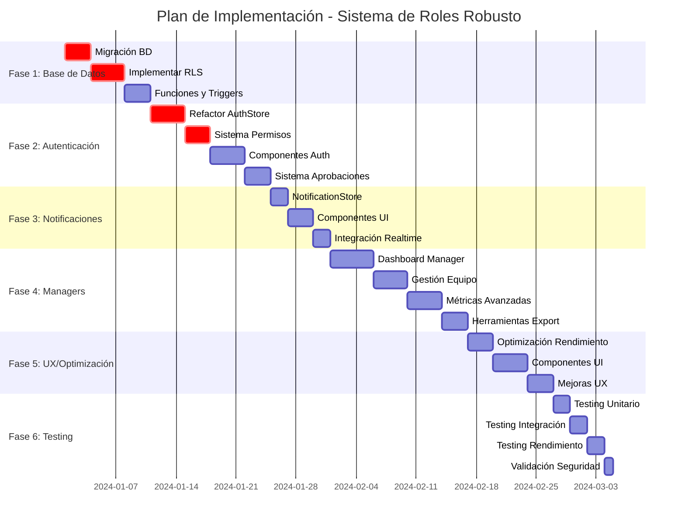

# Plan de Implementación: Sistema de Roles Robusto - CRM Cactus

## 1. Resumen Ejecutivo

Este documento detalla el plan de implementación para transformar el sistema actual de CRM Cactus en una plataforma robusta con gestión avanzada de roles, aprobaciones automáticas y funcionalidades específicas para cada tipo de usuario.

### Objetivos Principales:
- ✅ Implementar sistema de roles granular (Advisor/Manager/Admin)
- ✅ Crear flujo de aprobación automático para managers
- ✅ Optimizar estructura de base de datos para rendimiento
- ✅ Desarrollar funcionalidades específicas para managers
- ✅ Mejorar experiencia de usuario y arquitectura de componentes

## 2. Fases de Desarrollo

### **FASE 1: Fundación y Migración de Base de Datos** 📊
**Duración:** 1-2 semanas  
**Prioridad:** CRÍTICA

#### Objetivos:
- Migrar y optimizar estructura de base de datos
- Implementar sistema de seguridad robusto
- Establecer fundaciones para el nuevo sistema de roles

#### Tareas Específicas:

**1.1 Migración de Base de Datos**
```sql
-- Crear nueva migración: 002_enhance_role_system.sql
- Agregar campos faltantes a tabla users
- Crear tabla de notificaciones
- Crear tabla de métricas de usuario
- Crear tabla de configuraciones de equipo
- Implementar índices de optimización
```

**1.2 Implementación de Seguridad (RLS)**
```sql
-- Configurar Row Level Security
- Políticas para usuarios por rol
- Políticas para contactos y métricas
- Políticas para notificaciones
- Permisos granulares por tabla
```

**1.3 Funciones y Triggers**
```sql
-- Automatización de base de datos
- Trigger para updated_at automático
- Función para notificaciones de aprobación
- Función para cálculo de métricas diarias
- Validaciones de integridad de datos
```

**Entregables:**
- ✅ Migración de base de datos ejecutada
- ✅ Políticas RLS implementadas y probadas
- ✅ Funciones automáticas funcionando
- ✅ Documentación de cambios de BD

---

### **FASE 2: Sistema de Autenticación y Roles** 🔐
**Duración:** 1-2 semanas  
**Prioridad:** CRÍTICA

#### Objetivos:
- Refactorizar sistema de autenticación actual
- Implementar gestión avanzada de roles
- Crear sistema de aprobaciones automático

#### Tareas Específicas:

**2.1 Refactorización de AuthStore**
```typescript
// stores/authStore.ts - Mejoras
- Agregar campos adicionales de usuario
- Implementar cache de permisos
- Mejorar manejo de estados de aprobación
- Integrar con sistema de notificaciones
```

**2.2 Sistema de Permisos Granular**
```typescript
// utils/permissions.ts - Expansión
- Permisos específicos por funcionalidad
- Validación de acceso a recursos
- Middleware de autorización
- Cache de permisos por sesión
```

**2.3 Componentes de Autenticación**
```typescript
// Actualizar componentes existentes:
- Register.tsx: Mejorar flujo de registro
- Login.tsx: Agregar validaciones adicionales
- ProtectedRoute.tsx: Integrar nuevos permisos
- ApprovalPendingPage.tsx: Nueva página de espera
```

**2.4 Sistema de Aprobaciones**
```typescript
// Nuevos componentes:
- ApprovalRequestModal.tsx
- ApprovalManagement.tsx
- NotificationCenter.tsx
- UserRoleManager.tsx
```

**Entregables:**
- ✅ AuthStore refactorizado y optimizado
- ✅ Sistema de permisos granular funcionando
- ✅ Flujo de aprobación automático
- ✅ Componentes de gestión de roles

---

### **FASE 3: Sistema de Notificaciones** 🔔
**Duración:** 1 semana  
**Prioridad:** ALTA

#### Objetivos:
- Implementar centro de notificaciones en tiempo real
- Crear sistema de alertas automáticas
- Integrar notificaciones con flujos de aprobación

#### Tareas Específicas:

**3.1 NotificationStore**
```typescript
// stores/notificationStore.ts - Nuevo
- Estado global de notificaciones
- Integración con Supabase Realtime
- Cache de notificaciones leídas/no leídas
- Filtros y categorización
```

**3.2 Componentes de Notificaciones**
```typescript
// Nuevos componentes:
- NotificationCenter.tsx: Centro principal
- NotificationItem.tsx: Item individual
- NotificationBadge.tsx: Contador de no leídas
- NotificationSettings.tsx: Configuración
```

**3.3 Integración Realtime**
```typescript
// services/realtimeService.ts
- Suscripciones a cambios de BD
- Manejo de reconexión automática
- Optimización de rendimiento
- Cleanup de suscripciones
```

**3.4 Tipos de Notificaciones**
```typescript
// Implementar notificaciones para:
- Solicitudes de aprobación (Admin)
- Resultados de aprobación (Usuario)
- Asignación de contactos (Advisor)
- Actualizaciones de equipo (Manager)
- Métricas y logros (Todos)
```

**Entregables:**
- ✅ Sistema de notificaciones en tiempo real
- ✅ Centro de notificaciones funcional
- ✅ Integración con flujos existentes
- ✅ Configuración personalizable

---

### **FASE 4: Funcionalidades para Managers** 👥
**Duración:** 2-3 semanas  
**Prioridad:** ALTA

#### Objetivos:
- Desarrollar dashboard específico para managers
- Implementar visualización de métricas de equipo
- Crear herramientas de gestión de asesores
- Desarrollar sistema de reportes avanzado

#### Tareas Específicas:

**4.1 Dashboard de Manager**
```typescript
// pages/ManagerDashboard.tsx - Nuevo
- Vista general de métricas del equipo
- Gráficos de rendimiento individual
- Alertas y notificaciones importantes
- Accesos rápidos a funciones clave
```

**4.2 Gestión de Equipo**
```typescript
// components/TeamManagement/ - Expansión
- TeamOverview.tsx: Vista general del equipo
- AdvisorMetrics.tsx: Métricas individuales
- TeamSettings.tsx: Configuración del equipo
- PerformanceComparison.tsx: Comparativas
```

**4.3 Sistema de Métricas Avanzado**
```typescript
// stores/metricsStore.ts - Mejoras
- Métricas en tiempo real
- Comparativas históricas
- Proyecciones y tendencias
- Filtros avanzados por período
```

**4.4 Herramientas de Exportación**
```typescript
// utils/exportTools.ts - Nuevo
- Exportación a Excel/CSV
- Generación de reportes PDF
- Programación de reportes automáticos
- Plantillas personalizables
```

**4.5 Gestión de Contactos de Equipo**
```typescript
// Funcionalidades específicas:
- Vista consolidada de contactos del equipo
- Reasignación de contactos entre asesores
- Análisis de pipeline del equipo
- Identificación de oportunidades
```

**Entregables:**
- ✅ Dashboard completo para managers
- ✅ Herramientas de gestión de equipo
- ✅ Sistema de métricas avanzado
- ✅ Funcionalidades de exportación

---

### **FASE 5: Optimización y Experiencia de Usuario** 🎨
**Duración:** 1-2 semanas  
**Prioridad:** MEDIA

#### Objetivos:
- Optimizar rendimiento de la aplicación
- Mejorar diseño y usabilidad
- Implementar componentes reutilizables
- Optimizar carga de datos

#### Tareas Específicas:

**5.1 Optimización de Rendimiento**
```typescript
// Mejoras técnicas:
- Implementar lazy loading en rutas
- Optimizar queries de Supabase
- Cache inteligente de datos
- Paginación en listas grandes
```

**5.2 Componentes Reutilizables**
```typescript
// components/ui/ - Expansión
- DataTable.tsx: Tabla avanzada con filtros
- MetricCard.tsx: Tarjetas de métricas
- ChartContainer.tsx: Contenedor de gráficos
- FilterPanel.tsx: Panel de filtros avanzado
```

**5.3 Mejoras de UX**
```typescript
// Mejoras de interfaz:
- Loading states mejorados
- Error boundaries personalizados
- Feedback visual para acciones
- Navegación más intuitiva
```

**5.4 Responsive Design**
```css
/* Mejoras de diseño responsivo */
- Optimización para tablets
- Mejoras en móviles
- Componentes adaptativos
- Touch-friendly interactions
```

**Entregables:**
- ✅ Aplicación optimizada en rendimiento
- ✅ Componentes UI mejorados
- ✅ Experiencia de usuario pulida
- ✅ Diseño completamente responsivo

---

### **FASE 6: Testing y Validación** 🧪
**Duración:** 1 semana  
**Prioridad:** CRÍTICA

#### Objetivos:
- Implementar testing automatizado
- Validar todos los flujos de usuario
- Realizar pruebas de rendimiento
- Documentar casos de uso

#### Tareas Específicas:

**6.1 Testing Unitario**
```typescript
// tests/ - Implementación
- Tests para stores (Zustand)
- Tests para componentes críticos
- Tests para utilidades y helpers
- Tests para servicios de API
```

**6.2 Testing de Integración**
```typescript
// Pruebas de flujos completos:
- Flujo de registro y aprobación
- Gestión de equipos y asignaciones
- Sistema de notificaciones
- Exportación de datos
```

**6.3 Testing de Rendimiento**
```typescript
// Pruebas de carga:
- Carga de datos masivos
- Múltiples usuarios simultáneos
- Operaciones de base de datos
- Tiempo de respuesta de API
```

**6.4 Validación de Seguridad**
```sql
-- Pruebas de seguridad:
- Validación de políticas RLS
- Tests de autorización
- Pruebas de inyección SQL
- Validación de tokens JWT
```

**Entregables:**
- ✅ Suite de tests automatizados
- ✅ Validación completa de flujos
- ✅ Reporte de rendimiento
- ✅ Certificación de seguridad

---

## 3. Cronograma Detallado



## 4. Estructura de Archivos Actualizada

```
src/
├── components/
│   ├── auth/
│   │   ├── Login.tsx ✏️
│   │   ├── Register.tsx ✏️
│   │   ├── ProtectedRoute.tsx ✏️
│   │   ├── ApprovalPendingPage.tsx 🆕
│   │   └── UserRoleManager.tsx 🆕
│   ├── admin/
│   │   ├── AdminPanel.tsx ✏️
│   │   ├── ApprovalManagement.tsx 🆕
│   │   └── UserManagement.tsx 🆕
│   ├── manager/
│   │   ├── ManagerDashboard.tsx 🆕
│   │   ├── TeamOverview.tsx 🆕
│   │   ├── AdvisorMetrics.tsx 🆕
│   │   ├── TeamSettings.tsx 🆕
│   │   └── PerformanceComparison.tsx 🆕
│   ├── notifications/
│   │   ├── NotificationCenter.tsx 🆕
│   │   ├── NotificationItem.tsx 🆕
│   │   ├── NotificationBadge.tsx 🆕
│   │   └── NotificationSettings.tsx 🆕
│   ├── ui/
│   │   ├── DataTable.tsx 🆕
│   │   ├── MetricCard.tsx 🆕
│   │   ├── ChartContainer.tsx 🆕
│   │   └── FilterPanel.tsx 🆕
│   └── crm/
│       ├── CRM.tsx ✏️
│       ├── ContactList.tsx ✏️
│       └── TeamContactView.tsx 🆕
├── stores/
│   ├── authStore.ts ✏️
│   ├── teamStore.ts ✏️
│   ├── crmStore.ts ✏️
│   ├── metricsStore.ts ✏️
│   ├── notificationStore.ts 🆕
│   └── approvalStore.ts 🆕
├── services/
│   ├── realtimeService.ts 🆕
│   ├── metricsService.ts 🆕
│   └── exportService.ts 🆕
├── utils/
│   ├── permissions.ts ✏️
│   ├── exportTools.ts 🆕
│   └── dateHelpers.ts 🆕
├── pages/
│   ├── Dashboard.tsx ✏️
│   ├── ManagerDashboard.tsx 🆕
│   └── AdminDashboard.tsx 🆕
└── types/
    ├── auth.ts ✏️
    ├── notifications.ts 🆕
    ├── metrics.ts 🆕
    └── teams.ts ✏️

supabase/
├── migrations/
│   ├── 001_create_team_management_tables.sql ✅
│   ├── 002_enhance_role_system.sql 🆕
│   ├── 003_notifications_system.sql 🆕
│   └── 004_metrics_optimization.sql 🆕
└── functions/
    ├── process-daily-metrics/ 🆕
    ├── send-notifications/ 🆕
    └── generate-reports/ 🆕
```

**Leyenda:**
- ✅ Existe y está completo
- ✏️ Existe pero necesita modificaciones
- 🆕 Nuevo archivo a crear

## 5. Criterios de Aceptación

### **5.1 Gestión de Roles durante Registro**
- [ ] Usuario puede seleccionar rol durante registro
- [ ] Validación correcta de campos por rol
- [ ] Asignación automática de permisos
- [ ] Admin puede modificar roles posteriormente
- [ ] Historial de cambios de roles

### **5.2 Proceso de Aprobación para Managers**
- [ ] Solicitud automática de aprobación para managers
- [ ] Notificación inmediata a administradores
- [ ] Panel de gestión de aprobaciones
- [ ] Notificación de resultado al solicitante
- [ ] Estados claros: pendiente/aprobado/rechazado

### **5.3 Base de Datos Optimizada**
- [ ] Estructura normalizada y eficiente
- [ ] Índices optimizados para consultas frecuentes
- [ ] Políticas RLS implementadas correctamente
- [ ] Triggers y funciones automáticas funcionando
- [ ] Respuesta < 200ms en consultas principales

### **5.4 Funcionalidades para Managers**
- [ ] Dashboard con métricas de equipo en tiempo real
- [ ] Vista individual de cada asesor
- [ ] Comparativas de rendimiento
- [ ] Herramientas de exportación (Excel, PDF)
- [ ] Gestión de asignación de contactos
- [ ] Configuración de metas y objetivos

### **5.5 Experiencia de Usuario**
- [ ] Navegación intuitiva entre roles
- [ ] Feedback visual para todas las acciones
- [ ] Carga rápida de datos (< 2s)
- [ ] Diseño responsivo en todos los dispositivos
- [ ] Manejo elegante de errores
- [ ] Estados de carga informativos

## 6. Riesgos y Mitigaciones

### **6.1 Riesgos Técnicos**

| Riesgo | Probabilidad | Impacto | Mitigación |
|--------|--------------|---------|------------|
| Pérdida de datos durante migración | Media | Alto | Backup completo antes de migrar + Testing en ambiente de desarrollo |
| Problemas de rendimiento con RLS | Media | Medio | Optimización de índices + Testing de carga |
| Conflictos con código existente | Alta | Medio | Refactoring incremental + Testing exhaustivo |
| Complejidad de permisos | Media | Medio | Documentación detallada + Testing de casos edge |

### **6.2 Riesgos de Negocio**

| Riesgo | Probabilidad | Impacto | Mitigación |
|--------|--------------|---------|------------|
| Resistencia al cambio de usuarios | Media | Alto | Training + Rollout gradual + Feedback continuo |
| Tiempo de desarrollo extendido | Media | Medio | Priorización clara + Desarrollo iterativo |
| Bugs en producción | Media | Alto | Testing exhaustivo + Rollback plan |

## 7. Métricas de Éxito

### **7.1 Métricas Técnicas**
- ⚡ Tiempo de carga de dashboard < 2 segundos
- 📊 Consultas de base de datos < 200ms promedio
- 🔄 Uptime del sistema > 99.5%
- 🐛 Bugs críticos = 0 en producción
- 📱 Compatibilidad 100% en dispositivos objetivo

### **7.2 Métricas de Usuario**
- 👥 Adopción del sistema > 90% en 2 semanas
- ⭐ Satisfacción de usuario > 4.5/5
- 🎯 Reducción de tiempo en tareas administrativas > 30%
- 📈 Incremento en uso de funcionalidades > 50%
- 🔄 Tasa de retención de usuarios > 95%

### **7.3 Métricas de Negocio**
- 💼 Eficiencia de managers +40%
- 📊 Visibilidad de métricas +100%
- ⚡ Tiempo de aprobación de managers < 24h
- 🎯 Precisión en asignación de roles 100%
- 📈 Productividad general del equipo +25%

## 8. Plan de Rollout

### **8.1 Ambiente de Desarrollo**
- Implementación completa de todas las fases
- Testing exhaustivo de funcionalidades
- Validación de rendimiento y seguridad

### **8.2 Ambiente de Staging**
- Migración de datos de prueba
- Testing de integración completo
- Validación con usuarios beta

### **8.3 Producción**
- **Semana 1**: Migración de base de datos (fuera de horario)
- **Semana 2**: Rollout gradual por roles (Admin → Manager → Advisor)
- **Semana 3**: Monitoreo intensivo y ajustes
- **Semana 4**: Rollout completo y training

## 9. Recursos Necesarios

### **9.1 Equipo de Desarrollo**
- 1 Desarrollador Full-Stack Senior (Lead)
- 1 Desarrollador Frontend (React/TypeScript)
- 1 Especialista en Base de Datos (PostgreSQL/Supabase)
- 1 QA Engineer (Testing)

### **9.2 Herramientas y Servicios**
- Supabase Pro (para funcionalidades avanzadas)
- Herramientas de monitoring (Sentry, LogRocket)
- Servicios de backup automático
- Ambiente de staging dedicado

### **9.3 Tiempo Estimado**
- **Desarrollo**: 6-8 semanas
- **Testing**: 1-2 semanas
- **Rollout**: 1 semana
- **Total**: 8-11 semanas

## 10. Conclusión

Este plan de implementación proporciona una hoja de ruta clara y detallada para transformar el CRM Cactus actual en un sistema robusto con gestión avanzada de roles. La implementación por fases permite un desarrollo controlado, minimizando riesgos y asegurando la calidad del producto final.

### Próximos Pasos Inmediatos:
1. ✅ **Aprobación del plan** por stakeholders
2. 🔧 **Setup del ambiente de desarrollo** mejorado
3. 📊 **Inicio de Fase 1**: Migración de base de datos
4. 👥 **Asignación de recursos** del equipo de desarrollo
5. 📅 **Establecimiento de cronograma** detallado

**El éxito de este proyecto transformará significativamente la eficiencia operativa del CRM Cactus, proporcionando una base sólida para el crecimiento futuro de la plataforma.**