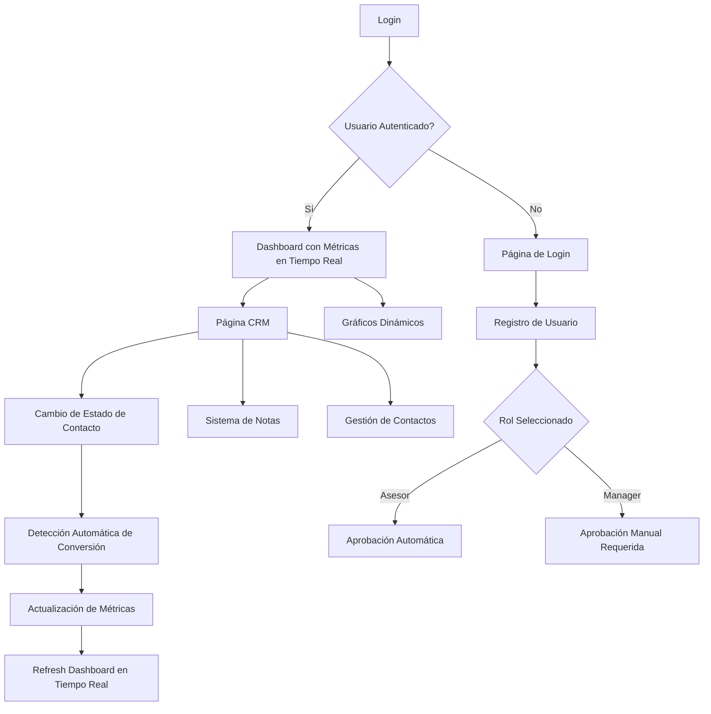

# Documentación de Requisitos del Producto - CRM Cactus Dashboard

## 1. Descripción General del Producto

CRM Cactus Dashboard es un sistema especializado de gestión de relaciones con clientes (CRM) con métricas en tiempo real, diseñado para optimizar el seguimiento de prospectos y clientes a través de un flujo de ventas estructurado. El sistema utiliza una temática visual de cactus para crear una experiencia de usuario única y memorable, mientras proporciona herramientas robustas para la gestión de contactos, análisis de rendimiento de ventas y cálculos automáticos de conversiones.

El producto está dirigido a equipos de ventas y gestores comerciales que necesitan una solución intuitiva para rastrear el progreso de sus prospectos desde el contacto inicial hasta la conversión en cliente, con capacidades de análisis en tiempo real para optimizar su estrategia de ventas y tomar decisiones basadas en datos actualizados instantáneamente.

## 2. Características Principales

### 2.1 Roles de Usuario

| Rol | Método de Registro | Permisos Principales |
|-----|-------------------|---------------------|
| Asesor | Registro por email + aprobación del Manager | Puede gestionar solo sus contactos asignados, agregar notas, ver su perfil y métricas personales |
| Manager | Invitación del sistema o promoción | Gestión completa de su equipo de asesores, asignación de contactos, aprobación de nuevos asesores, acceso a métricas del equipo |
| Administrador | Acceso directo del sistema | Acceso completo, gestión de usuarios, configuración del sistema, supervisión general |

### 2.2 Módulo de Características

Nuestro sistema CRM Cactus Dashboard consta de las siguientes páginas principales:

1. **Página Dashboard**: visualización de KPIs y métricas en tiempo real (personales para Asesores, del equipo para Managers), gráficos dinámicos con Recharts.
2. **Página CRM**: gestión de contactos (limitada por rol), seguimiento de estados con tracking automático de conversiones, sistema de notas integrado.
3. **Página de Inicio**: página básica de bienvenida con redirección automática según autenticación.
4. **Página de Login**: autenticación con validación de credenciales y manejo de sesiones persistentes.
5. **Página de Registro**: registro de usuarios con sistema de aprobación automática para asesores y manual para managers.

### 2.3 Detalles de Páginas

| Nombre de Página | Nombre del Módulo | Descripción de Características |
|------------------|-------------------|-------------------------------|
| Dashboard | Métricas en Tiempo Real | Calcular y mostrar automáticamente: total de contactos, prospectos activos, conversiones del mes, tasa de conversión. Actualización instantánea con cambios en datos |
| Dashboard | Gráficos Dinámicos | Generar gráficos de barras (llamadas semanales), pie charts (distribución pipeline), líneas (tendencias conversión) con Recharts. Auto-refresh cada 30 segundos |
| Dashboard | Panel de Actividad Reciente | Mostrar últimas actividades del usuario o equipo con timestamps, estados de contactos, acciones realizadas |
| Dashboard | Indicadores de Rendimiento | Tarjetas con métricas clave, tendencias (+/-), colores dinámicos según rendimiento, animaciones de actualización |
| Página CRM | Lista de Contactos | Mostrar contactos filtrados por rol con búsqueda, filtros por estado, paginación. Asesores ven solo asignados, Managers ven equipo completo |
| Página CRM | Gestión de Estados | Cambiar estados de contactos con tracking automático de conversiones. Pipeline: Prospecto → Contactado → Primera reunión → Segunda reunión → Apertura → Cliente → Cuenta vacía |
| Página CRM | Sistema de Notas Integrado | Agregar, editar, eliminar notas por contacto con tipos (llamada, reunión, email, general), timestamps automáticos, autor registrado |
| Página CRM | Formularios Modales | Crear y editar contactos con validación, campos obligatorios (nombre, estado), campos opcionales (email, teléfono, empresa, valor) |
| Página CRM | Acciones de Contacto | Botones contextuales para ver notas, editar contacto, cambiar estado, eliminar (con confirmación), asignar asesor (solo Managers) |
| Página de Inicio | Redirección Automática | Página básica que redirige a /dashboard si está autenticado, a /login si no está autenticado |
| Login | Autenticación de Usuario | Formulario con username/password, opción "recordar sesión", validación de credenciales, manejo de errores, estados de carga |
| Registro | Creación de Cuenta | Formulario completo con nombre, username, email opcional, contraseña, confirmación, selección de rol (asesor/manager), validaciones |
| Registro | Sistema de Aprobación | Aprobación automática para asesores, aprobación manual para managers, pantalla de confirmación según rol, redirección apropiada |

## 3. Proceso Principal

El sistema maneja flujos principales según el rol del usuario con métricas en tiempo real:

**Flujo de Asesor:**
El asesor se registra (aprobación automática), inicia sesión y accede al Dashboard con sus métricas personales en tiempo real. Navega al CRM para gestionar solo sus contactos asignados. Al cambiar estados de contactos, el sistema registra automáticamente conversiones y actualiza métricas instantáneamente. Puede agregar notas detalladas por contacto y ver su progreso personal actualizado en tiempo real.

**Flujo de Manager:**
El manager se registra (requiere aprobación manual), una vez aprobado accede al Dashboard con métricas consolidadas del equipo. Puede ver todos los contactos del equipo en el CRM, cambiar estados y asignar contactos. Las métricas se actualizan automáticamente con cada cambio. Tiene acceso a gráficos dinámicos y análisis de rendimiento del equipo completo.

**Flujo de Conversión Automática:**
Cuando cualquier usuario cambia el estado de un contacto, el sistema detecta automáticamente si es una conversión válida, registra el evento, actualiza todas las métricas relacionadas y refresca los dashboards en tiempo real para todos los usuarios afectados.

## 4. Diseño de Interfaz de Usuario

### 4.1 Estilo de Diseño

- **Colores primarios:** Verde (#10b981) para éxito y conversiones, azul (#3b82f6) para acciones principales
- **Colores secundarios:** Gris (#6b7280) para texto secundario, rojo (#ef4444) para alertas, amarillo (#f59e0b) para advertencias
- **Colores de estado:** Verde claro (#dcfce7) para prospectos, azul claro (#dbeafe) para contactados, púrpura (#f3e8ff) para reuniones
- **Estilo de botones:** Redondeados (rounded-lg) con efectos hover, sombras sutiles y transiciones suaves
- **Tipografía:** Sistema de fuentes nativo, tamaños desde text-sm (14px) hasta text-2xl (24px)
- **Estilo de layout:** Diseño responsivo con navegación superior, tarjetas con sombras y bordes redondeados
- **Iconografía:** Lucide React para iconos consistentes, con colores temáticos según contexto

### 4.2 Resumen de Diseño de Páginas

| Nombre de Página | Nombre del Módulo | Elementos de UI |
|------------------|-------------------|----------------|
| Dashboard | Tarjetas de Métricas | Tarjetas con gradientes sutiles, iconos Lucide, números grandes con animaciones de conteo, indicadores de tendencia |
| Dashboard | Gráficos Dinámicos | Gráficos Recharts responsivos con colores temáticos, tooltips interactivos, leyendas, auto-refresh cada 30s |
| Dashboard | Actividad Reciente | Lista con timestamps relativos, badges de estado coloridos, scroll vertical, avatares de usuario |
| Página CRM | Lista de Contactos | Tabla responsiva con filtros por estado, búsqueda en tiempo real, badges coloridos por estado, acciones contextuales |
| Página CRM | Formulario de Contacto | Modal con campos validados, selects estilizados, botones con estados de carga, validación en tiempo real |
| Página CRM | Sistema de Notas | Modal con textarea expandible, timestamps automáticos, historial de notas por contacto, tipos de nota |
| Login | Formulario de Autenticación | Diseño centrado con gradiente de fondo, campos con iconos Lucide, toggle de visibilidad de contraseña, estados de carga |
| Register | Formulario de Registro | Campos organizados verticalmente, validación visual en tiempo real, selector de rol con descripciones, confirmación de contraseña |
| Home | Página de Bienvenida | Diseño minimalista con navegación hacia login/register, branding consistente, redirección automática según autenticación |

### 4.3 Responsividad

El producto está diseñado con enfoque mobile-first y adaptación completa para desktop. Se considera optimización para interacción táctil en dispositivos móviles, con elementos de UI de tamaño adecuado para dedos y gestos de deslizamiento para navegación entre estados de contactos.