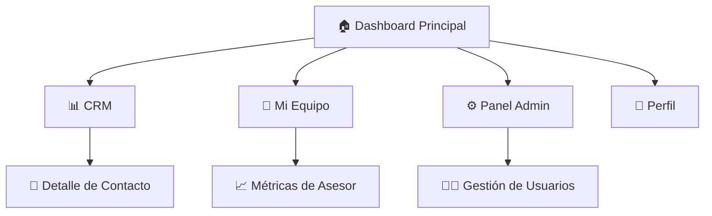

# Requisitos de Rediseño de Interfaz Moderna - CRM Cactus Dashboard

## 1. Visión General del Proyecto

Rediseño completo de la interfaz del CRM Cactus Dashboard para implementar un diseño moderno, minimalista y fresco que mejore significativamente la experiencia del usuario. El objetivo es eliminar la saturación visual actual y crear una experiencia contemporánea, limpia y profesional que mantenga la funcionalidad existente mientras optimiza la usabilidad y el atractivo visual.

## 2. Características Principales

### 2.1 Roles de Usuario
| Rol | Método de Registro | Permisos Principales |
|-----|-------------------|---------------------|
| Asesor | Registro por email corporativo | Gestión de contactos propios, métricas personales, seguimientos |
| Manager | Asignación por administrador | Supervisión de equipo, métricas globales, aprobaciones |
| Administrador | Acceso directo del sistema | Gestión completa del sistema, configuraciones, usuarios |

### 2.2 Módulos de Funcionalidad

Nuestro rediseño abarca las siguientes páginas principales:
1. **Dashboard Principal**: métricas en tiempo real, actividad reciente, gráficos de rendimiento
2. **CRM**: gestión de contactos, pipeline de ventas, seguimientos
3. **Mi Equipo**: supervisión de asesores, métricas de equipo, asignaciones
4. **Panel de Administración**: configuraciones del sistema, gestión de usuarios
5. **Perfil**: información personal, preferencias, configuraciones

### 2.3 Detalles de Páginas

| Página | Módulo | Descripción de Funcionalidad |
|--------|--------|-----------------------------|
| Dashboard Principal | Panel de Métricas | Mostrar métricas clave con emojis 📊 📈 📞 🎯. Usar tarjetas con colores pastel suaves |
| Dashboard Principal | Actividad Reciente | Listar actividades con iconos emoji 🔔 ✅ ⏰. Timeline minimalista con espaciado generoso |
| Dashboard Principal | Gráficos de Rendimiento | Visualizaciones limpias con paleta pastel. Eliminar elementos decorativos innecesarios |
| CRM | Lista de Contactos | Tabla simplificada con estados visuales claros 👤 🟢 🟡 🔴. Filtros intuitivos |
| CRM | Pipeline de Ventas | Kanban board con colores pastel diferenciados. Drag & drop fluido |
| Mi Equipo | Métricas de Equipo | Dashboard consolidado con comparativas visuales 👥 📊. Evitar duplicación de títulos |
| Panel Admin | Gestión de Usuarios | Interface limpia para CRUD de usuarios 👨‍💼 ⚙️. Formularios minimalistas |
| Perfil | Configuración Personal | Formulario elegante con validación visual suave 👤 🎨 |

## 3. Flujo Principal de Usuario

**Flujo del Asesor:**
El asesor inicia sesión → accede al Dashboard con métricas personalizadas → revisa actividad reciente → gestiona contactos en CRM → actualiza seguimientos → revisa próximas tareas.

**Flujo del Manager:**
El manager inicia sesión → visualiza métricas de equipo → supervisa rendimiento individual → aprueba acciones pendientes → asigna tareas → genera reportes.

## 4. Diseño de Interfaz de Usuario

### 4.1 Estilo de Diseño

**Paleta de Colores Pastel:**
- Primario: Verde menta suave (#E8F5E8) para elementos principales
- Secundario: Lavanda claro (#F0E6FF) para acentos y estados
- Terciario: Durazno suave (#FFE5D9) para alertas y notificaciones
- Cuaternario: Azul cielo (#E3F2FD) para información y enlaces
- Neutros: Grises cálidos (#F8F9FA, #E9ECEF, #6C757D)

**Tipografía:**
- Fuente principal: Inter (tamaños 14px, 16px, 18px, 24px, 32px)
- Peso: Regular (400) para texto, Medium (500) para subtítulos, Bold (600) para títulos
- Interlineado: 1.5 para legibilidad óptima

**Elementos Visuales:**
- Botones: Esquinas redondeadas (8px), sombras sutiles, estados hover suaves
- Tarjetas: Bordes redondeados (12px), sombra sutil (0 2px 8px rgba(0,0,0,0.1))
- Espaciado: Sistema de 8px (8, 16, 24, 32, 48px)
- Iconos: Emojis de alta resolución complementados con iconos Lucide minimalistas

### 4.2 Resumen de Diseño de Páginas

| Página | Módulo | Elementos de UI |
|--------|--------|----------------|
| Dashboard Principal | Panel de Métricas | Tarjetas con gradientes pastel suaves, emojis grandes (24px), números prominentes, micro-animaciones al actualizar |
| Dashboard Principal | Sidebar | Navegación minimalista con emojis, estados activos con color pastel, transiciones suaves |
| Dashboard Principal | Header | Título simplificado (eliminar "Dashboard" duplicado), avatar con menú dropdown, notificaciones discretas |
| CRM | Lista de Contactos | Tabla limpia con alternancia de colores pastel, estados con emojis, búsqueda prominente |
| Mi Equipo | Métricas Consolidadas | Grid responsivo con tarjetas uniformes, comparativas visuales con barras de progreso pastel |

### 4.3 Responsividad

Diseño mobile-first con adaptación fluida:
- Desktop: Layout de 3 columnas con sidebar expandido
- Tablet: Layout de 2 columnas con sidebar colapsable
- Mobile: Layout de 1 columna con navegación bottom sheet
- Optimización táctil con áreas de toque mínimas de 44px

## 5. Mejoras de Usabilidad Específicas

### 5.1 Eliminación de Redundancias
- Remover título "Dashboard" duplicado en header y sidebar
- Unificar terminología: "Contactos" en lugar de "Contactos/Prospectos/Clientes"
- Simplificar navegación: máximo 5 elementos principales

### 5.2 Reducción de Ruido Visual
- Eliminar bordes innecesarios y líneas divisorias
- Reducir densidad de información por pantalla
- Usar espacios en blanco generosos (mínimo 24px entre secciones)
- Limitar paleta a máximo 4 colores por vista

### 5.3 Jerarquía Visual Clara
- Títulos principales: 32px, peso 600, color primario
- Subtítulos: 24px, peso 500, color secundario
- Texto cuerpo: 16px, peso 400, color neutro oscuro
- Texto auxiliar: 14px, peso 400, color neutro medio

## 6. Especificaciones Técnicas de Implementación

### 6.1 Componentes a Rediseñar

**MetricCard Renovado:**
- Padding aumentado a 24px
- Sombra sutil y hover effect
- Emoji prominente (32px) en esquina superior derecha
- Número principal con tipografía bold 28px
- Descripción con color pastel

**Sidebar Minimalista:**
- Ancho reducido a 240px (expandido) / 64px (colapsado)
- Elementos con padding vertical 12px
- Estados activos con background pastel
- Emojis como iconos principales

**Header Simplificado:**
- Altura reducida a 64px
- Título único sin redundancias
- Avatar circular con dropdown elegante
- Notificaciones con badge minimalista

### 6.2 Animaciones y Transiciones
- Transiciones suaves de 200ms para hover states
- Fade-in de 300ms para carga de contenido
- Slide transitions de 250ms para navegación
- Micro-animaciones en actualizaciones de métricas

### 6.3 Accesibilidad
- Contraste mínimo 4.5:1 para texto
- Navegación por teclado completa
- Etiquetas ARIA descriptivas
- Indicadores de foco visibles
- Soporte para lectores de pantalla

## 7. Criterios de Éxito

- **Visual:** Reducción del 40% en elementos visuales por pantalla
- **Usabilidad:** Tiempo de navegación reducido en 30%
- **Profesionalismo:** Consistencia visual del 100% entre componentes
- **Rendimiento:** Carga de páginas bajo 2 segundos
- **Accesibilidad:** Cumplimiento WCAG 2.1 AA

El rediseño debe resultar en una experiencia visualmente atractiva, funcionalmente superior y profesionalmente pulida que elimine la saturación actual mientras mantiene toda la funcionalidad existente.