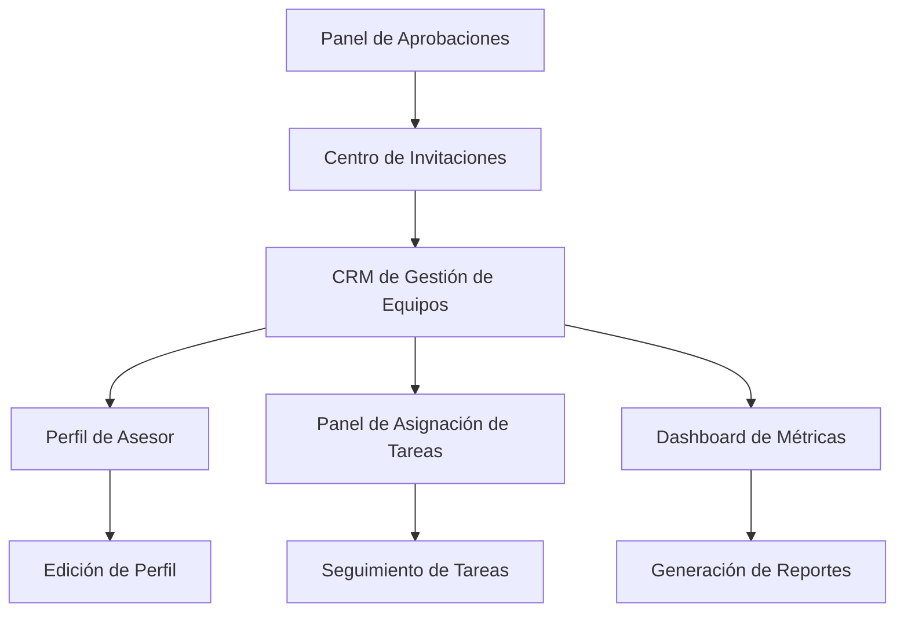

## 1. Visión General del Producto
Sistema de gestión completo para "Mi Equipo" dirigido a managers y administradores que permite la gestión integral de equipos de asesores con funcionalidades avanzadas de CRM, aprobaciones y monitoreo de rendimiento.
- Soluciona la necesidad de managers de gestionar eficientemente sus equipos de asesores desde una plataforma centralizada.
- Dirigido a managers y administradores que requieren herramientas avanzadas de gestión de personal y seguimiento de métricas.
- Maximiza la productividad mediante flujos de trabajo optimizados y acceso rápido a información crítica del equipo.

## 2. Características Principales

### 2.1 Roles de Usuario
| Rol | Método de Registro | Permisos Principales |
|-----|-------------------|---------------------|
| Manager | Registro con código de invitación + aprobación administrativa | Gestión completa de equipo, acceso a CRM, asignación de tareas, visualización de métricas |
| Administrador | Registro directo del sistema | Aprobación de managers, gestión global de equipos, configuración del sistema |
| Asesor | Invitación por manager | Acceso limitado a funciones básicas, sin acceso a gestión de equipos |

### 2.2 Módulos Funcionales
Nuestro sistema de gestión de equipos consta de las siguientes páginas principales:
1. **Panel de Aprobaciones**: gestión de solicitudes de registro de managers, aprobación/rechazo de cuentas pendientes.
2. **Centro de Invitaciones**: envío de invitaciones a nuevos miembros, seguimiento de invitaciones pendientes, gestión de códigos de acceso.
3. **CRM de Gestión de Equipos**: visualización de equipo actual, fichas detalladas de asesores, métricas individuales y grupales.
4. **Panel de Asignación de Tareas**: creación y asignación de tareas específicas, seguimiento de progreso, calendario de actividades.
5. **Dashboard de Métricas**: estadísticas consolidadas del equipo, reportes de rendimiento, análisis de productividad.
6. **Perfil de Asesor**: ficha completa individual con historial, métricas personales, tareas asignadas.

### 2.3 Detalles de Páginas

| Nombre de Página | Nombre del Módulo | Descripción de Funcionalidad |
|------------------|-------------------|------------------------------|
| Panel de Aprobaciones | Lista de Solicitudes | Mostrar solicitudes pendientes de registro como manager, aprobar/rechazar con comentarios, historial de decisiones |
| Panel de Aprobaciones | Filtros y Búsqueda | Filtrar por fecha, estado, departamento, buscar por nombre o email del solicitante |
| Centro de Invitaciones | Envío de Invitaciones | Crear invitaciones personalizadas, seleccionar rol de destino, establecer fecha de expiración |
| Centro de Invitaciones | Seguimiento | Visualizar estado de invitaciones enviadas, reenviar invitaciones, cancelar invitaciones pendientes |
| CRM de Gestión de Equipos | Vista de Equipo | Mostrar tarjetas de asesores con información básica, indicadores de estado, métricas clave |
| CRM de Gestión de Equipos | Navegación a Fichas | Acceder a ficha completa al hacer clic en tarjeta de asesor, modal o página dedicada |
| Panel de Asignación de Tareas | Creación de Tareas | Crear tareas específicas, asignar a uno o múltiples asesores, establecer prioridad y fechas |
| Panel de Asignación de Tareas | Monitoreo | Visualizar progreso de tareas, actualizar estados, enviar recordatorios |
| Dashboard de Métricas | Métricas Grupales | Mostrar KPIs del equipo, gráficos de rendimiento, comparativas temporales |
| Dashboard de Métricas | Exportación | Generar reportes en PDF/Excel, programar reportes automáticos |
| Perfil de Asesor | Información Personal | Mostrar datos del asesor, historial de actividad, métricas individuales |
| Perfil de Asesor | Gestión | Editar información, asignar tareas directas, configurar objetivos personales |

## 3. Proceso Principal

**Flujo para Administradores:**
1. Administrador recibe notificación de nueva solicitud de registro como manager
2. Revisa información del solicitante en Panel de Aprobaciones
3. Aprueba o rechaza la solicitud con comentarios
4. Si aprueba, el nuevo manager recibe acceso completo al sistema
5. Administrador puede monitorear actividad de todos los managers

**Flujo para Managers:**
1. Manager accede a "Mi Equipo" con permisos extendidos
2. Visualiza su equipo actual en el CRM integrado
3. Hace clic en tarjeta de asesor para acceder a ficha completa
4. Consulta métricas, asigna tareas, y monitorea progreso
5. Envía invitaciones a nuevos miembros según necesidades
6. Genera reportes y analiza rendimiento del equipo

## 4. Diseño de Interfaz de Usuario

### 4.1 Estilo de Diseño
- **Colores primarios:** Verde #10B981 (principal), Verde claro #34D399 (secundario)
- **Estilo de botones:** Redondeados con gradientes suaves, efectos hover con escala 1.02
- **Tipografía:** Inter para textos generales, tamaños 14px-16px para contenido, 24px-32px para títulos
- **Estilo de layout:** Basado en tarjetas con sombras suaves, navegación lateral expandible
- **Iconografía:** Lucide React icons, estilo minimalista con colores coherentes al tema verde

### 4.2 Resumen de Diseño de Páginas

| Nombre de Página | Nombre del Módulo | Elementos de UI |
|------------------|-------------------|----------------|
| Panel de Aprobaciones | Lista de Solicitudes | Tarjetas con avatar, información del solicitante, botones de acción verde/rojo, badges de estado |
| Centro de Invitaciones | Formulario de Invitación | Modal con campos de entrada, selector de roles, datepicker, botón de envío con animación |
| CRM de Gestión de Equipos | Vista de Equipo | Grid responsivo de tarjetas, indicadores de estado con colores, métricas en badges numerados |
| Panel de Asignación de Tareas | Lista de Tareas | Tabla interactiva con filtros, progress bars, iconos de prioridad, botones de acción rápida |
| Dashboard de Métricas | Gráficos | Charts.js integrados, cards con animaciones de contador, filtros temporales |
| Perfil de Asesor | Información Detallada | Layout de dos columnas, tabs para secciones, formularios inline editables |

### 4.3 Responsividad
Diseño mobile-first con adaptación completa para tablets y desktop. Navegación lateral se convierte en menú hamburguesa en móviles. Tarjetas se reorganizan en columna única en pantallas pequeñas. Optimización táctil para interacciones en dispositivos móviles.