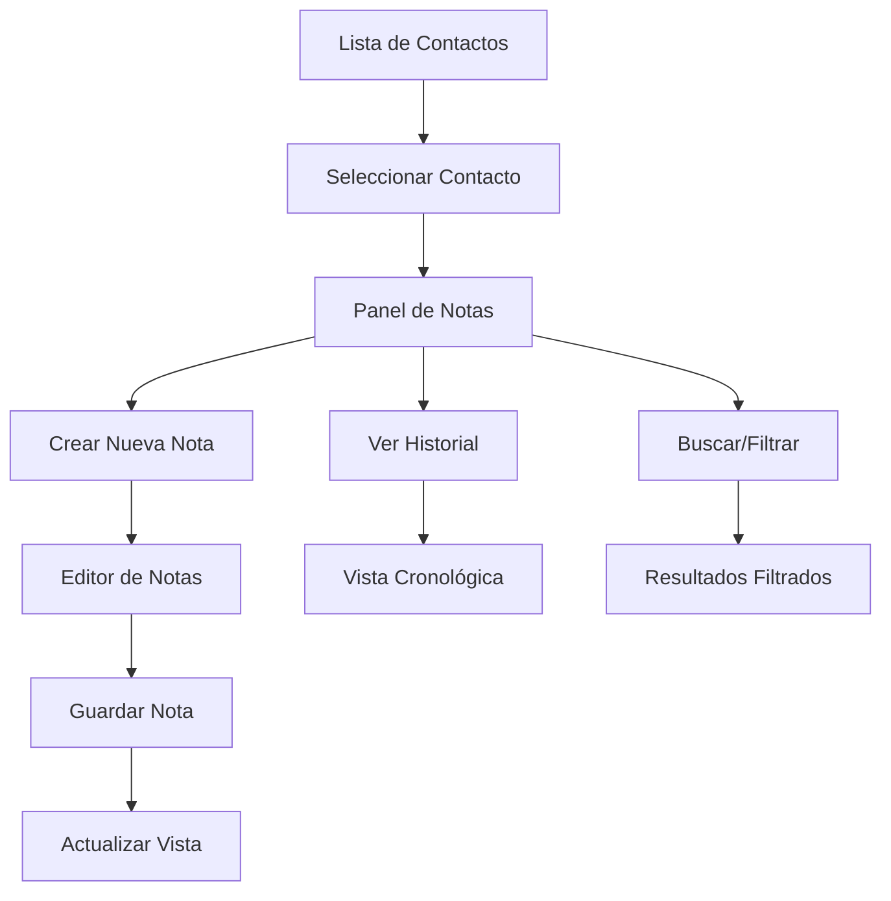

# Sistema de Gestión de Notas y Comentarios CRM - Requisitos del Producto

## 1. Descripción General del Producto

Sistema ultra robusto y optimizado para la gestión integral de notas y comentarios en el CRM Cactus Dashboard, diseñado para mejorar el seguimiento de contactos y la productividad del equipo de ventas.

El sistema resuelve la problemática actual donde el panel de notas se cierra inesperadamente al escribir, proporcionando una experiencia de usuario fluida y confiable para la gestión de información crítica de contactos.

## 2. Características Principales

### 2.1 Roles de Usuario
| Rol | Método de Registro | Permisos Principales |
|-----|-------------------|---------------------|
| Advisor | Autenticación existente | Crear, editar y eliminar sus propias notas, ver notas de contactos asignados |
| Manager | Autenticación existente | Acceso completo a todas las notas, gestión de permisos, reportes avanzados |
| Admin | Autenticación existente | Control total del sistema, configuración de seguridad, auditoría completa |

### 2.2 Módulos Funcionales

Nuestro sistema de gestión de notas consta de las siguientes páginas principales:

1. **Panel de Notas Principal**: interfaz principal de gestión, lista de notas, filtros avanzados, búsqueda en tiempo real.
2. **Editor de Notas**: creación y edición de notas, categorización, adjuntos, plantillas predefinidas.
3. **Vista de Historial**: cronología de notas, seguimiento de cambios, auditoría de actividades.
4. **Panel de Configuración**: configuración de permisos, plantillas personalizadas, reglas de notificación.
5. **Dashboard de Reportes**: métricas de productividad, análisis de seguimiento, reportes exportables.

### 2.3 Detalles de Funcionalidades

| Página | Módulo | Descripción de Funcionalidad |
|--------|--------|------------------------------|
| Panel Principal | Gestión de Notas | Crear, editar, eliminar notas con validación en tiempo real. Categorización automática por tipo (llamada, reunión, email, general). |
| Panel Principal | Búsqueda Avanzada | Filtrar por fecha, tipo, autor, contenido, estado del contacto. Búsqueda de texto completo con resaltado de resultados. |
| Panel Principal | Vista de Lista | Mostrar notas con paginación inteligente, ordenamiento múltiple, vista compacta/expandida. |
| Editor de Notas | Editor Rico | Editor WYSIWYG con formato de texto, enlaces, menciones de usuarios, plantillas rápidas. |
| Editor de Notas | Adjuntos | Subir archivos, imágenes, documentos con vista previa. Límite de 10MB por archivo. |
| Editor de Notas | Autoguardado | Guardado automático cada 30 segundos, recuperación de borradores, historial de versiones. |
| Vista Historial | Cronología | Línea de tiempo visual de todas las interacciones, filtros por período, exportación de historial. |
| Vista Historial | Auditoría | Registro de cambios, quién modificó qué y cuándo, restauración de versiones anteriores. |
| Configuración | Permisos | Configurar quién puede ver/editar notas por contacto, roles personalizados, restricciones por equipo. |
| Configuración | Plantillas | Crear plantillas reutilizables, variables dinámicas, plantillas por tipo de interacción. |
| Reportes | Métricas | Número de notas por período, tiempo promedio de respuesta, contactos más activos. |
| Reportes | Exportación | Exportar a PDF, Excel, CSV con filtros personalizados y formato profesional. |

## 3. Flujos Principales del Usuario

### Flujo del Advisor:
1. Accede al contacto desde la lista del CRM
2. Abre el panel de notas integrado
3. Selecciona el tipo de nota (llamada, reunión, email, otro)
4. Escribe la nota con editor enriquecido
5. Guarda automáticamente o manualmente
6. Puede editar/eliminar sus propias notas
7. Ve el historial completo del contacto

### Flujo del Manager:
1. Accede a vista global de notas del equipo
2. Filtra por advisor, período, tipo de nota
3. Revisa métricas de productividad
4. Puede editar notas de su equipo si es necesario
5. Genera reportes para análisis

## 4. Diseño de Interfaz de Usuario

### 4.1 Estilo de Diseño
- **Colores Primarios**: Verde #16a34a (primary), Verde claro #22c55e (secondary)
- **Colores de Apoyo**: Gris #6b7280 (text), Blanco #ffffff (background), Rojo #ef4444 (danger)
- **Estilo de Botones**: Redondeados con gradientes suaves, efectos hover con transformación sutil
- **Tipografía**: Inter, tamaños 12px-24px, peso 400-700
- **Layout**: Diseño de tarjetas con sombras suaves, espaciado consistente de 16px/24px
- **Iconografía**: Lucide React icons, emojis para categorías, tamaño 16px-24px

### 4.2 Diseño por Página

| Página | Módulo | Elementos de UI |
|--------|--------|-----------------|
| Panel Principal | Header de Notas | Título "Notas y Comentarios", contador de notas, botón "Nueva Nota" con icono +, filtros rápidos |
| Panel Principal | Lista de Notas | Tarjetas con gradiente verde suave, avatar del autor, timestamp, tipo de nota con emoji, contenido truncado |
| Panel Principal | Barra de Búsqueda | Input con icono de lupa, filtros desplegables, botón "Limpiar filtros", resultados en tiempo real |
| Editor de Notas | Formulario | Selector de tipo con botones pill, textarea expandible, contador de caracteres, botones de formato |
| Editor de Notas | Acciones | Botón "Guardar" verde con icono, "Cancelar" gris, "Eliminar" rojo, indicador de autoguardado |
| Vista Historial | Timeline | Línea vertical con puntos de conexión, tarjetas cronológicas, filtros de fecha, scroll infinito |
| Configuración | Paneles | Tabs horizontales, formularios organizados en secciones, switches para permisos, vista previa en vivo |

### 4.3 Responsividad
Diseño mobile-first con breakpoints en 640px, 768px, 1024px. Optimización táctil para dispositivos móviles con botones de mínimo 44px de altura.

## 5. Solución al Problema Técnico

### 5.1 Problema Identificado
El panel de notas se cierra inesperadamente cuando el usuario escribe en el textarea, causado por:
- Event bubbling en el overlay del modal
- Conflictos entre event handlers de click
- Falta de preventDefault en eventos específicos

### 5.2 Solución Implementada
- Agregar `e.stopPropagation()` en todos los elementos internos del modal
- Mejorar la lógica de detección de clics en el overlay
- Implementar debouncing en el autoguardado
- Agregar validación de eventos antes de cerrar el modal

### 5.3 Medidas Preventivas
- Testing automatizado para interacciones de modal
- Logging de eventos para debugging
- Fallback de recuperación de contenido
- Indicadores visuales de estado de guardado