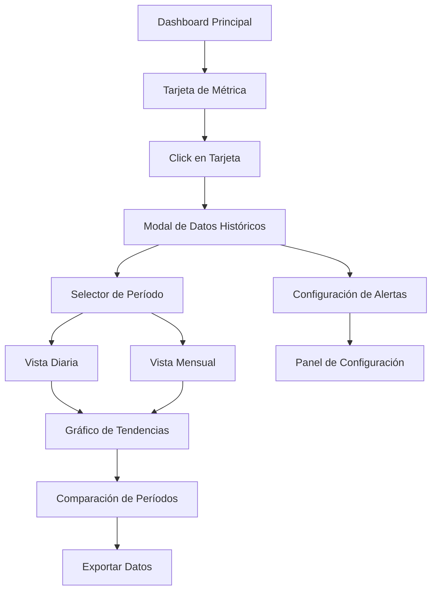

## 1. Visión General del Producto

Sistema robusto de visualización de datos históricos integrado en el dashboard de métricas existente, que permite a los usuarios explorar tendencias y patrones de sus métricas de CRM a través del tiempo mediante interacción directa con las tarjetas de métricas.

El sistema proporciona análisis temporal profundo de contactos, conversiones y rendimiento del pipeline, manteniendo la integridad de datos y optimizando el rendimiento para escalabilidad empresarial.

## 2. Características Principales

### 2.1 Roles de Usuario

| Rol | Método de Registro | Permisos Principales |
|-----|-------------------|---------------------|
| Usuario Estándar | Autenticación existente | Visualizar métricas históricas propias, navegar períodos temporales |
| Manager de Equipo | Asignación por admin | Visualizar métricas del equipo, comparar rendimiento entre miembros |
| Administrador | Acceso completo | Gestionar todos los datos históricos, configurar retención de datos |

### 2.2 Módulos de Funcionalidad

Nuestro sistema de visualización de datos históricos consta de las siguientes páginas principales:

1. **Panel de Métricas Interactivo**: tarjetas de métricas mejoradas, modal de datos históricos, controles de navegación temporal.
2. **Vista de Análisis Temporal**: gráficos de tendencias, comparaciones de períodos, indicadores de rendimiento.
3. **Panel de Configuración**: ajustes de retención de datos, preferencias de visualización, configuración de alertas.

### 2.3 Detalles de Páginas

| Nombre de Página | Nombre del Módulo | Descripción de Funcionalidad |
|------------------|-------------------|------------------------------|
| Panel de Métricas Interactivo | Tarjetas de Métricas Mejoradas | Mostrar métricas actuales con indicador de datos históricos disponibles, activar modal al hacer clic |
| Panel de Métricas Interactivo | Modal de Datos Históricos | Presentar datos históricos en formato tabular y gráfico, permitir navegación entre períodos |
| Panel de Métricas Interactivo | Controles de Navegación Temporal | Selector de período (día/mes), botones de navegación anterior/siguiente, selector de rango de fechas |
| Vista de Análisis Temporal | Gráficos de Tendencias | Visualizar tendencias de métricas a lo largo del tiempo usando Chart.js, mostrar líneas de tendencia |
| Vista de Análisis Temporal | Comparaciones de Períodos | Comparar métricas entre diferentes períodos, calcular porcentajes de cambio, destacar mejoras/declives |
| Vista de Análisis Temporal | Indicadores de Rendimiento | Mostrar KPIs clave, alertas de rendimiento, recomendaciones basadas en tendencias |
| Panel de Configuración | Ajustes de Retención | Configurar período de retención de datos históricos, opciones de archivado automático |
| Panel de Configuración | Preferencias de Visualización | Personalizar tipos de gráficos, colores, formato de fechas, métricas predeterminadas |
| Panel de Configuración | Configuración de Alertas | Establecer umbrales para alertas de rendimiento, notificaciones de cambios significativos |

## 3. Proceso Principal

**Flujo de Usuario Estándar:**
El usuario navega al dashboard principal y visualiza las tarjetas de métricas actuales. Al hacer clic en cualquier tarjeta de métrica, se abre un modal que muestra los datos históricos de esa métrica específica. El usuario puede navegar entre diferentes períodos (diario/mensual) usando los controles de navegación temporal. Los datos se cargan de forma asíncrona desde las tablas de métricas históricas, mostrando gráficos interactivos y tablas de datos. El usuario puede comparar períodos, exportar datos y configurar alertas personalizadas.

**Flujo de Manager de Equipo:**
Similar al flujo estándar, pero con acceso adicional a métricas agregadas del equipo y capacidad de comparar el rendimiento entre diferentes miembros del equipo a través del tiempo.

## 4. Diseño de Interfaz de Usuario

### 4.1 Estilo de Diseño

- **Colores primarios y secundarios**: Mantener la paleta existente de pastel-mint (#10B981), pastel-lavender (#8B5CF6), pastel-peach (#F97316), pastel-sky (#0EA5E9)
- **Estilo de botones**: Botones redondeados con efectos de hover y transiciones suaves, consistente con el diseño actual
- **Fuente y tamaños preferidos**: Font-family 'Cactus' para títulos, Inter para texto general, tamaños de 12px a 32px
- **Estilo de layout**: Diseño basado en tarjetas con navegación superior, modal overlay para datos históricos
- **Sugerencias de emojis o iconos**: Iconos de Lucide React para consistencia (Calendar, TrendingUp, BarChart3, Clock)

### 4.2 Resumen de Diseño de Páginas

| Nombre de Página | Nombre del Módulo | Elementos de UI |
|------------------|-------------------|----------------|
| Panel de Métricas Interactivo | Tarjetas de Métricas Mejoradas | Indicador visual sutil (ícono de reloj) en esquina superior derecha, efecto hover mejorado, animación de carga |
| Panel de Métricas Interactivo | Modal de Datos Históricos | Modal overlay con fondo semi-transparente, header con título y botón cerrar, área de contenido dividida en gráfico y tabla |
| Panel de Métricas Interactivo | Controles de Navegación Temporal | Selector de pestañas para día/mes, botones de navegación con iconos de flecha, selector de rango con calendario |
| Vista de Análisis Temporal | Gráficos de Tendencias | Gráficos de líneas responsivos con Chart.js, tooltips interactivos, leyenda personalizable, zoom y pan |
| Vista de Análisis Temporal | Comparaciones de Períodos | Tarjetas de comparación con indicadores de cambio porcentual, colores verde/rojo para mejora/declive |
| Panel de Configuración | Ajustes de Retención | Formulario con sliders para períodos de retención, switches para archivado automático, botones de acción |

### 4.3 Responsividad

El sistema está diseñado con enfoque mobile-first, adaptándose perfectamente a dispositivos móviles, tablets y desktop. Los modales se convierten en pantallas completas en dispositivos móviles, los gráficos se optimizan para touch interaction, y los controles de navegación se reorganizan verticalmente en pantallas pequeñas.
