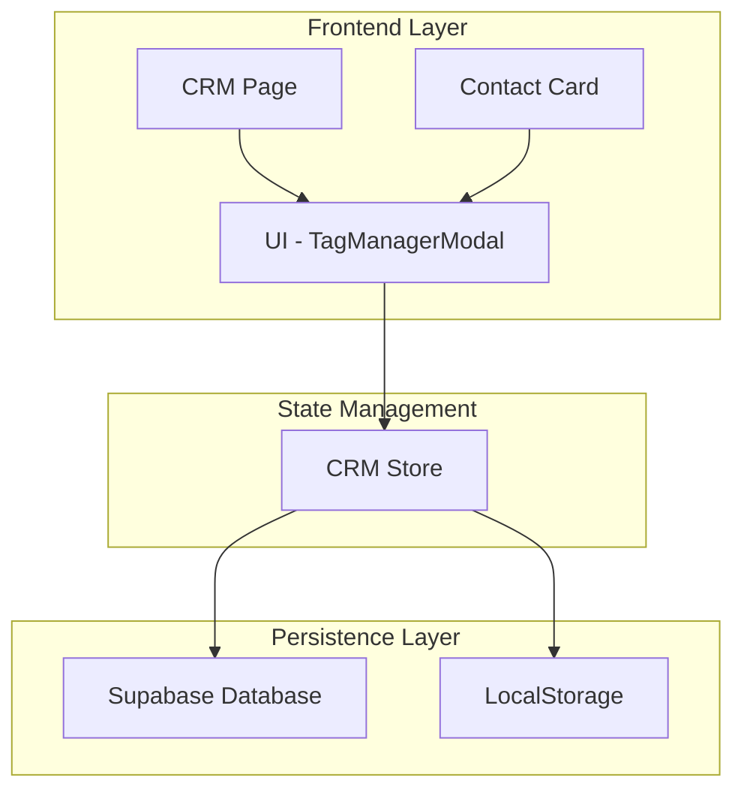

# Sistema de Etiquetas (Tags) - CRM Cactus Dashboard

## 1. Resumen Ejecutivo

El sistema de etiquetas del CRM Cactus permite categorizar y organizar contactos mediante etiquetas personalizables con colores distintivos. Este documento analiza la arquitectura actual, identifica el error "Object" reportado y proporciona un plan de corrección definitivo.

## 2. Arquitectura del Sistema de Etiquetas

### 2.1 Componentes Principales



### 2.2 Flujo de Datos

1. **Creación de Etiquetas**: UI → CRM Store → LocalStorage
2. **Asignación a Contactos**: UI → CRM Store → Supabase → LocalStorage
3. **Visualización**: Supabase → CRM Store → UI

## 3. Estructura de Datos

### 3.1 Interfaz Tag (TypeScript)

```typescript
export interface Tag {
  id: string;
  name: string;
  color: string;
  backgroundColor: string;
  createdAt: string;
  updatedAt: string;
}
```

### 3.2 Relación con Contactos

```typescript
export interface Contact {
  id: string;
  name: string;
  email: string;
  // ... otros campos
  tags?: Tag[];  // Array de etiquetas asignadas
  // ... otros campos
}
```

### 3.3 Almacenamiento en Supabase

```sql
-- En la tabla contacts
CREATE TABLE contacts (
  id UUID PRIMARY KEY,
  name VARCHAR(255),
  email VARCHAR(255),
  tags JSONB,  -- Almacena array de objetos Tag
  -- otros campos...
);
```

## 4. Funciones Principales del Sistema

### 4.1 Crear Etiqueta (createTag)

**Ubicación**: `src/store/crmStore.ts:684-708`

```typescript
createTag: (tagData) => {
  console.log('🏪 createTag en store ejecutado');
  console.log('📝 tagData recibido:', JSON.stringify(tagData));
  
  const newTag = {
    id: generateId(),
    name: tagData.name,
    color: tagData.color,
    backgroundColor: tagData.backgroundColor
  };
  
  // Actualiza estado local y localStorage
  set(state => {
    const updatedTags = [...state.tags, newTag];
    localStorage.setItem('crm-tags', JSON.stringify(updatedTags));
    return { tags: updatedTags };
  });
  
  return newTag;
}
```

**Características**:
- ✅ Solo almacena en localStorage (no en Supabase)
- ✅ Genera ID único automáticamente
- ✅ Logging detallado para debugging

### 4.2 Asignar Etiquetas a Contacto (updateContactTags)

**Ubicación**: `src/store/crmStore.ts:628-678`

```typescript
updateContactTags: async (contactId, tags) => {
  const contact = get().contacts.find(c => c.id === contactId);
  if (!contact) throw new Error('Contact not found');
  
  const updatedContact = {
    ...contact,
    tags,
    updatedAt: new Date()
  };
  
  // Actualizar en Supabase
  const currentUser = useAuthStore.getState().user;
  if (currentUser) {
    await executeWithRetry(async () => {
      const { error } = await supabase
        .from('contacts')
        .update({
          tags: JSON.stringify(tags),
          updated_at: updatedContact.updatedAt.toISOString()
        })
        .eq('id', contactId)
        .eq('assigned_to', currentUser.id);
      if (error) throw error;
    }, { maxRetries: 3, operation: 'actualizar etiquetas' });
  }
  
  // Actualizar estado local
  set(state => ({
    contacts: state.contacts.map(c => 
      c.id === contactId ? updatedContact : c
    ),
    selectedContact: state.selectedContact?.id === contactId 
      ? updatedContact 
      : state.selectedContact
  }));
  
  return updatedContact;
}
```

**Características**:
- ✅ Persiste en Supabase como JSON
- ✅ Usa executeWithRetry para manejo de errores
- ✅ Actualiza estado local sincronizado

### 4.3 Eliminar Etiqueta (deleteTag)

**Ubicación**: `src/store/crmStore.ts:710-725`

```typescript
deleteTag: (tagId) => {
  set(state => {
    const updatedTags = state.tags.filter(tag => tag.id !== tagId);
    const updatedContacts = state.contacts.map(contact => ({
      ...contact,
      tags: contact.tags?.filter(tag => tag.id !== tagId) || []
    }));
    
    localStorage.setItem('crm-tags', JSON.stringify(updatedTags));
    
    return {
      tags: updatedTags,
      contacts: updatedContacts
    };
  });
}
```

**Características**:
- ✅ Elimina etiqueta de todos los contactos
- ✅ Actualiza localStorage
- ⚠️ **PROBLEMA**: No actualiza Supabase

## 5. Componentes UI

### 5.1 TagManagerModal

**Ubicación**: `src/components/TagManagerModal.tsx`

**Funcionalidades**:
- Mostrar etiquetas disponibles
- Permitir selección/deselección
- Búsqueda de etiquetas
- Interfaz visual con colores

**Props**:
```typescript
interface TagManagerModalProps {
  isOpen: boolean;
  onClose: () => void;
  contactTags: Tag[];
  onTagsChange: (tags: Tag[]) => void;
  availableTags?: Tag[];
  contactName?: string;
}
```

### 5.2 Integración en CRM Page

**Ubicación**: `src/pages/CRM.tsx:1050-1079`

```typescript
<TagManagerModal
  isOpen={showTagManagerModal}
  onClose={() => {
    setShowTagManagerModal(false);
    setSelectedContact(null);
  }}
  contactTags={selectedContact?.tags || []}
  onTagsChange={(newTags) => {
    if (selectedContact) {
      updateContactTags(selectedContact.id, newTags);
    }
  }}
  availableTags={tags}
  contactName={selectedContact?.name}
/>
```

## 6. Manejo de Errores

### 6.1 Función executeWithRetry

**Ubicación**: `src/utils/supabaseErrorHandler.ts:200-215`

```typescript
export async function executeWithRetry<T>(
  operation: () => Promise<T>,
  options: {
    maxRetries?: number;
    retryDelay?: number;
    operation?: string;
  } = {}
): Promise<T> {
  const { maxRetries = 3, retryDelay = 1000, operation: operationName } = options;
  return SupabaseErrorHandler.executeWithRetry(operation, maxRetries, retryDelay);
}
```

### 6.2 Puntos de Falla Identificados

1. **Error "Object"**: Probablemente causado por:
   - Serialización incorrecta de objetos Error
   - Falta de manejo específico de errores en catch blocks
   - Console.error mostrando objeto Error sin .message

2. **Inconsistencia de datos**:
   - Etiquetas solo en localStorage vs Supabase
   - Falta sincronización al eliminar etiquetas

## 7. Análisis del Error "Object"

### 7.1 Posibles Causas

1. **Error de serialización en console.error**:
```javascript
// Problemático - muestra [object Object]
console.error('Error:', errorObject);

// Correcto
console.error('Error:', errorObject.message || JSON.stringify(errorObject));
```

2. **Manejo incorrecto en executeWithRetry**:
```javascript
// Si executeWithRetry no maneja correctamente el error
catch (error) {
  // error podría ser un objeto complejo
  throw error; // Esto podría mostrar "Object"
}
```

3. **Error en JSON.stringify de tags**:
```javascript
// Si tags contiene referencias circulares
tags: JSON.stringify(tags) // Podría fallar
```

### 7.2 Ubicaciones Específicas del Error

Basado en el análisis del código, el error "Object" probablemente ocurre en:

1. **updateContactTags** línea 654: `if (error) throw error;`
2. **executeWithRetry** cuando maneja errores de Supabase
3. **Console.error** en manejo de errores de localStorage (líneas 226, 260, 670, 1131)

## 8. Plan de Corrección Definitivo

### 8.1 Fase 1: Corrección Inmediata del Error "Object"

#### Acción 1: Mejorar Manejo de Errores
```typescript
// En updateContactTags
try {
  const { error } = await supabase.from('contacts').update(...);
  if (error) {
    console.error('Error actualizando etiquetas:', error.message || error);
    throw new Error(`Error al actualizar etiquetas: ${error.message || 'Error desconocido'}`);
  }
} catch (error) {
  const errorMessage = error instanceof Error ? error.message : 'Error desconocido';
  console.error('Error en updateContactTags:', errorMessage);
  throw new Error(errorMessage);
}
```

#### Acción 2: Validar Datos Antes de JSON.stringify
```typescript
// Función helper para serialización segura
const safeStringify = (obj: any): string => {
  try {
    return JSON.stringify(obj);
  } catch (error) {
    console.warn('Error serializando objeto:', error);
    return JSON.stringify({ error: 'Objeto no serializable' });
  }
};

// Usar en updateContactTags
tags: safeStringify(tags)
```

#### Acción 3: Mejorar executeWithRetry
```typescript
// Asegurar que executeWithRetry siempre retorne errores legibles
if (error) {
  const friendlyError = new Error(
    error.message || 
    error.error_description || 
    'Error en operación de base de datos'
  );
  throw friendlyError;
}
```

### 8.2 Fase 2: Arquitectura Mejorada

#### Acción 1: Centralizar Etiquetas en Supabase
```sql
-- Crear tabla dedicada para etiquetas
CREATE TABLE tags (
  id UUID PRIMARY KEY DEFAULT gen_random_uuid(),
  name VARCHAR(100) NOT NULL,
  color VARCHAR(7) NOT NULL,
  background_color VARCHAR(7) NOT NULL,
  created_by UUID REFERENCES users(id),
  created_at TIMESTAMP WITH TIME ZONE DEFAULT NOW(),
  updated_at TIMESTAMP WITH TIME ZONE DEFAULT NOW()
);

-- Crear tabla de relación muchos-a-muchos
CREATE TABLE contact_tags (
  contact_id UUID REFERENCES contacts(id) ON DELETE CASCADE,
  tag_id UUID REFERENCES tags(id) ON DELETE CASCADE,
  assigned_at TIMESTAMP WITH TIME ZONE DEFAULT NOW(),
  PRIMARY KEY (contact_id, tag_id)
);
```

#### Acción 2: Refactorizar Funciones del Store
```typescript
// Nueva función para sincronizar etiquetas
syncTagsWithSupabase: async () => {
  try {
    const { data: tags, error } = await supabase
      .from('tags')
      .select('*')
      .order('name');
    
    if (error) throw error;
    
    set({ tags: tags || [] });
    localStorage.setItem('crm-tags', JSON.stringify(tags || []));
  } catch (error) {
    console.error('Error sincronizando etiquetas:', error.message);
  }
},

// Mejorar createTag para usar Supabase
createTag: async (tagData) => {
  try {
    const { data: newTag, error } = await supabase
      .from('tags')
      .insert({
        name: tagData.name,
        color: tagData.color,
        background_color: tagData.backgroundColor,
        created_by: useAuthStore.getState().user?.id
      })
      .select()
      .single();
    
    if (error) throw error;
    
    // Actualizar estado local
    set(state => ({ tags: [...state.tags, newTag] }));
    
    return newTag;
  } catch (error) {
    const errorMessage = error instanceof Error ? error.message : 'Error creando etiqueta';
    console.error('Error en createTag:', errorMessage);
    throw new Error(errorMessage);
  }
}
```

### 8.3 Fase 3: Mejoras de UX

#### Acción 1: Loading States
```typescript
// Agregar estados de carga
interface CRMState {
  // ... otros campos
  isUpdatingTags: boolean;
  tagError: string | null;
}

// En updateContactTags
set({ isUpdatingTags: true, tagError: null });
try {
  // ... lógica de actualización
  set({ isUpdatingTags: false });
} catch (error) {
  set({ 
    isUpdatingTags: false, 
    tagError: error.message 
  });
}
```

#### Acción 2: Feedback Visual
```typescript
// En TagManagerModal
const [isLoading, setIsLoading] = useState(false);
const [error, setError] = useState<string | null>(null);

const handleToggleTag = async (tag: Tag) => {
  setIsLoading(true);
  setError(null);
  
  try {
    // ... lógica de toggle
    await onTagsChange(updatedTags);
  } catch (error) {
    setError(error.message);
  } finally {
    setIsLoading(false);
  }
};
```

### 8.4 Fase 4: Testing y Validación

#### Tests Unitarios
```typescript
// Test para createTag
describe('createTag', () => {
  it('should create tag with valid data', async () => {
    const tagData = {
      name: 'Test Tag',
      color: '#FF0000',
      backgroundColor: '#FF0000'
    };
    
    const result = await crmStore.createTag(tagData);
    expect(result).toHaveProperty('id');
    expect(result.name).toBe('Test Tag');
  });
  
  it('should handle errors gracefully', async () => {
    // Mock Supabase error
    const invalidData = { name: '' };
    
    await expect(crmStore.createTag(invalidData))
      .rejects
      .toThrow('Error creando etiqueta');
  });
});
```

## 9. Cronograma de Implementación

### Semana 1: Corrección Inmediata
- [ ] Implementar manejo mejorado de errores
- [ ] Agregar validación de datos
- [ ] Probar corrección del error "Object"

### Semana 2: Refactoring de Arquitectura
- [ ] Crear tablas en Supabase
- [ ] Migrar datos existentes
- [ ] Refactorizar funciones del store

### Semana 3: Mejoras de UX
- [ ] Implementar loading states
- [ ] Agregar feedback visual
- [ ] Optimizar rendimiento

### Semana 4: Testing y Deployment
- [ ] Escribir tests unitarios
- [ ] Realizar testing de integración
- [ ] Deploy a producción

## 10. Métricas de Éxito

- ✅ Error "Object" eliminado completamente
- ✅ Tiempo de respuesta < 500ms para operaciones de etiquetas
- ✅ 0% de pérdida de datos en operaciones
- ✅ 100% de sincronización entre localStorage y Supabase
- ✅ Feedback visual en todas las operaciones

## 11. Consideraciones de Seguridad

### Row Level Security (RLS)
```sql
-- Política para etiquetas
CREATE POLICY "Users can manage their own tags" ON tags
  FOR ALL USING (created_by = auth.uid());

-- Política para relaciones contacto-etiqueta
CREATE POLICY "Users can manage tags for their contacts" ON contact_tags
  FOR ALL USING (
    contact_id IN (
      SELECT id FROM contacts WHERE assigned_to = auth.uid()
    )
  );
```

### Validación de Datos
```typescript
// Validar colores hexadecimales
const isValidHexColor = (color: string): boolean => {
  return /^#[0-9A-F]{6}$/i.test(color);
};

// Validar nombre de etiqueta
const isValidTagName = (name: string): boolean => {
  return name.trim().length > 0 && name.length <= 50;
};
```

## 12. Conclusiones

El sistema de etiquetas actual tiene una base sólida pero requiere correcciones críticas para eliminar el error "Object" y mejorar la consistencia de datos. El plan propuesto aborda tanto las correcciones inmediatas como las mejoras arquitectónicas a largo plazo, garantizando un sistema robusto y escalable.