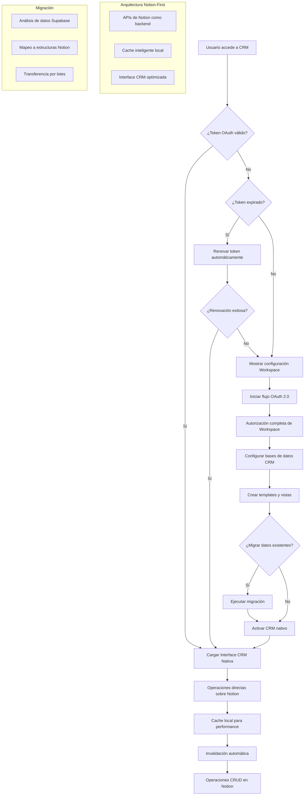

# Sistema CRM Nativo con Notion como Base de Datos Principal

## 1. Visión General del Producto

Sistema CRM completamente nativo que utiliza Notion como base de datos principal y única fuente de verdad para todos los datos de contactos, clientes, pipeline de ventas e interacciones. El sistema proporciona una interfaz CRM profesional y optimizada que opera 100% sobre la infraestructura de Notion, eliminando la necesidad de bases de datos locales y sincronización compleja.

El producto revoluciona la gestión de CRM al combinar la flexibilidad y potencia de Notion como backend con una experiencia de usuario especializada para equipos de ventas, marketing y atención al cliente, manteniendo todos los datos centralizados en el workspace de Notion de la organización.

## 2. Funcionalidades Principales

### 2.1 Roles de Usuario

| Rol | Método de Registro | Permisos Principales |
|-----|-------------------|---------------------|
| Usuario Autenticado | Sistema existente de autenticación | Acceso a Notion CRM con SSO automático, configuración de workspace personal |
| Manager/Administrador | Sistema existente con permisos elevados | Gestión de configuraciones de equipo, supervisión de integraciones, acceso a métricas consolidadas |
| Super Admin | Acceso administrativo completo | Configuración global del sistema, gestión de tokens OAuth, monitoreo de seguridad |

### 2.2 Módulos de Funcionalidad

Nuestro sistema CRM nativo con Notion consiste en los siguientes componentes principales:

1. **Interface CRM Nativa**: Vista optimizada de contactos, pipeline y tareas operando directamente sobre bases de datos de Notion
2. **Motor de Autenticación OAuth**: SSO automático con workspace de Notion, gestión de permisos granulares
3. **API Notion-First**: Todas las operaciones CRUD realizadas directamente sobre APIs de Notion, cache inteligente para performance
4. **Sistema de Migración**: Herramientas para migrar datos existentes de Supabase a estructuras de Notion
5. **Cache y Performance**: Sistema de cache local para optimizar velocidad sin duplicar datos
6. **Gestión de Workspace**: Configuración automática de bases de datos de Notion para CRM, templates predefinidos

### 2.3 Detalles de Funcionalidades

| Página/Módulo | Componente | Descripción de Funcionalidad |
|---------------|------------|------------------------------|
| CRM Dashboard | Contacts Manager | Vista nativa de contactos operando directamente sobre base de datos de Notion, filtros avanzados |
| CRM Dashboard | Pipeline View | Visualización de pipeline de ventas usando propiedades de Notion, drag & drop nativo |
| CRM Dashboard | Activity Feed | Timeline de interacciones y actividades sincronizado en tiempo real con Notion |
| OAuth Setup | Workspace Connection | Conexión directa con workspace de Notion, configuración automática de bases de datos CRM |
| OAuth Setup | Database Setup | Creación automática de templates de bases de datos para contactos, deals, tareas |
| Migration Tool | Data Transfer | Migración completa de datos existentes de Supabase a estructuras optimizadas de Notion |
| Migration Tool | Schema Mapping | Mapeo inteligente de campos CRM a propiedades de Notion, preservación de relaciones |
| Admin Panel | Notion Workspace Config | Gestión de permisos de workspace, configuración de bases de datos, templates |
| Admin Panel | Performance Monitor | Monitoreo de cache, latencia de APIs de Notion, optimización de queries |
| API Layer | Notion API Wrapper | Capa de abstracción sobre APIs de Notion optimizada para operaciones CRM |
| API Layer | Cache Management | Sistema de cache inteligente para reducir llamadas a Notion, invalidación automática |

## 3. Procesos Principales

### Flujo de Acceso CRM Nativo

1. Usuario navega a "CRM" desde el dashboard principal
2. Sistema verifica token OAuth válido para workspace de Notion
3. Si token es válido, carga interface CRM nativa operando sobre Notion
4. Si token expiró, ejecuta renovación transparente en background
5. Usuario interactúa con CRM que opera 100% sobre bases de datos de Notion
6. Todas las operaciones (crear, editar, eliminar) se ejecutan directamente en Notion

### Flujo de Configuración Inicial del Workspace

1. Usuario nuevo ve asistente de configuración "Configurar CRM con Notion"
2. Click inicia flujo OAuth 2.0 con permisos completos de workspace
3. Usuario autoriza acceso completo a su workspace de Notion
4. Sistema detecta workspace y verifica permisos de administración
5. Configuración automática de bases de datos CRM (Contactos, Deals, Tareas, Interacciones)
6. Creación de templates y vistas optimizadas para CRM
7. Migración opcional de datos existentes desde sistema anterior
8. Activación del CRM nativo operando completamente sobre Notion

### Flujo de Migración de Datos

1. Sistema analiza estructura de datos existente en Supabase
2. Mapea automáticamente campos CRM a propiedades de Notion
3. Crea bases de datos optimizadas en Notion con relaciones preservadas
4. Transfiere datos por lotes con validación y verificación
5. Establece relaciones entre contactos, deals, tareas e interacciones
6. Valida integridad de datos migrados
7. Desactiva tablas locales y activa modo Notion-only
8. Notifica finalización exitosa de migración

## 4. Diseño de Interfaz de Usuario

### 4.1 Estilo de Diseño

- **Colores primarios**: Paleta Cactus (#10B981, #059669) con gradientes sutiles
- **Colores secundarios**: Grises modernos (#F8FAFC, #E2E8F0, #64748B)
- **Colores de estado**: Verde (#22C55E) para conectado, Ámbar (#F59E0B) para sincronizando, Rojo (#EF4444) para errores
- **Estilo de botones**: Rounded-xl con efectos hover suaves, sombras sutiles, estados de loading
- **Tipografía**: font-cactus con jerarquía clara, tamaños optimizados para legibilidad
- **Layout**: Card-based con espaciado generoso, navegación contextual, breadcrumbs inteligentes
- **Iconos**: Lucide React con iconografía consistente, estados animados para feedback
- **Animaciones**: Transiciones suaves (300ms), loading states, micro-interacciones

### 4.2 Componentes de Interfaz

| Página/Módulo | Componente | Elementos de UI |
|---------------|------------|----------------|
| Notion CRM | Header Integrado | Breadcrumbs con estado de conexión, botón de configuración, indicador de sincronización en tiempo real |
| Notion CRM | Viewer Principal | iFrame optimizado con controles de navegación, zoom, modo fullscreen, overlay de loading |
| Notion CRM | Status Bar | Barra inferior con estado de sincronización, última actualización, botones de acción rápida |
| OAuth Setup | Connection Card | Card centrado con logo de Notion, descripción de permisos, botón CTA prominente |
| OAuth Setup | Progress Indicator | Stepper visual del progreso de configuración, estados de validación |
| Sync Dashboard | Real-time Grid | Grid responsivo con métricas de sincronización, gráficos en tiempo real |
| Sync Dashboard | Conflict Panel | Panel lateral para resolución de conflictos, diff visual, botones de acción |
| Admin Panel | Workspace Cards | Cards de workspaces con thumbnails, métricas, controles de gestión |
| Admin Panel | Security Monitor | Dashboard de seguridad con logs, alertas, métricas de acceso |
| Mobile View | Responsive Layout | Navegación optimizada para touch, gestos de swipe, menús colapsables |

### 4.3 Responsividad y Accesibilidad

- **Desktop-first** con adaptación móvil completa
- **Touch optimization** para dispositivos móviles y tablets
- **Keyboard navigation** completa con shortcuts personalizados
- **Screen reader support** con ARIA labels y roles semánticos
- **High contrast mode** para usuarios con necesidades visuales
- **Reduced motion** respetando preferencias de accesibilidad
- **Progressive enhancement** con fallbacks para conexiones lentas

## 5. Arquitectura de Seguridad

### 5.1 Encriptación y Almacenamiento

- **Tokens OAuth**: Encriptación AES-256-GCM con claves rotativas
- **Datos sensibles**: Hashing con salt único por usuario
- **Comunicación**: TLS 1.3 obligatorio, certificate pinning
- **Almacenamiento**: Políticas RLS estrictas, auditoría completa

### 5.2 Políticas de Acceso

- **Row Level Security**: Usuarios solo acceden a sus datos
- **API Rate Limiting**: Límites por usuario y endpoint
- **Token Validation**: Verificación continua de validez
- **Session Management**: Timeouts automáticos, renovación segura

### 5.3 Monitoreo y Auditoría

- **Access Logs**: Registro completo de accesos y modificaciones
- **Security Alerts**: Notificaciones automáticas de actividad sospechosa
- **Compliance**: Cumplimiento con GDPR y regulaciones de privacidad
- **Backup Security**: Respaldos encriptados con retención configurable

## 6. Métricas y Monitoreo

### 6.1 KPIs del Sistema

- **Tiempo de conexión SSO**: < 2 segundos promedio
- **Tasa de éxito de sincronización**: > 99.5%
- **Disponibilidad del servicio**: > 99.9% uptime
- **Latencia de API**: < 200ms percentil 95

### 6.2 Métricas de Usuario

- **Adopción de SSO**: % de usuarios con OAuth configurado
- **Frecuencia de uso**: Accesos diarios a Notion CRM
- **Satisfacción**: NPS y feedback de experiencia
- **Productividad**: Tiempo ahorrado vs. flujo manual

### 6.3 Alertas y Notificaciones

- **Fallos de sincronización**: Notificación inmediata a usuarios afectados
- **Tokens expirados**: Alertas proactivas para renovación
- **Cambios de seguridad**: Notificaciones de nuevos accesos o permisos
- **Mantenimiento**: Comunicación anticipada de actualizaciones

## 7. Plan de Implementación

### Fase 1: Fundación (Semanas 1-2)
- Configuración de OAuth 2.0 con Notion
- Implementación de encriptación de tokens
- Políticas RLS avanzadas
- Testing de seguridad básico

### Fase 2: SSO Core (Semanas 3-4)
- Motor de SSO automático
- Renovación transparente de tokens
- Interface de configuración inicial
- Testing de flujos principales

### Fase 3: Sincronización (Semanas 5-6)
- API de sincronización bidireccional
- Webhooks de Notion
- Detección de conflictos
- Resolución automática básica

### Fase 4: UX Avanzada (Semanas 7-8)
- Interface de resolución de conflictos
- Dashboard de monitoreo
- Optimizaciones de rendimiento
- Testing de usuario final

### Fase 5: Producción (Semanas 9-10)
- Deployment y configuración
- Monitoreo en producción
- Documentación final
- Training y soporte

## 8. Consideraciones de Escalabilidad

### 8.1 Arquitectura Distribuida
- **Microservicios**: Separación de concerns por funcionalidad
- **Load Balancing**: Distribución inteligente de carga
- **Caching**: Redis para datos frecuentemente accedidos
- **CDN**: Distribución global de assets estáticos

### 8.2 Optimización de Base de Datos
- **Índices optimizados**: Para queries de sincronización
- **Particionado**: Por fecha y usuario para escalabilidad
- **Replicación**: Read replicas para consultas pesadas
- **Archivado**: Políticas de retención de datos históricos

### 8.3 Monitoreo de Performance
- **APM**: Application Performance Monitoring completo
- **Métricas custom**: KPIs específicos del negocio
- **Alerting**: Notificaciones proactivas de degradación
- **Capacity Planning**: Predicción de necesidades de recursos

Este sistema representa una evolución significativa en la integración de herramientas de productividad, proporcionando una experiencia fluida y segura que maximiza la eficiencia del equipo mientras mantiene los más altos estándares de seguridad y confiabilidad.