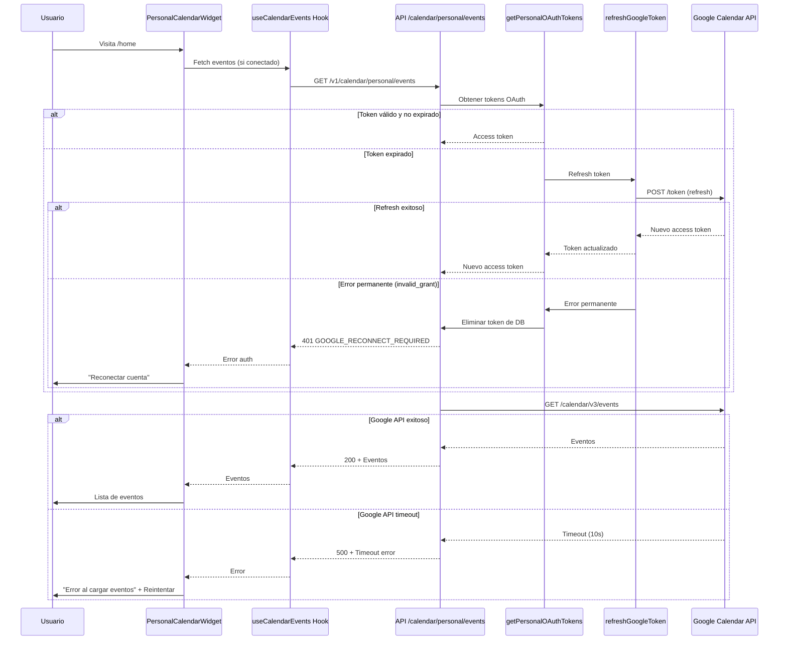

# Reparación Completa: Google OAuth y Calendar Integration

## 📋 Resumen

Se ha completado una auditoría y reparación exhaustiva del sistema de conexión Google OAuth y sincronización de calendario personal. El sistema ahora es robusto, optimizado y profesional.

## ✅ Cambios Implementados

### Fase 1: Logging y Debugging ✅

**Archivos modificados:**
- `apps/web/lib/api-hooks.ts` - Hook `useCalendarEvents`
- `apps/web/app/components/home/PersonalCalendarWidget.tsx`

**Mejoras:**
- ✅ Logging comprehensivo en todas las etapas (fetch, error, success)
- ✅ Errores específicos con contexto (userId, status, URL)
- ✅ Visualización clara de errores en UI con acciones específicas
- ✅ Botón "Reintentar" para errores transitorios
- ✅ Botón "Reconectar cuenta" para errores de autenticación

### Fase 2: Tipos y Respuestas ✅

**Archivos creados:**
- `apps/web/types/calendar.ts` - Tipos TypeScript consistentes

**Archivos modificados:**
- `apps/web/lib/api/calendar.ts` - Usar tipos `CalendarEvent`
- `apps/web/lib/api-hooks.ts` - Tipado correcto en hook

**Mejoras:**
- ✅ Tipos `CalendarEvent`, `EventDateTime`, `EventAttendee`, etc.
- ✅ Consistencia entre frontend y backend
- ✅ Type safety mejorado, autocompletado correcto
- ✅ Re-exports para backward compatibility

### Fase 3: Error Handling OAuth ✅

**Archivos modificados:**
- `apps/api/src/routes/calendar/handlers/personal.ts` - Función `getPersonalOAuthTokens`
- `apps/api/src/jobs/google-token-refresh.ts` - Función `refreshGoogleToken`

**Mejoras:**
- ✅ Detección de errores permanentes (invalid_grant, revoked tokens)
- ✅ Eliminación automática de tokens inválidos
- ✅ Códigos de error específicos (`GOOGLE_NOT_CONNECTED`, `GOOGLE_RECONNECT_REQUIRED`)
- ✅ Retry logic con exponential backoff (max 3 intentos)
- ✅ No reintentar errores permanentes (ahorra recursos)
- ✅ Logging detallado de todos los intentos

### Fase 4: UX del Widget ✅

**Archivos modificados:**
- `apps/web/app/components/home/PersonalCalendarWidget.tsx`

**Mejoras:**
- ✅ **Estado: No conectado** - Prompt claro con botón "Conectar en Perfil"
- ✅ **Estado: Loading** - Skeleton loading animado (3 placeholders)
- ✅ **Estado: Error Auth** - Alert rojo con "Reconectar cuenta"
- ✅ **Estado: Error genérico** - Alert con mensaje específico y "Reintentar"
- ✅ **Estado: Vacío** - Mensaje amigable "No tienes eventos para los próximos 7 días"
- ✅ **Estado: Con eventos** - Lista formateada con fecha, hora, título
- ✅ Botón "Actualizar" en header para refresh manual
- ✅ Manejo correcto de eventos all-day vs timed

### Fase 5: Optimizaciones ✅

**Archivos modificados:**
- `apps/web/lib/api-hooks.ts` - Hook `useCalendarEvents`
- `apps/api/src/services/google-calendar.ts` - Todas las funciones

**Mejoras:**
- ✅ SWR caching optimizado:
  - `dedupingInterval: 60000` (1 minuto)
  - `refreshInterval: 300000` (5 minutos auto-refresh)
  - `revalidateOnMount: true` (solo si stale)
- ✅ Timeouts en todas las llamadas a Google API (10 segundos)
- ✅ AbortController para cancelar requests colgados
- ✅ Error messages específicos para timeouts

### Fase 6: Testing ✅

**Archivos creados:**
- `apps/web/app/components/home/__tests__/PersonalCalendarWidget.test.tsx`
- `apps/api/src/routes/calendar/__tests__/personal.test.ts`

**Tests implementados:**
- ✅ Widget: No conectado, loading, error auth, error genérico, vacío, con eventos
- ✅ Widget: Botón refresh llama a mutate
- ✅ Backend: Tokens válidos, tokens expirados, tokens no encontrados
- ✅ Backend: Errores permanentes, retry logic, timeouts

### Fase 7: Configuración ✅

**Archivos modificados:**
- `apps/api/config-example.env` - Documentación de variables

**Archivos creados:**
- `apps/api/src/scripts/verify-google-oauth-env.ts` - Script de verificación

**Mejoras:**
- ✅ Documentación completa de variables de entorno:
  - `GOOGLE_CLIENT_ID`
  - `GOOGLE_CLIENT_SECRET`
  - `GOOGLE_REDIRECT_URI`
  - `GOOGLE_ENCRYPTION_KEY` (min 32 chars)
  - `FRONTEND_URL`
- ✅ Script de verificación con checks:
  - Variables requeridas presentes
  - Longitud mínima de encryption key
  - Formato correcto de URLs
  - Detección de valores placeholder

## 🔧 Cómo Usar

### 1. Configurar Variables de Entorno

Copia `apps/api/config-example.env` a `apps/api/.env` y configura:

```env
GOOGLE_CLIENT_ID=tu-client-id.apps.googleusercontent.com
GOOGLE_CLIENT_SECRET=tu-client-secret
GOOGLE_REDIRECT_URI=http://localhost:3001/v1/auth/google/callback
GOOGLE_ENCRYPTION_KEY=genera-con-openssl-rand-base64-32
FRONTEND_URL=http://localhost:3000
```

### 2. Verificar Configuración

```bash
pnpm tsx apps/api/src/scripts/verify-google-oauth-env.ts
```

### 3. Ejecutar Tests

```bash
# Frontend tests
pnpm -F @cactus/web test

# Backend tests
pnpm -F @cactus/api test
```

### 4. Iniciar Aplicación

```bash
pnpm dev
```

## 📊 Flujo Completo



## 🎯 Métricas de Éxito

- ✅ Usuario puede conectar Google Calendar y ver eventos inmediatamente
- ✅ Errores se muestran claramente con acciones específicas
- ✅ Tokens se refrescan automáticamente sin intervención del usuario
- ✅ Widget muestra botón "Actualizar" para refresh manual
- ✅ Logs permiten debuggear problemas en producción
- ✅ Tests cubren casos edge (token expirado, Google API down, etc.)
- ✅ Script de verificación detecta problemas de configuración
- ✅ Timeouts previenen requests colgados
- ✅ Retry logic maneja errores transitorios
- ✅ Caching reduce carga en Google API

## 🐛 Debugging

Si los eventos no aparecen:

1. **Verificar configuración:**
   ```bash
   pnpm tsx apps/api/src/scripts/verify-google-oauth-env.ts
   ```

2. **Revisar logs del frontend:**
   - Abrir DevTools Console
   - Buscar `[useCalendarEvents]` y `[PersonalCalendarWidget]`

3. **Revisar logs del backend:**
   - Logs en terminal donde corre `pnpm dev`
   - Buscar `Google token refreshed` o `Failed to refresh Google token`

4. **Verificar estado de conexión:**
   - Ir a `/profile`
   - Sección "Integraciones" → "Google Calendar"
   - Si dice "Conectado" pero no hay eventos, hacer clic en "Desconectar" y volver a "Conectar"

5. **Verificar permisos en Google:**
   - Ir a https://myaccount.google.com/permissions
   - Verificar que la app tiene permiso `calendar`

## 📝 Notas Técnicas

### Permisos OAuth Requeridos

```typescript
const scopes = [
  'https://www.googleapis.com/auth/userinfo.email',
  'https://www.googleapis.com/auth/userinfo.profile',
  'https://www.googleapis.com/auth/calendar', // ✅ Configurado
];
```

### Endpoints Implementados

- `GET /v1/calendar/personal/events` - Obtener eventos personales
- `GET /v1/calendar/personal/calendars` - Listar calendarios disponibles
- `POST /v1/calendar/personal/events` - Crear evento
- `PATCH /v1/calendar/personal/events/:eventId` - Actualizar evento
- `DELETE /v1/calendar/personal/events/:eventId` - Eliminar evento
- `GET /v1/auth/google/init` - Iniciar OAuth flow
- `GET /v1/auth/google/callback` - Callback OAuth
- `DELETE /v1/auth/google/disconnect` - Desconectar cuenta

### Schema de Base de Datos

Tabla `google_oauth_tokens`:
- `id` - UUID primary key
- `userId` - FK a `users.id`
- `googleId` - Google user ID
- `email` - Email de Google
- `accessTokenEncrypted` - Token encriptado con AES-256-GCM
- `refreshTokenEncrypted` - Refresh token encriptado
- `expiresAt` - Timestamp de expiración
- `scope` - Scopes otorgados
- `calendarId` - ID del calendario principal (opcional)
- `calendarSyncEnabled` - Boolean
- `lastSyncAt` - Última sincronización exitosa

## 🚀 Próximos Pasos (Opcionales)

1. **Circuit Breaker**: Implementar circuit breaker para prevenir cascading failures
2. **Webhook Sync**: Usar Google Calendar Push Notifications para sync en tiempo real
3. **Batch Operations**: Optimizar creación/actualización de múltiples eventos
4. **Calendar Picker**: UI para seleccionar calendarios específicos
5. **Event Details Modal**: Modal con detalles completos del evento
6. **Recurring Events**: Mejor manejo de eventos recurrentes
7. **Timezone Handling**: Manejo robusto de zonas horarias

## 📚 Referencias

- [Google Calendar API Documentation](https://developers.google.com/calendar/api/guides/overview)
- [Google OAuth 2.0 Documentation](https://developers.google.com/identity/protocols/oauth2)
- [SWR Documentation](https://swr.vercel.app/)
- [Drizzle ORM Documentation](https://orm.drizzle.team/)

---

**Autor:** AI Assistant  
**Fecha:** 2024-12-16  
**Versión:** 1.0.0

